#  097：AWS数据库连接故障排除实验演练 🔧

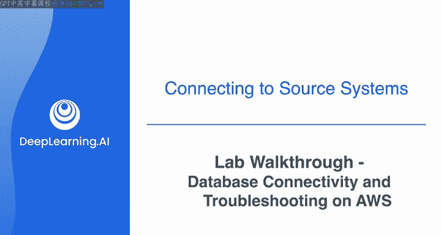

在本节课中，我们将学习如何解决连接AWS RDS数据库时遇到的常见网络、安全和权限问题。你将通过一个实验，从Cloud9终端连接到RDS数据库，创建表，并从S3桶下载数据填充该表。作为数据工程师，连接数据库、移动和读取数据是超级常见的任务，而排查这些基本任务中的连接和权限问题更是家常便饭。

## 概述

本次实验模拟了一个真实的故障排除场景。首先，你将尝试连接一个RDS数据库，但会遇到几个需要修复的问题。之后，你需要从一个S3桶下载CSV文件，并将数据复制到数据库中。在从S3读取文件时，你还会遇到权限问题。本教程将引导你逐步解决所有这些问题。

## 实验步骤详解

### 1. 检查并连接资源

首先，你需要在AWS控制台中定位提供的RDS数据库和Cloud9环境。

在控制台中搜索“RDS”并点击进入。在“数据库”列表中找到提供的数据库标识符，点击它并找到数据库终端节点。请保存这个终端节点，因为在排查连接问题时需要多次使用它。

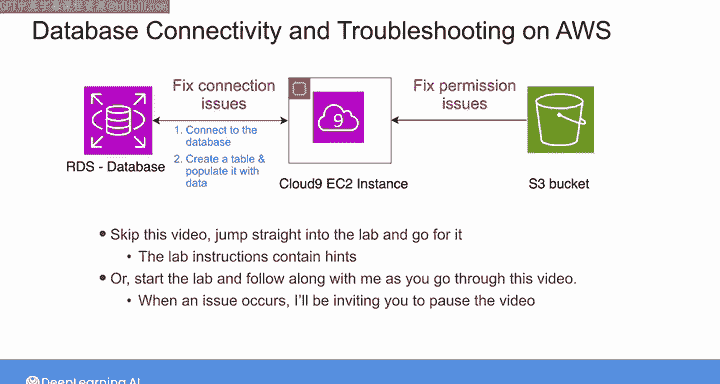

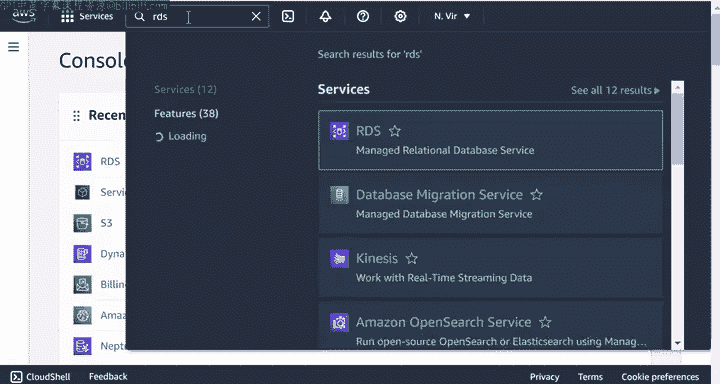

接下来，创建Cloud9环境。在控制台搜索“Cloud9”，点击“创建环境”。输入环境名称（例如 `DE-C2W1A1`），选择实例类型为“t3.small”，网络设置选择“安全Shell(SSH)”。关键的一步是选择VPC。

上一节我们介绍了如何定位资源，本节中我们来看看如何配置网络以确保它们能够通信。

### 2. 解决VPC不匹配问题

当你首次尝试从Cloud9终端连接数据库时，连接会失败且没有明确的错误信息。这通常是由于网络配置问题。

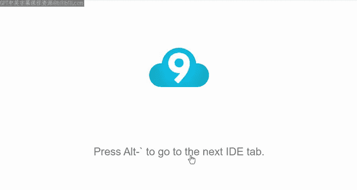

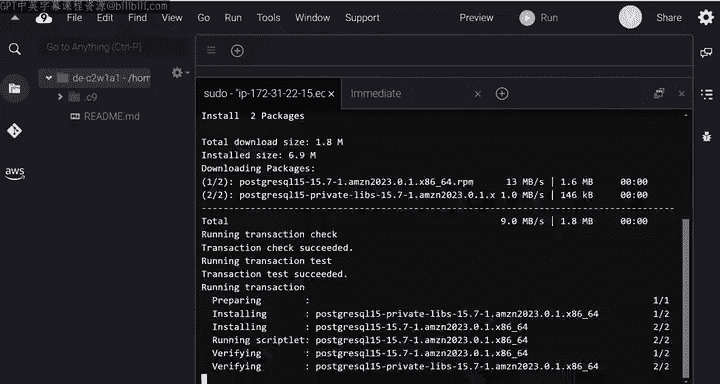

**问题根源**：Cloud9环境运行在一个EC2实例上。如果这个EC2实例和RDS数据库不在同一个VPC中，它们默认无法通信。

**排查方法**：
1.  在RDS控制台，查看数据库的“网络”选项卡，记录其VPC ID。
2.  在Cloud9控制台，查看环境的“网络设置”选项卡，记录其VPC ID。

**解决方案**：
如果两个VPC ID不同，你需要删除当前的Cloud9环境，然后重新创建一个，并在VPC设置中选择与RDS数据库相同的VPC（例如名为 `DEC-C2W1A1` 的VPC），同时选择一个公有子网。

以下是创建新环境时的关键配置代码示例（概念性描述）：
```bash
# 在AWS Cloud9控制台创建环境时，需手动选择：
# 环境名称: DE-C2W1A1
# VPC设置: 选择与RDS实例相同的VPC (例如 vpc-xxxxxx)
# 子网: 选择一个公有子网
```

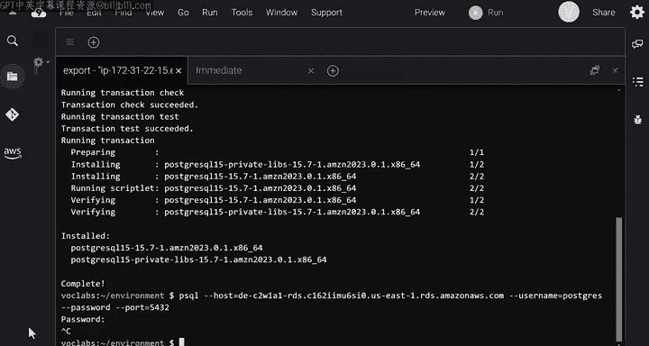

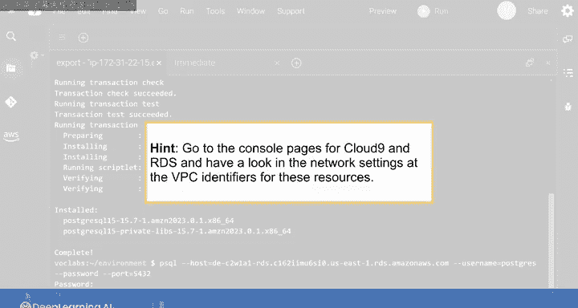

### 3. 解决安全组规则问题

将Cloud9环境创建在正确的VPC后，再次尝试连接数据库，可能依然失败。现在需要检查安全组规则。

**问题根源**：即使资源在同一个VPC，RDS数据库的安全组规则可能不允许来自Cloud9 EC2实例的流量。

**排查方法**：
1.  在RDS控制台，进入数据库的“安全”选项卡，查看其VPC安全组。
2.  在EC2控制台，找到运行Cloud9环境的EC2实例，查看其“安全”选项卡下的安全组ID。

**解决方案**：
你需要修改RDS数据库安全组的入站规则，允许来自Cloud9 EC2实例安全组的流量访问数据库端口。

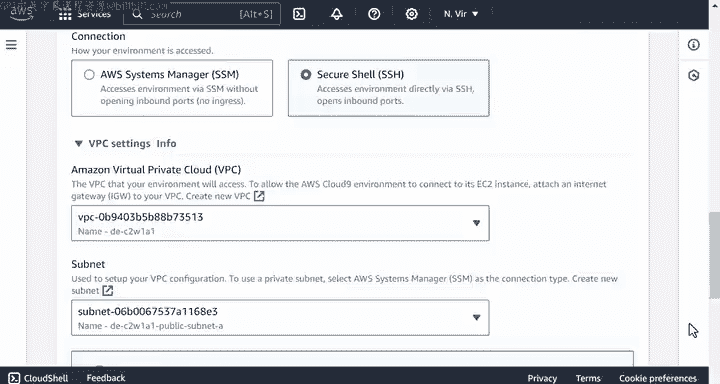

以下是添加入站规则的步骤：
1.  编辑RDS安全组的入站规则。
2.  添加一条新规则。
3.  类型选择“PostgreSQL”（或根据你的数据库类型选择，如MySQL）。
4.  端口范围设置为 `5432`（PostgreSQL默认端口）或 `3306`（MySQL默认端口）。
5.  在“源”字段中，粘贴Cloud9 EC2实例的安全组ID（格式如 `sg-xxxxxx`），而不是使用 `0.0.0.0/0`（允许所有公共流量），后者存在安全风险。
6.  保存规则。

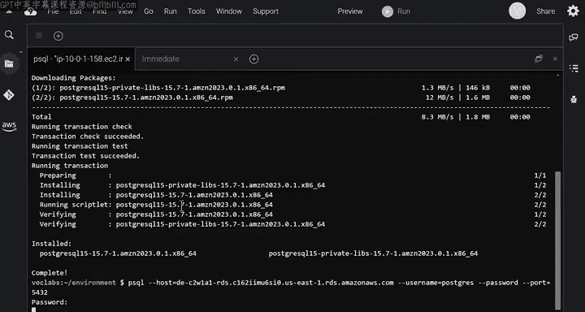

核心安全组规则公式如下：
```
允许 入站流量
协议: TCP
端口: [数据库端口号，如 5432]
源: [Cloud9 EC2实例的安全组ID]
```

### 4. 解决密码认证失败问题

修复网络和安全组后再次连接，你可能会收到“密码认证失败”的错误。这是一个非常常见的问题。

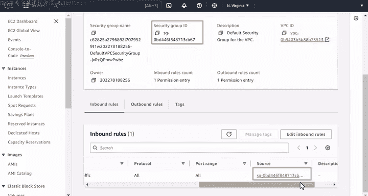

**问题根源**：密码错误。可能原因包括密码轮换后未更新、输错密码或遗漏了密码更新通知。

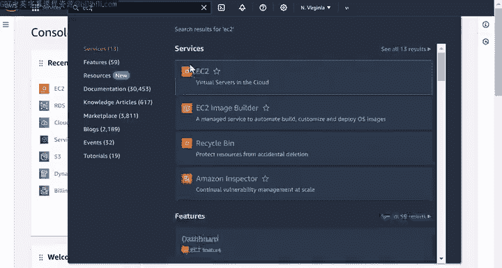

**解决方案**：
1.  仔细检查输入的密码。
2.  如果确认密码无误但仍失败，可能需要联系团队获取最新的正确密码。
3.  使用正确的密码重新连接。

使用 `psql` 客户端连接数据库的命令格式如下：
```bash
psql -h [数据库终端节点] -U [用户名] -d [数据库名]
# 执行后会提示输入密码
```

### 5. 创建数据库表

成功连接数据库后，下一步是在数据库中创建表。

实验提供了SQL文件来创建表结构。首先，你需要下载实验文件。然后，在Cloud9终端中连接到数据库，并执行DDL（数据定义语言）文件。

以下是操作命令示例：
```bash
# 1. 下载实验所需文件（假设脚本已提供）
# ./download_files.sh

# 2. 连接到数据库
psql -h [数据库终端节点] -U postgres -d postgres

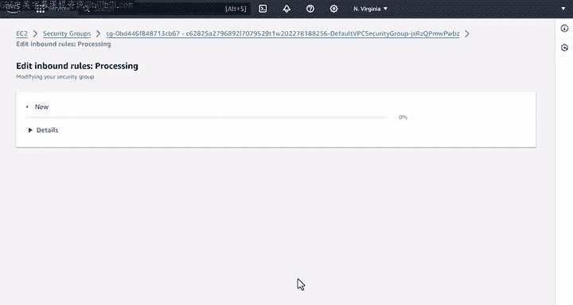

# 3. 执行创建表的SQL文件
\i /path/to/sql/ratings_table_ddl.sql

# 4. 验证表已创建（可选）
SELECT * FROM ratings LIMIT 1;
```

### 6. 从S3下载数据并解决权限问题

表创建好后是空的，需要从S3桶中的CSV文件填充数据。首先需要将CSV文件下载到本地。

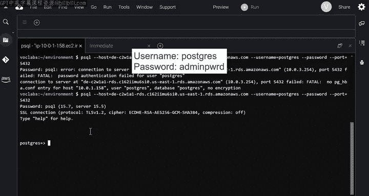

**遇到的问题**：运行提供的Python下载脚本时，会出现权限错误，拒绝访问S3桶。

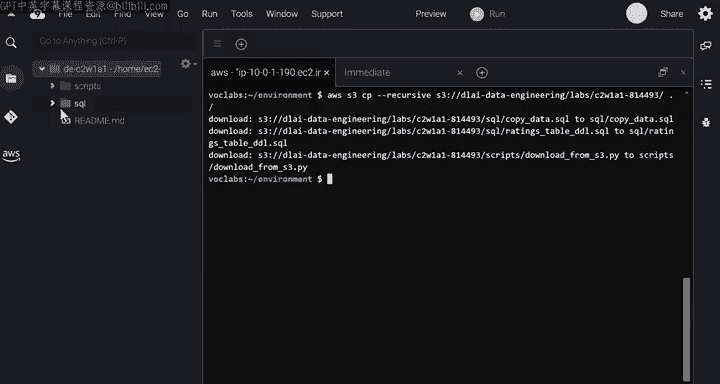

**问题根源**：S3桶的策略（Bucket Policy）未授权Cloud9的EC2实例读取对象。

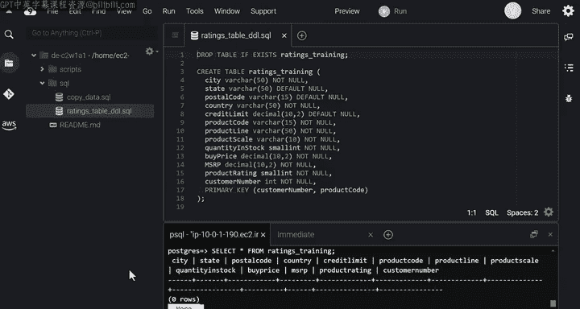

**排查与解决方案**：
1.  在S3控制台，找到目标桶，进入“权限”选项卡下的“存储桶策略”。
2.  你会发现现有策略可能拒绝了所有读取操作。
3.  你需要用实验说明中提供的新策略替换它。新策略应包含以下关键部分：
    *   `Effect: Allow`
    *   `Action: s3:GetObject`
    *   `Resource: arn:aws:s3:::[你的桶名]/csv/*`
    *   `Condition`：限制源IP为你的Cloud9 EC2实例的公有IPv4地址（可在EC2控制台找到）。

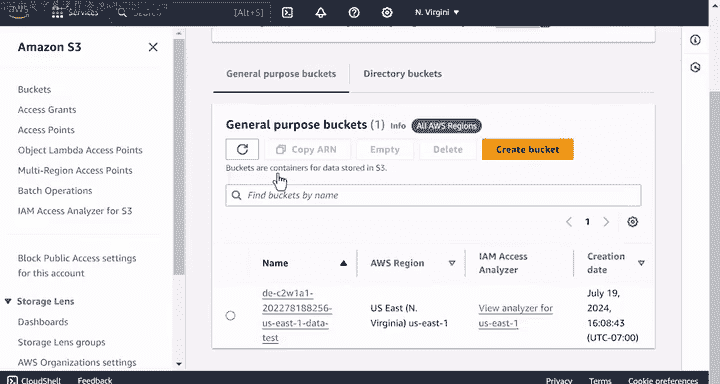

一个简化的策略示例如下：
```json
{
  "Version": "2012-10-17",
  "Statement": [
    {
      "Effect": "Allow",
      "Principal": "*",
      "Action": "s3:GetObject",
      "Resource": "arn:aws:s3:::your-data-bucket/csv/*",
      "Condition": {
        "IpAddress": {
          "aws:SourceIp": "[你的EC2实例公有IP]/32"
        }
      }
    }
  ]
}
```
4.  保存策略后，重新运行Python下载脚本，文件应能成功下载到本地的 `data` 文件夹。

### 7. 将数据导入数据库

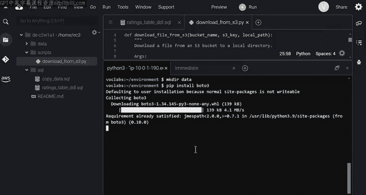

最后一步是将下载的CSV数据导入到数据库的表中。

实验会提供一个包含 `COPY` 命令的SQL文件。你需要在 `psql` 连接中执行这个命令。

以下是操作命令示例：
```bash
# 1. 连接到数据库
psql -h [数据库终端节点] -U postgres -d postgres

# 2. 执行数据导入的SQL文件
\i /path/to/sql/copy_data.sql

# 3. 验证数据已成功导入
SELECT COUNT(*) FROM ratings;
```

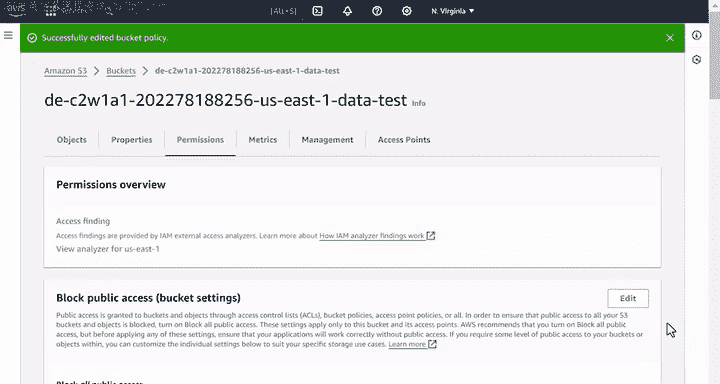

## 总结

在本节课中，我们一起完成了一个完整的AWS数据库连接与数据导入的故障排除实验。我们学习了：

1.  **诊断VPC网络问题**：确保Cloud9 EC2实例和RDS数据库位于同一VPC以实现网络连通性。
2.  **配置安全组规则**：通过添加精确的入站规则，允许特定安全组（EC2实例）访问数据库端口，而不是开放给所有IP。
3.  **处理认证错误**：细心核对并获取正确的数据库连接密码。
4.  **管理S3存储桶权限**：通过修改存储桶策略，授予特定IP地址的EC2实例读取S3对象的权限。
5.  **执行数据库操作**：使用 `psql` 连接数据库，运行SQL文件来创建表结构（DDL）和导入数据（`COPY` 命令）。

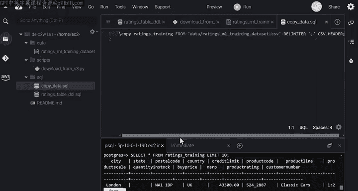

这些步骤涵盖了数据工程师在日常工作中最常遇到的基础设施连接和权限问题。掌握这些排查技能，对于构建和维护可靠的数据管道至关重要。你可以随时回看本视频，以便在独立完成类似任务时参考这些步骤。