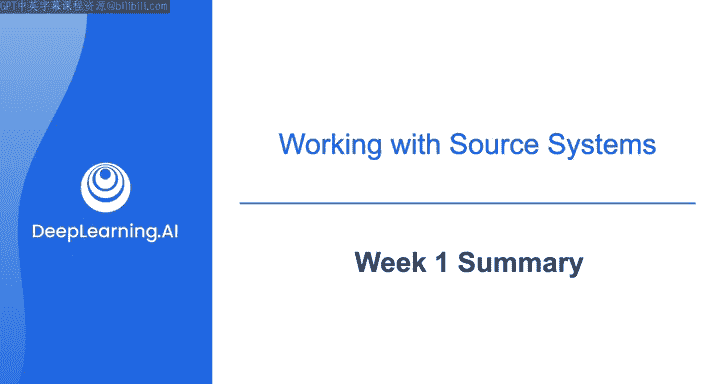
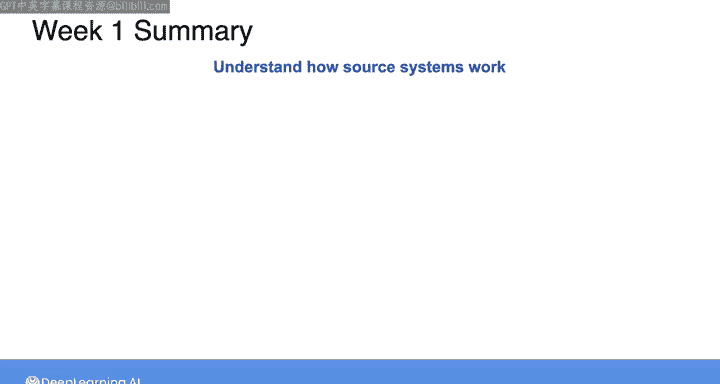
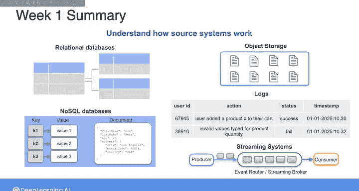
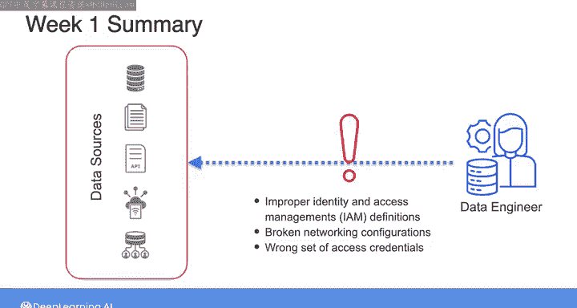

#  098：源系统、数据摄取与管道（第1周总结）📚



在本节课中，我们将回顾数据工程生命周期第一阶段的核心内容，即数据在源系统中的生成。我们将总结本周学习的关于常见源系统、连接方式以及相关挑战的知识。

---

## 🎯 第一周内容回顾

恭喜你顺利完成本课程第一周的学习。本周我们聚焦于数据工程生命周期的初始阶段，即数据在源系统中的生成。无论你是从头构建新的数据系统，还是更新维护现有的数据管道，理解源系统的工作原理都至关重要。

上一节我们介绍了课程的整体目标，本节中我们来具体回顾第一周的核心知识点。

## 🔍 常见源系统详解

本周我们首先深入探讨了几种常见的源系统。以下是几种主要的源系统类型：

*   **关系型与非关系型数据库**：例如 MySQL、PostgreSQL（关系型）和 MongoDB、Cassandra（非关系型）。它们是结构化或半结构化数据的主要来源。
*   **对象存储与文件日志**：例如 Amazon S3、Azure Blob Storage。常用于存储大量非结构化或半结构化数据，如日志文件、图片、视频。
*   **事件流处理系统**：例如 Apache Kafka、Amazon Kinesis。用于实时处理连续生成的事件流数据。

## 🔗 云端架构下的数据源连接

接着，我们研究了在基于云的架构中连接这些数据源的方法。网络配置是实现连接的基础，它确保了数据能够从源系统安全、可靠地传输到处理环节。

以下是连接时需要考虑的几个关键方面：

*   **网络连接**：通过虚拟私有云、对等连接等技术建立安全的数据通路。
*   **身份与访问管理**：其核心是确保安全，通过最小权限原则控制谁可以访问什么资源。一个基础的权限策略可以用代码描述为：
    ```json
    {
      "Effect": "Allow",
      "Action": "s3:GetObject",
      "Resource": "arn:aws:s3:::my-bucket/*",
      "Principal": {"AWS": "arn:aws:iam::123456789012:user/DataEngineer"}
    }
    ```
*   **全链路安全**：安全考虑必须贯穿从源系统到整个数据管道的每一个环节。

## ⚠️ 常见问题与排查

在本周的学习中，我重点指出了处理源系统时可能遇到的一些典型问题。例如，连接超时、数据格式不一致、权限认证失败等。你在实验环节也有机会动手排查其中部分常见故障，这有助于加深理解。

## 🚀 下周内容预告



第一周我们重点了解了数据的“源头”——源系统。在接下来的一周，我们将专注于从这些源系统**摄取数据**的不同方式。





我们将更深入地探讨**批量摄取**与**流式摄取**的细节与区别。同时，我们会梳理在设计数据摄取架构时应考虑的各种因素，例如数据量、延迟要求、成本和处理逻辑。

期待在下一周与你继续学习。

---

本节课中我们一起学习了数据工程生命周期的起点——源系统。我们回顾了关系型数据库、NoSQL数据库、对象存储和流系统等常见数据源，探讨了在云环境中安全连接它们的方法，并初步认识了可能遇到的挑战。这些知识为理解后续的数据摄取与处理流程奠定了坚实基础。