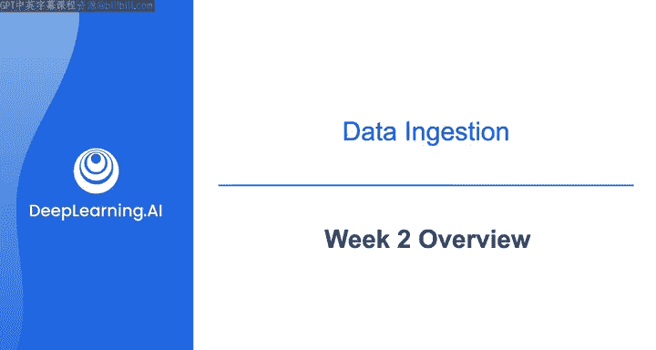
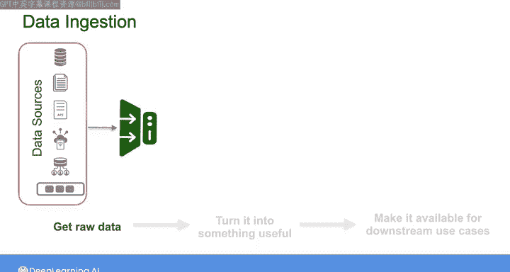
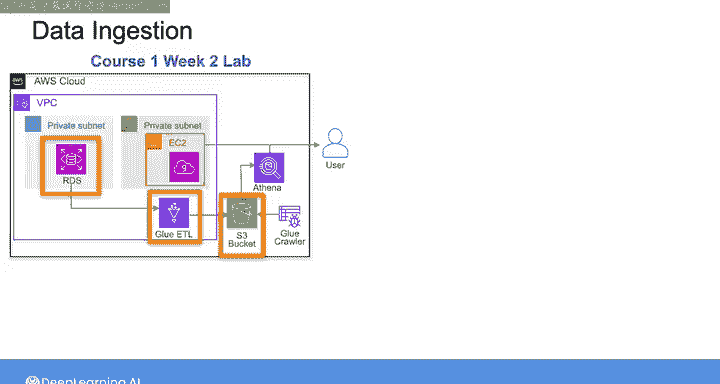
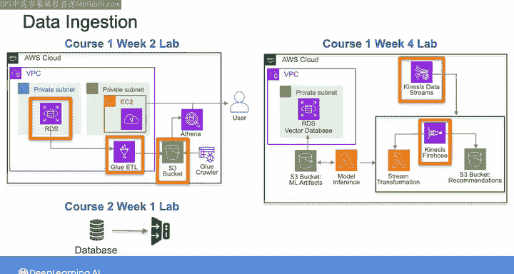
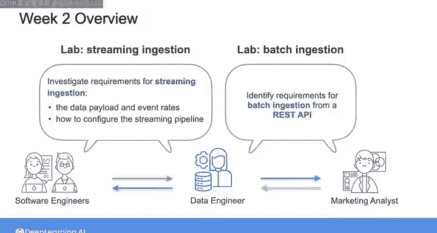

#  099：数据工程（导论，源系统、数据摄取和管道，数据存储和查询｜1-2-3课）｜第2周概览 🗺️

在本节课中，我们将要学习数据工程生命周期的下一个关键阶段：**数据摄取**。我们将回顾第一周关于源系统的知识，并深入了解如何从不同来源获取原始数据，为后续处理做好准备。

---

## 回顾与衔接

在第一周，我们详细探讨了**源系统**，并练习了如何与数据库和对象存储进行交互。上周材料的重点在于如何连接并与源系统互动，因为这些系统通常不是数据工程师直接设立或控制的。

然而，连接和与源系统交互，正是数据工程生命周期下一阶段——**数据摄取**——的开始。

---

## 数据摄取的核心任务

正如之前所说，数据工程师的工作是从某个地方获取数据，将其转化为有用的东西，然后使其可用于下游用例。数据摄取正是你工作中“**从某处获取原始数据**”的部分。

你已经知道，这个“某处”可能是一个数据库、一个API、一组文件，甚至是一个流式处理系统。事实上，在之前的课程实验中，你已经执行过多次数据摄取操作：
*   在前序课程中，你使用AWS Glue ETL作业将数据从Amazon RDS MySQL数据库摄取到S3存储。
*   你还从AWS Kinesis数据流摄取数据，并使用Kinesis Firehose将事件传送到S3存储桶。
*   在本课程第一周最后的实验中，你排查了连接数据库时的一些常见问题。

这一切都表明，你对数据摄取已经有很多了解。本周，我们将在你现有知识的基础上，增加**深度和细节**。

---

## 本周学习路径

以下是本周我们将要深入探讨的内容：

首先，我们将更详细地审视一些**批处理和流式摄取模式**。这意味着我们将区分以**块或批次**处理数据的模式，与处理**连续数据流**的模式。

接着，我们将与一位营销分析师进行对话，从中识别从**REST API**（一个我们目前尚未深入探讨的源系统）进行批处理摄取的需求。

然后，我们将与一位软件工程师交流，以探讨在前序课程中略过的流式摄取的一些要求。例如**数据负载的特征**（即你正在摄取的单个消息的特征）、**事件速率**，以及如何配置流式管道以将数据送达目的地。

最后，你将有机会在实验环节亲自构建这些解决方案，即：**从REST API进行批处理摄取**，以及**从Web服务器日志进行流式摄取**。

---

## 总结

本节课中，我们一起学习了第二周的概览。我们明确了数据摄取在数据工程生命周期中的核心地位，回顾了已有的实践经验，并预览了本周将深入学习的批处理与流式摄取模式、相关需求分析以及实践构建环节。

请跟随下一个视频，开始我们深入的学习之旅。