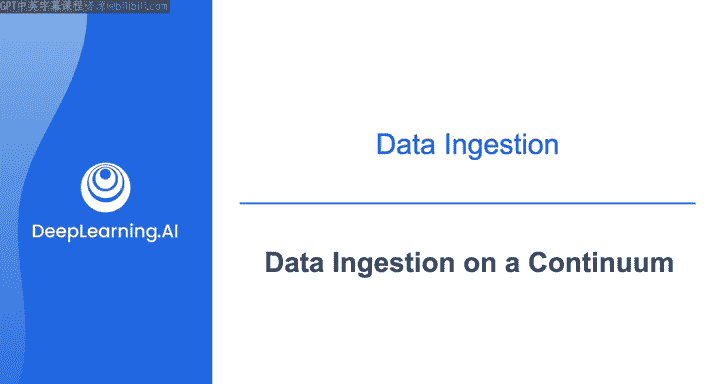
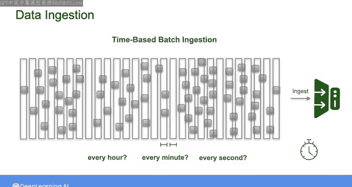
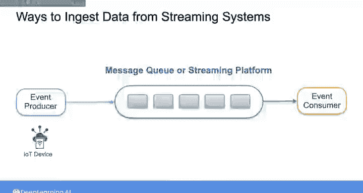
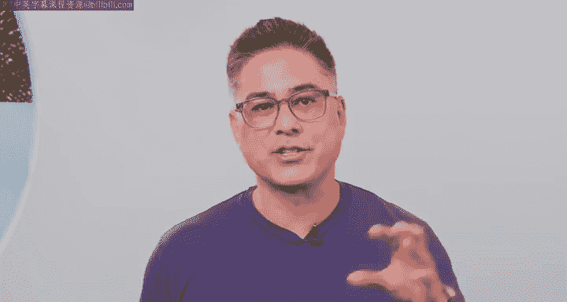

#  100：数据摄取的连续体 📊➡️💾

在本节课中，我们将要学习数据摄取的核心概念，特别是批处理与流处理之间的关系。我们将探讨如何根据不同的数据源和业务需求，在这两种处理方式构成的连续体中选择合适的点。

---

在之前的课程中，我们多次探讨了批处理与流处理之间的区别，这是数据工程师在工作中必然会遇到的。

从某种意义上说，几乎所有的数据都可以被视为一个连续的事件流。

这些事件可能发生在现实世界中，例如股价变动、你喜爱的体育赛事进球，或者用户在网站上点击按钮。在本课程中，我们关注的是当代码运行并记录这些事件时所产生的数字数据。

因此，在数据摄取方面，我的理解是：无论你使用何种系统，数据都是在某处作为一个**无界的连续事件流**生成的。所谓“无界”，是指这个流没有特定的开始或结束。

如果你在这些事件生成时，**逐个实时地**摄取它们，这就是**流式摄取**的一个例子。

相反，如果你对这个流施加一些**边界**，并将这些边界内的所有数据作为一个**单一单元**进行摄取，那么这就是**批处理摄取**。

当然，你可以用多种方式来决定如何为数据流施加边界。例如，你可以按**特定的大小阈值**（如分成10GB的块）来划分数据，或者按**记录总数**（如每生成1000个事件就摄取一次）来划分。更常见的是按**时间**来划分数据。例如，你可能决定摄取过去一周的所有销售订单数据，或者选择更频繁地（如每天）摄取数据。在这种情况下，你只是对初始数据流施加了不同的边界。

你可以继续这个思路：如果你想每小时、每分钟甚至每秒从源系统检索一次新数据，会发生什么？随着摄取频率的不断提高，在某个时刻，当批处理摄取的频率极高时，你实际上就回到了流式处理。

---

因此，这里的要点是：批处理和流处理并非两种完全独立的数据摄取方法。相反，它们存在于一个**连续体**上。你的数据管道在这个连续体上的位置，将取决于你所处理的源系统类型以及你最终要服务的业务用例。

传统意义上，批处理通常意味着将**有界的大块数据**作为一个整体进行移动和处理。在很长一段时间里，这几乎是唯一的选择。

随着工具和技术变得更强大、更灵活，对**更小的数据块**进行**更频繁的**批处理已成为可能。近几十年来，出现了所谓的**微批处理**工具，它们开始模糊批处理与流处理之间的界限。

对于什么算作批处理、微批处理，或者数据需要多接近实时处理才能被视为流处理，并没有严格的规则或行业标准。

在实践中，你选择以批处理还是流式方式摄取数据，将取决于从利益相关者需求中确定的**业务用例**，以及你所交互的**源系统类型**。

对于某些数据库，你可以使用像**JDBC**或**ODBC**这样的连接器（我们上周简要介绍过），也可以设置定期摄取，或者在记录了一定量的新数据时立即摄取。你还可以选择像**AWS Glue ETL**这样的无服务器摄取工具，它可以配置为连接到源数据库并定期摄取数据。

如果你要从**API**摄取数据（正如本周第一个实验要求的那样），你将需要根据该API的特定协议建立连接，并且会受到该API各种约束和限制的影响，例如一次可以摄取多少数据，或者可以多频繁地调用API。目前，通过API进行数据交换并没有统一的标准，因此这可能是一个有些令人沮丧的过程，涉及阅读文档、与外部数据所有者沟通以及编写和维护自己的自定义API连接代码。

尽管如此，我们正看到行业趋势是供应商提供**API客户端库**，以消除API访问的许多复杂性。同时，市面上也出现了越来越多的**托管数据连接平台**，它们为许多数据源提供了更简单的连接性。

因此，如果你需要从API摄取数据，我的建议是：**尽可能使用现有的解决方案**，只在没有其他选择时才进行自定义连接工作。

当**文件**作为源系统时（正如我们上周所看），你可能正在使用一个对象存储系统作为数据源。但你也可能遇到无法完全自动化文件摄取的情况，也就是说，你只需要手动下载文件或让人直接发送文件。

以下是常见的文件传输协议：
*   你可以使用命令行工具，如**SFTP**（安全文件传输协议）或**SCP**（安全复制）。
*   或者使用其他常见方式来摄取文件。

如果你想从流式系统摄取**物联网设备或传感器数据**，那么无论你最终目标是进行批处理还是流处理，你可能别无选择，只能设置一个**消息队列**或其他流式系统来摄取这类数据。

无论如何，我认为要熟悉不同摄取模式的各种考虑因素和注意事项，唯一的方法就是深入研究一些实际用例。我们本周的材料主要设置为两个案例研究：一个用于从API进行**批处理摄取**，另一个用于从Kinesis数据流进行**流式摄取**。

在本视频之后的阅读材料中，你将了解更多关于从本课程中已提及以及一些未提及的不同源系统进行摄取的知识。

---

本节课中，我们一起学习了数据摄取的连续体概念。我们了解到批处理和流处理并非截然分开，而是存在于一个频谱之上。选择哪种方式取决于数据源的特性和业务需求。我们还简要探讨了从数据库、API和文件等不同源系统摄取数据时的常见方法和工具。理解这个连续体，将帮助你在实际工作中为不同的场景设计最合适的数据摄取策略。