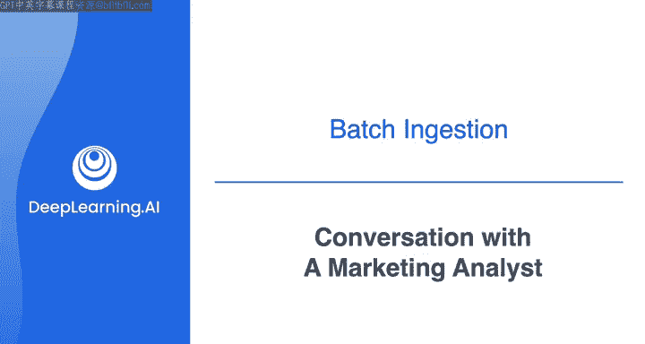

#  101：数据工程导论 - 与市场分析师的需求沟通 🎯

## 概述

在本节课中，我们将学习如何与市场分析师进行需求沟通，并基于对话内容，明确一个数据工程项目的数据需求。我们将重点关注从外部API（如Spotify）获取数据，以分析其与产品销售趋势的关联。

---

在专项课程的第一门课中，我们基于与不同利益相关者的对话进行了一些需求收集。

这些利益相关者包括数据科学家、首席数据官、产品营销经理以及一家虚构电商公司的软件工程师。

通过这些对话，你从首席数据官那里了解到，公司的目标是开拓新市场并提高现有客户的留存率。

你与这些利益相关者合作，为推荐系统搭建了一条数据管道。

这里，我们将基于这一系列对话，与一位负责寻找产品销量趋势洞察的市场分析师进行交流。

因此，在这个视频中，我将扮演数据工程师，我的朋友Colleen将扮演市场分析师。

让我们开始吧。

Colleen，你好，很高兴见到你。我也很高兴见到你。你好，我是Joe，新来的数据工程师，期待了解更多关于你正在做的工作。

是的，当然，我非常期待与你合作。

我正在做的工作是试图理解哪些外部因素可能是与客户购买习惯相关的信号。

在营销团队中，我们一直在集思广益，思考这些因素可能是什么，并且我们已经想出了一些希望进一步探索的想法。

听起来很酷。我想请你详细介绍一下。

好的。

我们当时在想，或许从广义上讲，一个人的情绪状态，比如更快乐或更悲伤、兴奋或放松，可能会影响他们在线购物的行为。

当然，我们无法确切知道我们的客户在任何一天的具体感受，但我们认为可以探索一些特定的想法。

我们特别希望研究在我们产品销售的不同地区，人们都在听什么类型的音乐，然后将这些数据与产品销量进行比较。

我明白了。

所以你在考虑从一些外部来源和关于人们收听信息中提取公共数据。

是的，没错。我一直在研究，看起来Spotify有一个公共API，我们可以从中提取关于不同地区哪些音乐艺术家正在流行以及人们随时间变化的收听趋势的数据。

这听起来像是你有可能帮助我们的事情吗？

当然可以。我是Niback的忠实粉丝，确实很喜欢音乐。

好的，那么我只需要更仔细地研究一下Spotify API。一旦我弄清楚细节，也许我们可以详细讨论一下你希望提取什么类型的信息，以及你希望如何获取这些信息。

好的，这听起来太棒了。在此期间，如果有任何我可以帮忙的地方，请告诉我。我期待在我们理清细节后与你进行更多交流。

太好了。谢谢。

---

好的，以上就是与市场分析师对话的一个例子。他们描述了一个项目的需求，该项目专注于从公共API提取数据，并希望将这些数据与产品销售数据一起进行分析。

现在我要承认，可能你也在想，研究地区趋势和人们听什么音乐，听起来可能不是一个特别高明的营销方法。你可能是对的。

但请相信我，在涉及不同利益相关者想要获取什么类型的数据时，我见过各种疯狂的事情。

所以，这里的重点不在于纠结这是否是一项值得投入的事业，而在于识别你需要构建的系统的关键需求。

在这种情况下，要确切知道构建整个项目数据管道的最佳方法是什么，当然需要更多信息。

但目前，我们将专注于数据摄取环节。你将在这里学到的关键点是，你需要从第三方API摄取数据。

你最终需要考虑其他细节，比如你将如何最终存储数据并提供给分析师使用。

这将取决于分析师的需求。

一般来说，当从API摄取数据时，你将考虑某种批处理摄取流程，但具体形式将取决于你对数据的目标用途。

在下一个视频中，我们将更仔细地看看流行的批数据处理范式——提取、转换、加载（ETL）与提取、加载、转换（ELT）之间的权衡，因为它们与你的数据摄取相关。

之后，我们将看看如何连接和调整来自REST API的数据。

我们下个视频见。

---

## 总结

本节课中，我们一起学习了如何通过与市场分析师对话来明确数据需求。我们了解到，项目需要从Spotify等外部API获取音乐趋势数据，并与内部销售数据关联分析。核心任务是构建数据摄取管道，并初步认识到后续需要根据分析需求考虑数据存储和提供方式。下一节我们将深入探讨数据处理的两种主要范式：ETL与ELT。