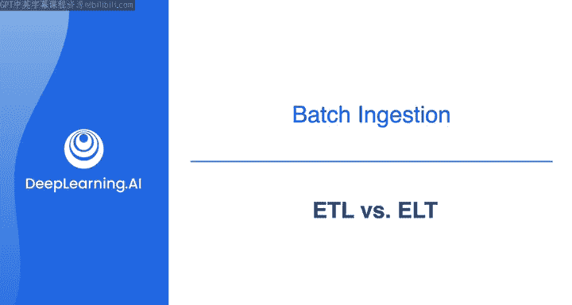
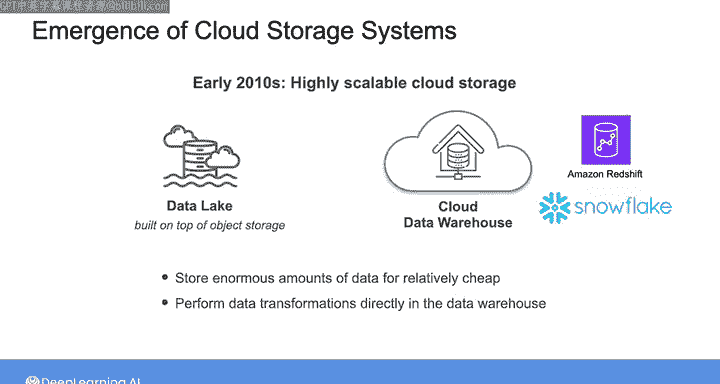
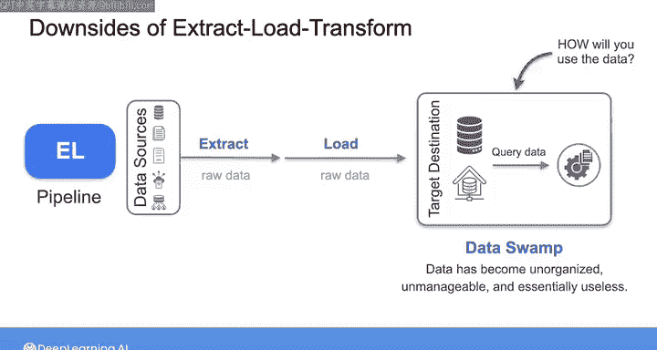
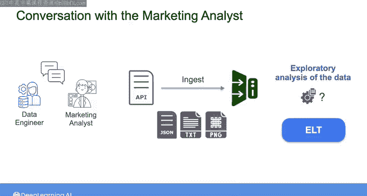

#  102：ETL vs ELT 🔄



在本节课中，我们将要学习两种非常重要的批处理数据摄取模式：ETL（提取、转换、加载）和ELT（提取、加载、转换）。我们将探讨它们的区别、各自的优缺点，并分析如何为一个具体的营销分析项目选择合适的模式。

上一节我们介绍了营销分析师的项目背景，本节中我们来看看如何为该项目选择数据摄取模式。

## 项目背景回顾

在之前的视频中，我们的营销分析师分享了他们的项目目标：将一些外部数据整合到他们对产品销售的分析中。对于这个项目，分析师主要关注数据的历史趋势，未来可能转向对当前数据进行更明确的分析，但并非实时或紧急需求。此外，数据将从第三方API获取。

虽然你通常可以灵活决定轮询数据的频率或数量，但你将受限于某种形式的批处理摄取。这是因为API调用的工作原理类似于网络请求，你发送数据请求并接收响应，而单位时间内可发出的请求数量通常是有限的。因此，对于这个项目的数据摄取，你面对的是一个批处理过程。

## ETL与ELT简介

在之前的课程中，我简要介绍了ETL和ELT。它们是两种非常常见的批处理摄取模式。虽然从技术上讲，它们包含了数据工程生命周期中的转换和存储阶段，但在实践中，你需要在摄取阶段就考虑这两种模式之间的权衡。这就是我们现在要做的。

首先，我将进一步说明区分这两种流程的关键点，然后我们将看看哪一种可能更适合营销分析师的使用场景。

### ETL：提取、转换、加载

ETL，即提取、转换、加载，是20世纪80年代和90年代流行起来的原始批处理摄取模式。

该流程始于从源系统（例如通过直接查询数据库或使用API）提取原始数据。然后，你在一个中间暂存区域对数据进行转换。最后，你将数据加载到目标存储目的地，如数据库或数据仓库。

在80年代和90年代，存储和计算能力极其有限。因此，制定一个明确的计划至关重要，包括你想要摄取哪些数据、以何种格式存储和访问数据等。数据仓库的建立成本高昂，且不适合运行包含复杂连接和转换的重型查询。因此，在那个年代，人们别无选择，必须在摄取过程中非常审慎地规划如何转换原始数据，以确保数据能够以高效的方式存储和提供。

**公式/代码表示：**
```
ETL流程：源系统 -> 提取 -> 转换 -> 加载 -> 目标数据仓库
```



如今，ETL作为一种摄取模式仍然非常流行。但随着云存储成本相对较低和计算能力的提升，它不再是唯一的选择。

### ELT：提取、加载、转换

在2010年代初期，云存储系统变得高度可扩展，我们看到了建立在S3等对象存储系统以及Redshift等云数据仓库之上的数据湖的出现。这使得以相对低廉的成本存储海量数据，并直接在数据仓库中执行所有数据转换成为可能。就在这时，ELT（提取、加载、转换）的概念应运而生。

在ELT流程中，你从源系统提取原始数据，并直接将其加载到目标数据库、数据仓库甚至对象存储中，而不执行任何转换。

ELT的核心理念是，你无需预先决定如何使用数据。这在某种程度上很有吸引力，因为可以说，通过对原始数据应用转换并仅存储处理结果（如ETL所做），在此过程中会丢失一些信息。但使用ELT，所有选项都保留着，因为你只是捕获所有数据并保存以备后用，然后你可以随心所欲地查询和转换原始数据，信息永远不会丢失。

## ETL与ELT的权衡

尽管这个范式听起来很吸引人，但说实话，当我第一次听说ELT的想法时，我认为这是一个糟糕的主意。我当时的想法是，为什么要在不深入思考如何使用数据的情况下，就把一堆原始数据堆在存储里？正如我在这些课程中一直强调的，任何数据工程项目的首要步骤都应该是牢固确立最终目标，然后才考虑如何构建系统来实现这些目标。

然而，随着时间的推移，我确实开始看到ELT的潜在好处。

以下是ELT的一些优势：

*   **实施更快**：因为它不需要提前详细规划如何转换数据。
*   **数据可用性更高**：可以更快地向用户提供数据（尽管是原始形式），因为ELT消除了对暂存服务器和中间数据转换的需求。
*   **转换效率高**：借助现代数据仓库的处理能力，数据加载到存储后，转换仍然可以高效完成。
*   **灵活性更强**：正如我之前所说，当你存储所有原始数据时，你可以在以后采用不同的转换方式或以不同的方式分析数据，这比一开始只存储转换后的数据更具可能性。

那么，ELT的缺点是什么？简而言之，如果你不小心，你的管道可能只会变成一个EL（提取-加载）管道，你将海量的原始数据提取并加载到存储中，却没有想好如何将其转换成有用的东西。当你不想花时间提前规划如何使用数据时，你最终可能会陷入通常所说的“数据沼泽”。

数据沼泽是指你的数据变得杂乱无章、难以管理且基本上无用的状况。我喜欢在谈到数据沼泽这个话题时展示这张图片：一个数据工程师坐在他的数据沼泽中，他保存了他认为将来可能有价值的一切东西，但现在，即使他能记住里面有什么，他很可能也找不到了。

在2010年代初期，数据沼泽很常见，因为公司发现可以保存字面上的每一份原始数据，以防万一。如今，这种情况已经得到了很大程度的清理，部分原因是法规要求公司以可审计或有序删除的方式存储数据，例如，当用户要求将其数据从公司系统中删除时。

尽管如此，当今相对较低的存储成本，结合现代数据仓库和其他存储抽象的强大处理能力，意味着ETL和ELT都可以是合理的批处理方法。

但无论采用哪种方法，重要的是心中要有一套清晰的目标，并相应地管理你的数据。




## 为营销分析项目选择模式

现在，让我们回想一下与营销分析师的对话。对于这个项目，你将从第三方API摄取数据。通常，通过API连接接收的数据将是半结构化数据，可能是JSON格式。在某些情况下，你可能还会检索非结构化数据，如文本和图像。

在这种情况下，营销分析师似乎旨在对数据进行一些探索性分析，无法预先确切说明可能需要哪些转换。因此，ELT管道可能是此摄取场景的正确选择，因为它为转换和服务阶段提供了更大的灵活性。


对于这个项目，我们尚未详细讨论的这个摄取用例的一个重要组成部分是关于从API摄取数据的部分。这就是我们下一步要探讨的内容。

## 总结

本节课中我们一起学习了ETL和ELT这两种核心的批处理数据摄取模式。我们了解了ETL作为传统模式的特点，以及ELT在现代云环境下的优势与潜在风险。最后，我们结合营销分析师的具体用例，分析了选择ELT模式的合理性，因为它能更好地支持探索性分析所需的灵活性。



在下一个视频中，请与我一起探讨如何将API作为数据源进行工作。