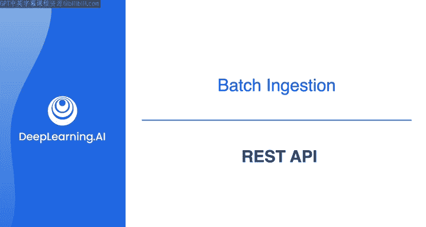
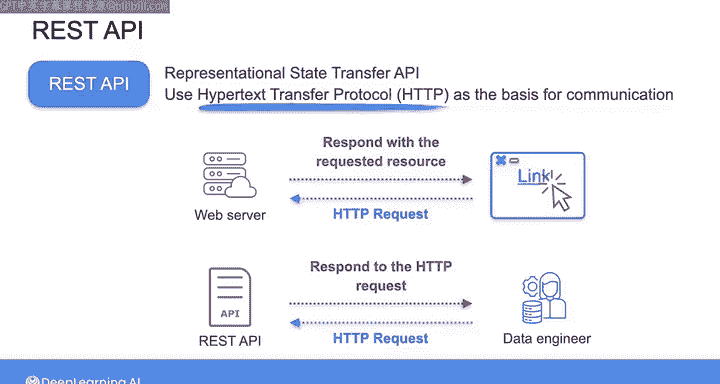

#  103：REST API 🚀

在本节课中，我们将要学习什么是API，特别是REST API，以及它们在现代数据工程中扮演的关键角色。我们将了解API如何促进系统间的数据交换，并为你后续实际连接和提取数据打下基础。

---

## 从“API指令”说起

上一节我们介绍了数据源系统，本节中我们来看看数据如何通过标准化的接口被获取。

在之前的课程中，我提到了所谓的“API指令”。这源自2002年杰夫·贝佐斯发给所有亚马逊员工的一封电子邮件。这封邮件的核心内容是：从今往后，所有团队都必须使用服务接口（即应用程序编程接口，或API）来进行通信、提供数据和功能。

这个指令旨在解决当时存在的问题：在那之前，亚马逊乃至其他所有组织的团队之间，都没有一个一致或稳定的方式来交换数据和服务，导致了效率低下。通过将API确立为不同团队之间稳定且可预测的服务接口，意味着任何单个团队都可以向其他团队提供数据、功能和通信，无论该团队自身的系统内部有多么复杂。

API指令的另一部分是，所有这些服务接口或API都必须从头开始构建，最终要能够对外部世界的开发者公开。这种向服务接口的重新定位，为后来成为亚马逊网络服务（AWS）奠定了基础，并为全球公司最终如何在内部和外部共享数据与服务指明了方向。

---

## 什么是API？ 🤔

那么，API究竟是什么？它本质上是一套规则和规范，允许你通过编程方式与应用程序进行通信和交换数据。这里的“编程方式通信”指的是通过运行代码进行通信。

如果你做过一些软件开发，可能对连接API很熟悉。但即使你没有亲自设置过API连接，你也无疑每天都在直接使用API，例如在线搜索或使用手机上的应用程序。这是因为如今，API被构建来实现各种软件应用的功能。

以下是API的一些常见应用场景：
*   社交媒体应用使用API从网络服务器获取并向最终用户显示数据。
*   API也用于促进电子商务网站和支付系统之间的交易。
*   许多公司提供面向公众的API，以便开发者可以访问他们的数据和服务，并将其集成到自己的应用程序中。

---

## 数据工程师与API 🔧

作为一名数据工程师，你将使用API来连接和提取来自各种源系统的数据，例如网络服务、云平台或第三方提供商。其方式是发送请求并以标准化格式接收响应。

API还可以提供元数据、文档、身份验证和错误处理功能，以方便数据提取。

---

## 最常见的API类型：REST API 🌐

最常见的API类型是所谓的REST API。REST代表**表征状态转移**。

REST API通常使用**超文本传输协议**（或者你可能更熟悉的叫法：HTTP方法）作为通信的基础。因此，你可以将与REST API的交互类比为浏览互联网时的行为。

当你在浏览器中点击一个链接时，你正在向服务器发送一个HTTP请求，以获取特定资源（如一个网页）。服务器则通过提供该资源来响应。

使用REST API时，你同样是在发送一个HTTP请求来获取特定资源，而API则根据你请求的内容来设置响应。

---

## 实践场景：连接Spotify API 🎵

在我们与营销团队的对话中，我们了解到他们希望分析存储在第三方平台（本例中是Spotify）上并通过API可用的数据。这是数据工程师经常会遇到的一个非常常见的场景：你需要从中提取数据的源系统，无论是内部系统还是外部第三方系统，都通过API进行访问。

在接下来的阅读材料中，我包含了一些在与API交互以从源系统摄取数据时你应该熟悉的技术细节。但熟悉其工作原理的最佳方式是亲自实践，而这正是你在下一个实验课中要做的。

因此，在阅读材料之后的视频中，我将带你了解这一切将如何运作。

---

## 总结

本节课中我们一起学习了API，特别是REST API的核心概念。我们了解到API是一套标准化的通信规则，它解决了系统间数据交换的混乱问题，是现代数据生态（如AWS）的基石。作为数据工程师，我们将频繁使用API从各种源系统（如Spotify）提取数据。REST API基于HTTP协议，其交互模式类似于浏览网页。掌握API是构建数据管道的关键第一步。