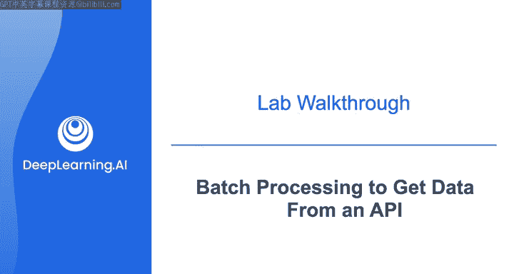
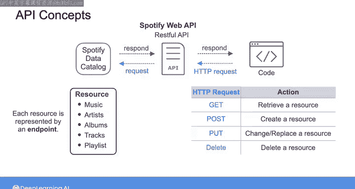
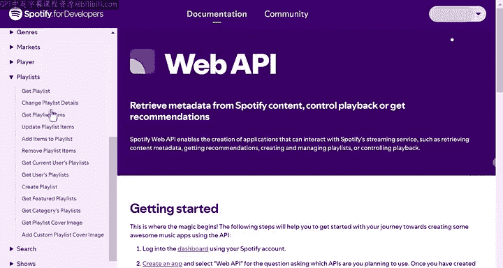
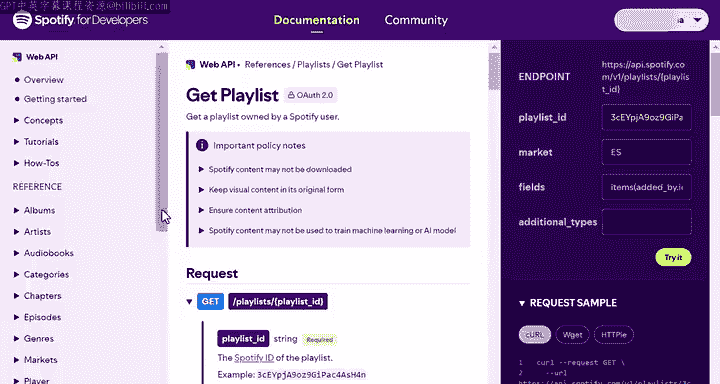
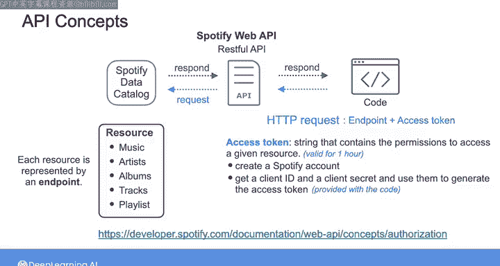
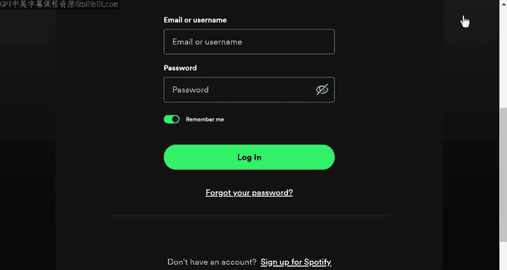
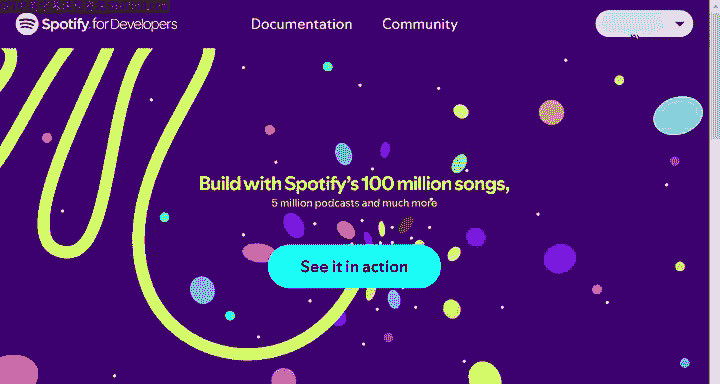
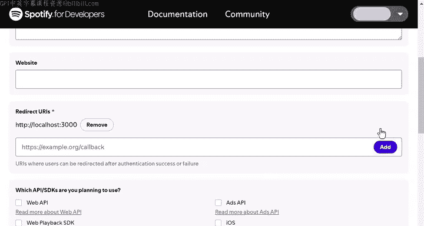
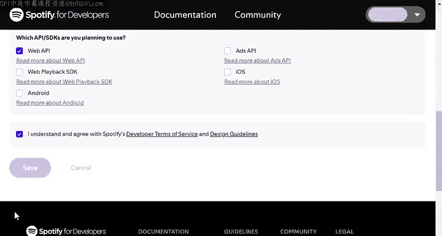
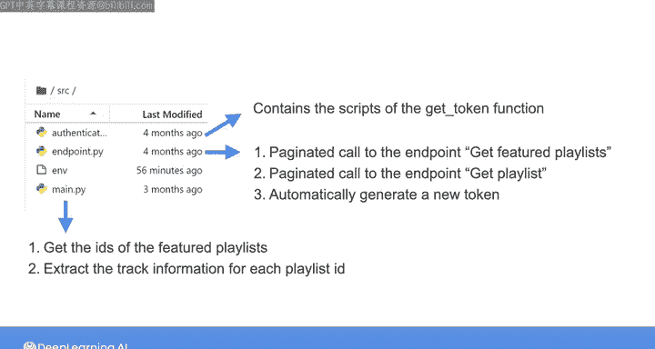

#  104：使用批处理从API获取数据 🎵



在本节课中，我们将学习如何与Spotify Web API进行交互，通过批处理方式获取数据。我们将探索分页的概念，并学习如何发送需要授权的API请求。课程将涵盖从创建账户、获取访问令牌，到实际执行API调用和实现分页数据提取的完整流程。

---

## API核心概念

上一节我们介绍了本实验的目标，本节中我们来看看与Spotify API交互所需理解的核心概念。

Spotify Web API是一个RESTful API。你可以向其发送请求，以直接从Spotify数据目录访问音乐、艺术家、专辑和曲目。

每个特定的数据项（如播放列表、艺术家或专辑）被称为一个**资源**。你可以通过向代表该资源的**端点**发送HTTP请求来访问它。

常见的HTTP请求类型包括：
*   **GET**：检索资源。
*   **POST**：创建资源。
*   **PUT**：更改和/或替换资源。
*   **DELETE**：删除资源。

例如，在Spotify的API文档中，点击“Playlist”部分，你可以看到所有可用于与此资源交互的请求。







一个成功的请求会返回一个**JSON格式**的响应，其中包含所请求资源的信息。如果请求不成功，则会返回一个包含**状态码**的错误对象，用于解释失败原因。

---

## 授权与访问令牌

当我们向Spotify Web API发出请求时，需要指定资源端点以及一个**访问令牌**。

访问令牌是一个字符串，包含用于访问特定资源的凭证和权限。要获取访问令牌，你需要先创建一个Spotify账户，并从账户中获取**客户端ID**和**客户端密钥**。这两个值将用于授权过程和访问令牌的生成。

访问令牌的有效期为**一小时**。过期后，你需要请求一个新的令牌。

以下是获取访问令牌的代码示例：
```python
def get_token(client_id, client_secret):
    # 此函数使用client_id和client_secret向Spotify授权服务器请求访问令牌
    # 返回一个包含访问令牌的响应字典
    pass
```

请注意，其他API的授权要求可能不同。建议在开始使用任何API前，先查阅其官方文档。



---

## 实验准备：创建Spotify应用



在开始与Spotify API交互之前，你需要创建一个账户以获取用于生成访问令牌的密钥。





以下是创建应用并获取凭证的步骤：
1.  访问Spotify开发者网站并登录你的账户。
2.  点击右上角账户名，进入“Dashboard”。
3.  点击“Create App”。
4.  填写应用名称、描述。
5.  在“Redirect URI”中，可以指定 `http://localhost:8888/callback`。
6.  选择“Web API”作为类型。
7.  点击“Save”。



应用创建后，进入应用设置页面，即可找到**客户端ID**和**客户端密钥**。你需要将这些值复制下来，在实验的Jupyter笔记本中，将它们粘贴到指定的环境变量文件中。

---

## 执行API请求

在Python中创建API调用，可以使用`requests`库。这是一个流行且易于使用的与API交互的库。

例如，要对Spotify API执行GET请求，可以调用`requests.get()`方法。你需要传入想要访问的资源的端点，并使用`headers`参数指定访问令牌。

以下是执行GET请求的代码结构：
```python
import requests

def get_auth_header(access_token):
    return {'Authorization': f'Bearer {access_token}'}

# 假设已获得访问令牌 `token_response`
headers = get_auth_header(token_response['access_token'])
endpoint = "https://api.spotify.com/v1/browse/featured-playlists"
response = requests.get(endpoint, headers=headers)
data = response.json() # 将响应转换为Python字典
```

在实验中，你会使用一个预先提供的函数来自动创建授权请求头。

---

## 理解响应与分页

让我们以获取“Featured Playlists”的端点为例，查看返回的响应。

响应是一个字典。对于“featured-playlists”请求，响应可能包含诸如`message`和`playlists`等键。`playlists`本身又是一个包含多个键的字典，例如：
*   `href`：指向该资源（包含当前查询参数）的端点链接。
*   `items`：包含实际播放列表详情的列表。
*   `limit`：本次返回的项目数量限制。
*   `offset`：本次返回项目的起始偏移量。
*   `total`：符合条件项目总数。
*   `next`：用于获取下一页结果的端点URL（如果存在）。

`offset`和`limit`参数用于实现**分页**。这允许你分批提取大量数据，而不是一次性获取所有项目。

例如，默认请求可能返回前20个播放列表（`offset=0, limit=20`）。`next`字段提供的URL则可用于获取下一批20个项目（`offset=20, limit=20`）。

---

## 实验任务概述

在实验的第一部分，你将完成一个函数，该函数对“featured-playlists”端点执行GET请求，并允许自定义`offset`和`limit`参数。

接下来，你将实现**分页逻辑**以提取完整的特色播放列表。有两种方法：
1.  手动递增`offset`参数进行新的API调用。
2.  使用当前API响应中`next`字段提供的端点。

你将完成两个分别对应这两种方法的函数。

在实验的第二部分，你将构建一个批处理摄取流程，用于提取特色播放列表中曲目的详细信息（如曲目名称、专辑、艺术家）。这需要执行两个分页API调用：
1.  获取特色播放列表的ID列表（使用第一部分的分页调用）。
2.  针对每个播放列表ID，使用`get playlist`端点获取其曲目信息。

你需要完成`authentication.py`中令牌刷新的部分代码，并完善`endpoints.py`中的两个分页调用函数。最后，在`main`函数中整合这些调用，构建完整的数据提取流程。

实验还包含一些可选部分，供你深入学习API调用。

---

## 总结与下一步

本节课中，我们一起学习了如何通过Spotify Web API进行批处理数据获取。我们涵盖了从账户创建、授权获取访问令牌，到使用`requests`库执行API调用、解析响应以及实现关键的分页技术。

完成本实验后，你将掌握与需要授权的RESTful API交互的基本技能，并理解如何构建一个简单的批处理数据摄取管道。



在开始实验前，请务必查阅Spotify API文档并创建你的账户。实验完成后，我们将在下一课中共同探索流式数据摄取模式。