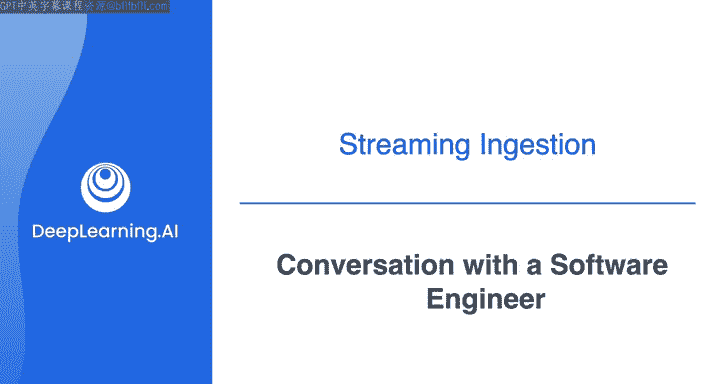

#  105：与软件工程师的对话 🗣️

在本节课中，我们将详细探讨流式数据摄取。我们将通过一个产品推荐系统的案例，了解如何与上游的软件工程师沟通，以确定数据摄取的细节，包括数据格式、消息速率和存储策略。

---

在之前的课程中，我们接触过一个产品推荐系统，但并未深入其流式数据摄取的设置细节。本节视频将通过一次模拟的利益相关者对话，与一位软件工程师讨论该推荐系统的数据摄取方案。之后，您将在下一个实验课中亲自构建这个系统。

让我们开始与软件工程师的后续对话。

**对话开始**

很高兴见到你，Colleen。
我也很高兴见到你，谢谢。

我正在着手建立一个新的产品推荐系统，希望能与你合作，更好地理解如何从网站接收实时用户活动数据。

当然可以。我们网站的系统是这样工作的：我们在Web服务器日志中持续记录事件。这些事件包括内部系统性能指标、生成的任何错误或其他异常，以及用户活动，例如用户浏览不同产品或结账购买时点击的按钮或链接。

好的。在理想情况下，我可能希望只摄取用户活动数据，而不包括内部系统指标。你认为是否有可能将用户活动相关的事件记录分离出来，并推送到一个独立的日志中供我摄取？

是的，我们当然可以做到。我能想到几种实现方式。如果我们把用户活动消息推送到一个Kafka主题或Kinesis流中，你就可以直接从那里将数据摄取到你的管道中。

太好了，这听起来是个好方案。我认为如果能推送到Kinesis数据流，对我来说会非常合适。我一直在探索如何使用Kinesis来处理管道的其他方面，所以目前看来这是个很好的选择。

我另一个问题是关于数据负载本身和预期的消息速率。你能详细告诉我单个消息的格式以及写入流中的消息速率吗？

好的。消息以JSON格式记录。你可以预期的负载是一个JSON对象，包含会话ID、所有客户信息（如地理位置）以及他们的浏览活动（例如查看了哪些产品或加入了购物车）。关于单个消息的大小，它们略有不同，但通常在几百字节左右。

消息速率方面，你可以预期它会变化很大，这取决于任何给定时间平台上有多少用户。可以想象，一个用户每分钟可能产生几个事件，而在高峰时段，我们平台上可能有多达约10，000名用户。因此，这可能转化为每秒多达约1，000个事件。

好的，那么我们来粗略估算一下。假设每秒有1，000个事件，每个事件大小几百字节。这大概是每秒不到1兆字节。这应该完全在Kinesis数据流的处理能力范围内，根据配置，它们每秒可以处理数百兆字节的数据。

没错。另外，我需要在我这边配置的是消息在流中保留多长时间。如你所知，这个流本质上是一个仅追加日志，但我们会设置成消息在一段时间后被移除。

当然。我们的想法是，我们将实时使用这些数据来生成推荐，同时也会保存推荐模型的输入和输出以供后续分析。因此，如果一切顺利，我们不需要从流中重新读取消息。但我想，如果出现问题，我们可能希望有能力回退并重新处理流中的数据。也许我们可以在消息最初写入后，在流中保留一天。

好的。那么，在繁忙的一天，我们可能像你说的那样，每秒向流中写入约1兆字节的数据。一天大约有100，000秒，所以流的总大小在最坏情况下可能增长到大约100吉字节。这似乎是合理的。

好的。你还有其他想了解的吗？或者我们可以直接开始构建这个系统了？

目前就这些了。我们开始构建吧。
好的。

**对话结束**

以上是一个与上游利益相关者（即源系统所有者）的对话示例。正如我在这些课程中多次强调的，在与系统所有者讨论时，除了理解数据本身和摄取机制（如本例），还应该讨论其他可能影响数据管道的事项，例如模式变更或系统中断。不过，目前我们只聚焦于理解数据和摄取机制。

在下一个视频中，我们将详细解析这次对话的细节，并更深入地探讨流式数据摄取。

---

**本节课总结**

本节课中，我们一起学习了如何与软件工程师沟通以确定流式数据摄取的细节。我们讨论了：
*   将用户活动数据从系统日志中分离并推送到消息队列（如Kinesis流）的可行性。
*   数据负载的格式（**JSON**）和大致大小（几百字节/消息）。
*   预期的消息速率（峰值约 **1000 events/sec**）及其对系统容量的影响。
*   数据在流中的保留策略（例如保留一天，估算最大数据量约 **100 GB**），以支持可能的回放需求。

这些信息是设计和构建一个健壮的流式数据管道的基础。