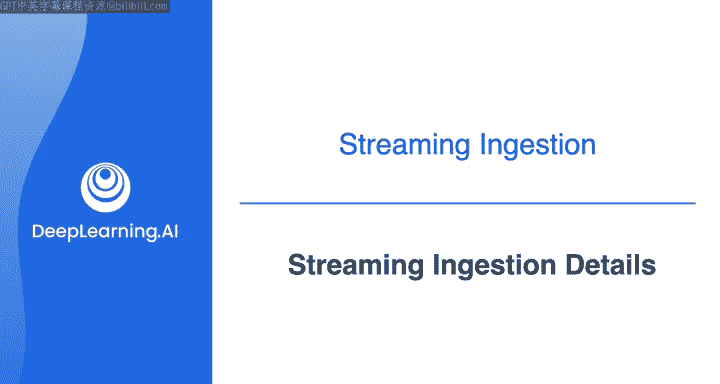
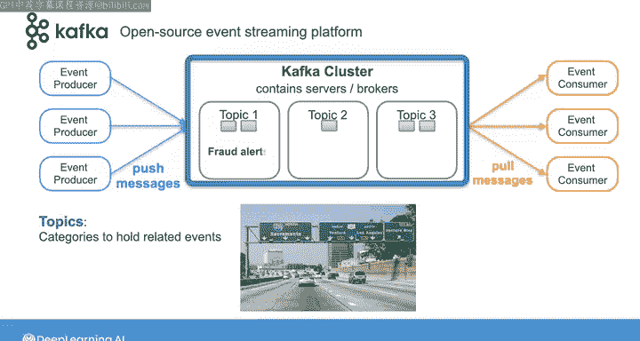
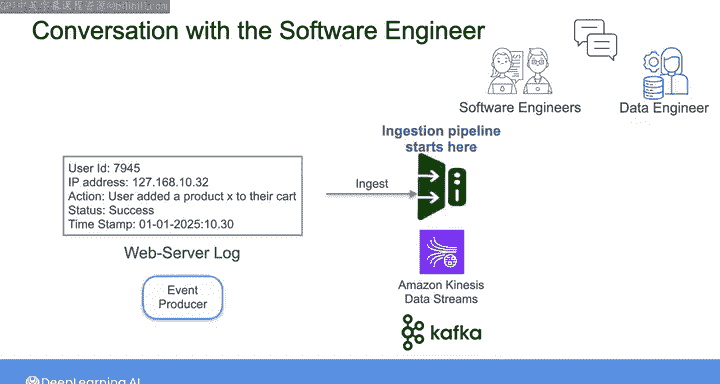

#  106：流摄取详解 🚀

在本节课中，我们将深入学习流式摄取系统的核心概念与工作原理。我们将重点探讨消息队列与事件流平台这两种主要模式，并以Apache Kafka为例，详细解析其架构和关键组件。最后，我们会将Kafka的概念与即将在实验中使用的Amazon Kinesis服务进行对比。

---

## 流式摄取系统概述

在本课程的第一周，我们从数据管道作为数据源消费者的角度，探讨了包括消息队列和事件流平台在内的流式系统。

根据你所使用的具体系统，实际的数据源可能仅仅是事件生产者，也可能是流式系统的多个元素。例如，多个生产者、代理和消费者都可能位于你摄取系统的上游。

在与软件工程师的讨论中，我们制定的计划是让工程师建立一个Kinesis数据流，而你将作为该流的消息消费者。

本节视频将更详细地讨论消息流的细节，之后你将进入实验环节。

---

## 流式摄取的两种主要模式

作为快速回顾，流式摄取主要有两种模式：事件流平台和消息队列。

**消息队列**本质上是一个缓冲区，用于以异步方式将消息从事件生产者传递到消费者。消息队列通常以**先进先出（FIFO）** 的原则运行。这意味着事件消费者总是先读取队列中最旧的消息。一旦消息被消费，它就会从队列中删除。

**事件流平台**则不同，它通过将消息以**追加日志**的方式持久化存储来运作。事件路由器将日志中的消息分发给订阅者，并且可以重放或重新处理日志中的任何消息。

在实验中，你将使用Amazon的Kinesis服务作为事件流平台。另一个广泛使用的平台是**Apache Kafka**。本节视频将以Kafka为例讲解一些细节，并在概念存在对应关系时与Kinesis进行类比。下一节视频中，Morgan将更详细地介绍Kinesis。因此，到本周结束时，你将能对这两种解决方案都有所了解。

---

## Apache Kafka 架构详解

Apache Kafka是一个开源的事件流平台。虽然流式平台有多种不同的类型和变体，但事件路由和存储的原理在各个平台间是相似的。

从高层次看，事件生产者通过网络将消息发送或推送到**Kafka集群**，该集群包含一台或多台服务器，也称为**代理**。然后，事件消费者从该Kafka集群读取或拉取消息。

让我们放大观察一下Kafka集群的内部结构。

### 主题与分区

在Kafka集群中，消息流被拆分并路由到称为**主题**的单元中。你可以将主题视为一个类别，用于保存一组相关事件；或者从另一个角度理解，它就像一条通往某处的道路。消息在主题中排队，类似于不同目的地的汽车在不同高速公路上排队。

一个主题可以包含任何类型的消息，例如欺诈警报、客户订单或物联网设备的温度读数。**生产者的职责是将消息发送到其对应的主题。**

每个主题有一个或多个**分区**。分区就是日志，包含有序、不可变的消息序列，你可以不断向其追加新消息。沿用“道路”的类比，分区就像是高速公路上的车道。更多的车道允许更多的汽车通过。因此，每个分区处理添加到主题中的一部分消息，这允许更高效的消息流。

同样，**生产者的职责是决定将每条消息发送到哪个分区**。这个决定可以基于轮询策略，或者通过基于消息键计算目标分区。

### Kinesis的对应概念

在Kinesis中，所有这些概念本质上是相同的。但Kinesis不使用“主题”，而是使用“流”；不使用“分区”，而是使用所谓的“分片”。

---

## 消费者与消息传递

在另一端，消费者被分组，每个**消费者组**订阅一个或多个主题。组内的消费者协同工作，消费给定主题所有分区中的消息。每个分区只能分配给组内的一个消费者，每个消费者消费来自不同分区子集的消息。

当生产者将消息发布到主题分区时，该消息会被传递给每个订阅的消费者组中的一个消费者。

一旦消息被发布到主题，Kafka集群会根据可配置的时间段保留该信息，无论消息是否已被消费。这允许消费者在需要时重放和重新处理消息。

---

## 实际应用场景

在我们与软件工程师的对话中，我们了解到网站上的用户操作被记录为Web服务器日志中的消息，这些消息将被路由到一个Kinesis数据流。同样，这些消息也可以被路由到一个Kafka主题，你可以通过订阅该主题来消费它们。

在不同的情况下，你可以设想这样一个场景：你拥有直接监控Web服务器日志以获取新消息的权限。那么，你可以将Web服务器日志视为事件生产者。从那里，事件可以作为你摄取管道的第一步，被摄取到Kafka主题或Kinesis流中。

你还可以通过一个称为**持续变更数据捕获（CDC）** 的过程来监控数据库活动。通过处理数据库日志，你可以将数据变更流式传输到你的数据管道中，以确保管道中的数据与源数据库的数据更新保持同步。

---

## 课程总结与预告

本节课中，我们一起学习了流式摄取的核心概念。我们区分了消息队列和事件流平台，并深入探讨了Apache Kafka的架构，包括主题、分区以及生产者与消费者的协作方式。我们还了解了这些概念如何对应到Amazon Kinesis服务中。

接下来，Morgan将带你详细了解**Amazon Kinesis Data Streams**，这是在即将到来的实验中你将使用的流式摄取工具。之后，我会回来为你快速讲解最后一个实验，然后你将开始构建自己的流式摄取解决方案。

