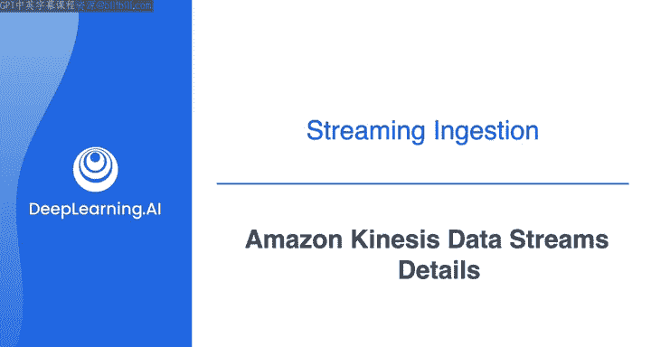
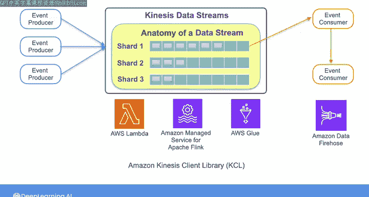

#  107：第29讲 - Amazon Kinesis Data Streams 详解 🚀

在本节课中，我们将学习 Amazon Kinesis Data Streams 的核心工作原理。我们将了解其基本架构、关键概念（如分片、分区键）以及两种容量管理模式。通过本教程，你将能够理解如何根据数据读写需求来规划和配置一个 Kinesis 数据流。

---

上一节我们介绍了 Apache Kafka 的基本概念。本节中，我们来看看 Amazon Kinesis Data Streams 是如何工作的。

与 Kafka 类似，Kinesis 数据流系统也包含事件生产者（将数据推送到流）和消费者（从流中读取数据）。在即将进行的实验中，你将把一个 Kinesis 数据流作为上游数据源。虽然实验本身不要求你创建流，但理解其内部机制对于设计完整的数据系统至关重要。接下来，我们将深入探讨当你需要管理包含生产者、消费者和流的整个系统时，需要了解的 Kinesis 细节。

### 流与分片：容量的基础单元

在 Kinesis Data Streams 中，生产者将数据推送到一个特定的**流**。一个流由多个**分片**组成，分片是流容量的基本单位。当需要扩展流以摄取更多数据时，你就需要为流添加更多分片。

要确定你的用例需要多少分片，或者何时需要增加分片数量，你需要了解管道中预期的写入和读取操作的大小与速率。**写入操作**指生产者向流写入数据，**读取操作**指下游消费者从流中读取数据。

以下是每个分片的容量限制：
*   **写入容量**：每个分片每秒最多支持写入 **1000 条记录**，最大总数据写入速率为 **1 MB/秒**。
*   **读取容量**：每个分片每秒最多支持 **5 次读取操作**，最大总数据读取速率为 **2 MB/秒**。

因此，为特定用例确定所需分片数量需要进行一些分析和计算，主要依据预期的读写操作大小和速率。

### 容量管理模式：按需与预置

有时很难精确估计读写操作的数量，例如在一个全新的应用程序中。或者，你可能唯一能确定的是应用程序的流量会随时间剧烈波动，比如在电子商务平台或其他面向公众的应用中。

对于这些情况，你可以使用 Kinesis 的**按需模式**。按需模式会根据需要自动管理分片的扩容或缩容，你只需为实际使用的资源付费。从运维角度看，这比另一种模式更为便捷。

另一种模式是**预置模式**。使用预置模式时，你需要根据预期的读写请求速率，为应用程序指定所需的分片数量。然后，由你在需要时手动添加更多分片或进行重新分片。如果你的应用程序流量可预测，或者希望更精细地控制成本，预置模式可能更适合你的工作。

### 数据记录与分区键

流中传输的每个数据记录都包含三个部分：**分区键**、**序列号**和**数据本身**（数据以二进制大对象的形式存储）。

在设置系统的数据生产者时，你需要选择一个**分区键**。分区键用于决定数据记录被放入哪个分片。Kinesis 本身会在每条记录写入时分配一个**序列号**，以维护分片内记录的顺序。

例如，假设你想创建一个来自电子商务平台的交易流。那么，你可能希望使用**客户ID**作为分区键。这样，单个客户的所有交易都可以存储在同一分片中，从而使得下游消费者更容易提取与单个客户相关的记录进行聚合和分析。

### 消费者与数据读取

生产者将数据放入分片，消费者则从分片读取数据。通常，一个分片会有多个消费者读取数据。

默认情况下，消费者共享一个分片的读取容量，这被称为**共享扇出**。这意味着消费者会竞争读取容量，这对某些用例可能是个问题。

为了避免遇到这种容量问题，你可以进行设置，使每个消费者都能以分片完整的 **2 MB/秒** 读取容量进行读取，这被称为**增强扇出**。

### 数据处理与集成

你可以使用托管服务来处理存储在 Kinesis 数据流中的数据，例如：
*   AWS Lambda
*   Amazon Managed Service for Apache Flink
*   AWS Glue

你也可以使用 **Amazon Kinesis Client Library** 编写自己的自定义消费者。

此外，你还可以进行设置，使一个流的输出成为另一个流的输入，从而构建更复杂的实时数据处理工作流。消费者也可以将数据发送到其他 AWS 服务，例如与 **Amazon Kinesis Data Firehose** 集成，将数据存储到 Amazon S3 中。

同样重要的是，Kinesis Data Streams 允许多个应用程序同时处理同一个流，每个应用程序独立消费数据，并将数据发送到下游的不同系统。

---

本节课中，我们一起学习了 Amazon Kinesis Data Streams 的核心机制。我们了解了流由分片构成，分片决定了读写容量；认识了按需和预置两种容量管理模式；掌握了分区键如何决定数据路由，以及消费者如何以不同模式读取数据。接下来，Joe 将带你详细了解即将进行的实验，然后你将亲自开始使用 Kinesis 进行流数据处理。祝你实验顺利，学有所获！