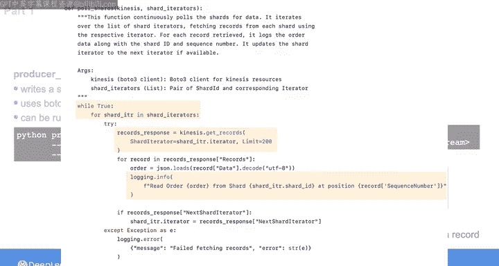
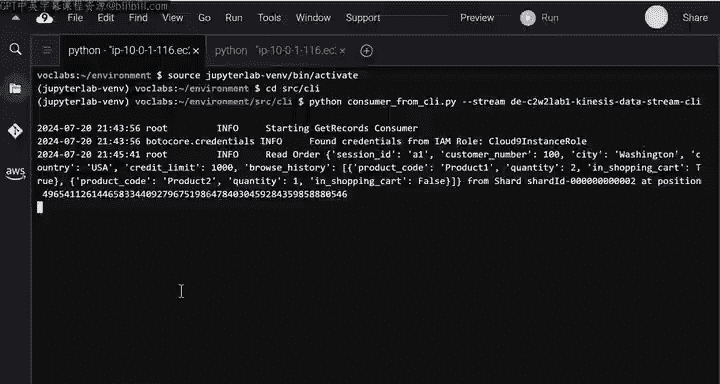
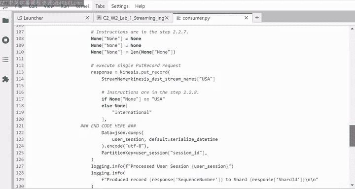
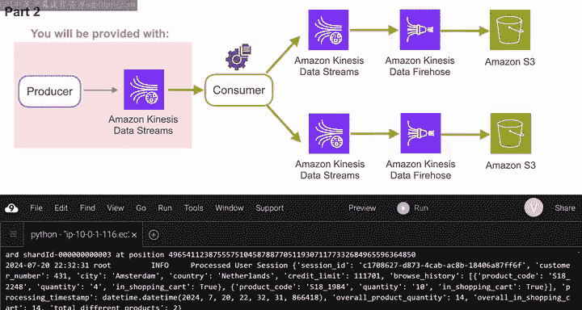

#  108：实验演练 - 流式数据摄取 📡

在本节课中，我们将学习如何构建一个流式数据处理管道。我们将使用 AWS Kinesis 数据流作为数据源，通过生产者脚本写入数据，并通过消费者脚本处理和转发数据。课程分为两部分：首先，我们将理解流式平台的基本组件；其次，我们将在一个电子商务场景中实现一个包含数据转换和路由的流式ETL管道。

---

## 第一部分：理解流式平台组件 🔧

上一节我们介绍了流式管道的概念，本节中我们来看看其核心组件如何协同工作。

首先，我们需要创建一个 Kinesis 数据流。它将作为一个简单的路由，连接生产者应用程序和消费者应用程序。

为此，我们提供了两个 Python 脚本：`consumer.py` 和 `producer.py`。

以下是脚本的核心功能：

*   **生产者脚本**：代表一个简单的生产者应用，向 Kinesis 数据流写入一条数据记录。记录是一个包含用户会话详情的 JSON 字符串，例如会话 ID、客户编号、城市、国家和浏览历史。该脚本使用 Boto3 库与 Kinesis 交互。
    *   代码示例：`put_record` 方法用于将记录写入数据流。
*   **消费者脚本**：代表一个简单的消费者应用。运行时，它会遍历数据流的所有分片，读取每个分片中的所有记录，并在终端打印每条记录的信息。该脚本同样使用 Boto3。
    *   代码示例：`get_records` 方法用于从分片获取记录。

在第一部分的实验中，你无需修改脚本，只需在创建 Kinesis 数据流后运行它们。

操作步骤如下：

1.  首先在终端运行消费者脚本。你需要先激活 Jupyter Lab 环境，然后导航到 `source/` 或 `src/` 目录，最后执行命令：`python consumer.py <你的Kinesis数据流名称>`。此时终端不会打印任何内容，因为数据流是空的。
2.  保持第一个终端运行，打开另一个终端运行生产者脚本。同样先激活环境并导航到目录，然后执行：`python producer.py <数据流名称> ‘<JSON记录字符串>’`。
3.  此时，检查运行消费者脚本的第一个终端，你将看到消费者已经读取并打印了你刚刚发送到数据流的记录信息。

---

## 第二部分：实现流式ETL管道 ⚙️

理解了基本组件后，现在我们将回到最初的电子商务场景，实现一个更复杂的流式处理管道。

在本部分，你将获得一个作为源系统的 Kinesis 数据流。你将站在消费者一侧，从流式源摄取数据。

你将实现一个流式 ETL 管道：首先对摄取的记录进行简单转换，然后根据条件将这些记录继续流式传输到下游。

具体来说，你需要设置两个 Kinesis 数据流：
*   将美国客户的记录发送到第一个数据流。
*   将国际客户的记录发送到第二个数据流。

这样做的业务假设是：公司注意到不同国家的客户表现出不同的购买行为，因此需要由不同的推荐引擎处理。

对于这两个目标数据流，数据将由 Kinesis Data Firehose 自动摄取并传送到各自的 S3 存储桶。

你需要完成以下任务：

1.  使用 Boto3 创建两个目标数据流、两个 Firehose 实例和两个 S3 存储桶。
2.  修改位于 `etl/` 文件夹下提供的消费者脚本中的转换代码。该脚本可从终端运行，需要指定源数据流名称和两个目标数据流名称。

脚本中的 `pull_shards` 函数已提供遍历分片并提取记录的代码。你的任务是在提取记录后，完成代码的转换部分。

转换需要为每条记录添加三个字段：

*   **`overall_product_quantity`**：浏览历史中所列产品数量的总和。
    *   公式：`sum(item['quantity'] for item in record['browse_history'])`
*   **`overall_in_shopping_cart`**：购物车中所列产品数量的总和。
    *   公式：`sum(item['quantity'] for item in record['browse_history'] if item['in_shopping_cart'])`
*   **`total_different_products`**：浏览历史中列出的不同产品的数量。
    *   公式：`len(set(item['product_id'] for item in record['browse_history']))`

完成转换后，你需要根据记录中 `country` 字段的值，将转换后的记录发送到对应的目标数据流。

完成脚本修改后，在终端运行它：
`python consumer.py <源数据流名称> <目标数据流1名称> <目标数据流2名称>`

运行此命令后，消费者脚本将从源数据流读取记录，进行转换，然后根据国家发送到相应的 Kinesis 数据流。Kinesis Firehose 实例将自动把数据传送到 S3 存储桶。

---

## 总结 🎯

本节课中我们一起学习了流式数据摄取的实践方法。我们首先通过一个简单的生产者-消费者模型，理解了 Kinesis 数据流作为路由核心组件的工作方式。随后，我们在一个模拟的电子商务场景中，实现了一个完整的流式ETL管道，包括数据转换、基于业务规则（国家）的数据路由，以及利用 Kinesis Data Firehose 将处理后的数据自动交付到存储层（S3）。这套流程展示了构建实时数据处理管道的基本模式和关键技术环节。

现在，你可以开始动手实验了。完成实验后，我们将回顾本周的学习内容。