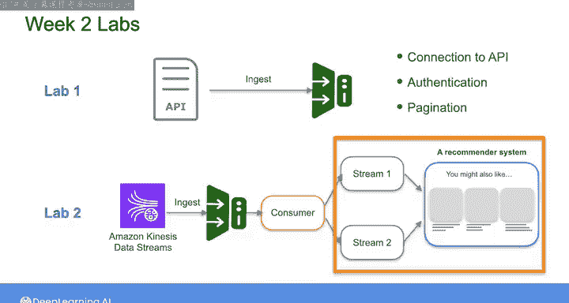

#  109：数据工程导论 第2周总结 📊

在本节课中，我们将回顾数据工程生命周期中“数据摄取”阶段的核心内容，重点关注批处理和流式处理两种模式，以及相关的工具与实践。

## 概述

本周我们探讨了数据工程生命周期中的数据摄取阶段，主要围绕批处理和流式处理两种模式展开。我们分析了适用于这两种摄取模式的工具，并完成了相应的实践练习。

## 批处理与流式处理：一个连续谱系

我们本周首先讨论的核心观点是：虽然批处理摄取和流式摄取常被视作两种不同的范式，但它们实际上存在于一个连续谱系中。

在这个谱系的一端，是低频次、相对大批量的数据摄取。而在另一端，是消息生成时即进行的实时流式摄取。在这两者之间，则存在着广泛的批处理和微批处理场景，以及不同的流式处理方法。

您为自身数据管道选择何种方法，应由利益相关者的真实需求和系统的具体要求决定。

## 批处理摄取：ETL 与 ELT

在专门讨论批处理摄取时，我们研究了 **ETL** 和 **ELT**，并探讨了如何根据系统需求权衡两者的优劣。

**ETL** 代表 **提取、转换、加载**。数据在加载到目标存储（如数据仓库）之前进行转换。
**ELT** 代表 **提取、加载、转换**。数据先被加载到目标存储，然后在该存储内部进行转换。

选择 ETL 还是 ELT，通常取决于目标系统的计算能力、数据量、转换复杂度以及对数据新鲜度的要求。

然而，您也看到，在流式管道中考虑进行“飞行中转换”同样重要。

## 实践练习概览

以下是本周完成的两个实践练习：

**练习一：批处理摄取**
您从公共 API 摄取数据，并练习了与 API 相关的特定概念，例如连接、身份验证和分页步骤。这些步骤适用于许多以 API 为数据源的摄取场景。

**练习二：流式摄取**
您为一个推荐系统设置了流式摄取。在该案例中，源系统是一个 Kinesis 数据流。您使用 Python 代码设置了一个消费者，对数据执行一些即时转换，然后将消息推送到两个独立的流中，以供下游的推荐模型消费。

通过这些练习以及期间讨论的概念，您深化并拓宽了对数据摄取的理解。

## 过渡与预告

上一节我们回顾了本周关于数据摄取的核心内容与实践。接下来，我们将展望下周的学习方向。

下周，我们将深入探讨数据工程生命周期中的一个重要底层主题：**DataOps**。

我们将更仔细地研究 DataOps 的一些关键概念，包括数据质量、自动化、监控和基础设施即代码。

## 总结

本节课中，我们一起学习了数据摄取阶段在批处理和流式处理模式下的不同特点与工具选择。我们理解了批处理与流式处理并非截然对立，而是一个连续谱系。我们探讨了 ETL 与 ELT 的权衡，并通过两个实验分别实践了从 API 进行批处理摄取以及为推荐系统设置流式管道。这些知识为您构建健壮的数据管道奠定了坚实基础。