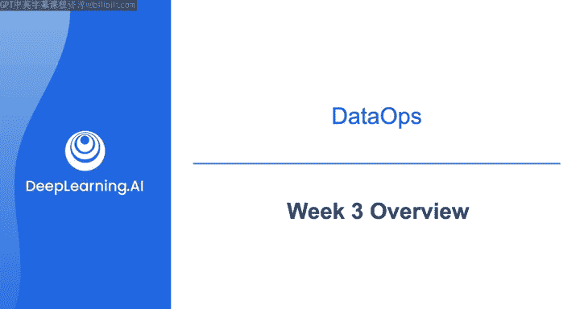
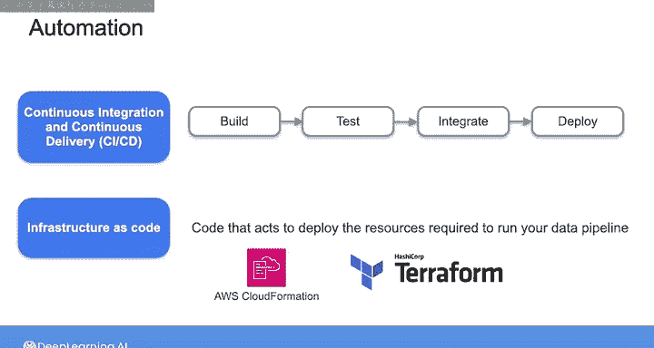
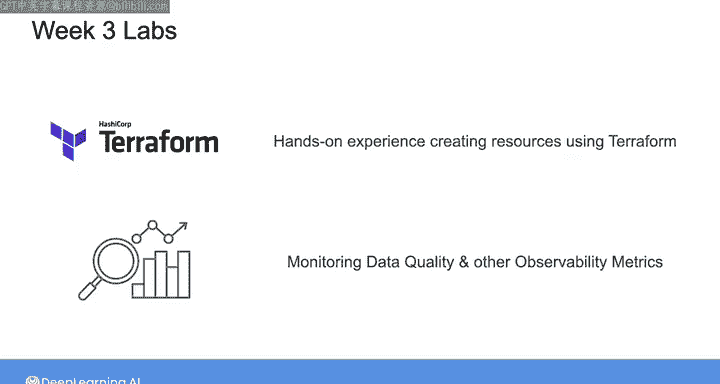
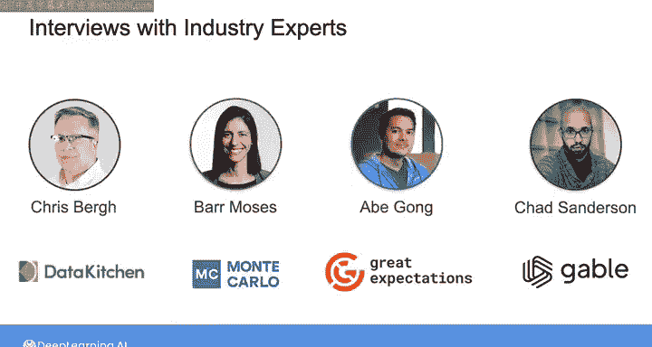
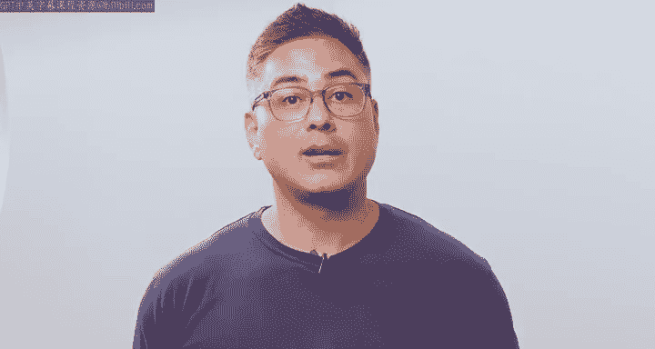

#  110：第3周概览 🚀

在本节课中，我们将学习数据工程中一个至关重要的概念：**DataOps**。我们将探讨DataOps的三大支柱——自动化、可观测性与监控，以及事件响应，并了解它们如何帮助构建健壮的数据系统和高质量的数据产品。

---

## 欢迎来到第3周

本周的主题是DataOps。实际上，它也包含了软件工程和数据管理的基础元素。正如你在之前的课程中学到的，DataOps是一套实践和文化习惯，其核心是构建健壮的数据系统并交付高质量的数据产品。

DataOps真正起源于DevOps。DevOps是一套允许软件工程师高效交付和维护高质量软件产品的实践和文化习惯。

---

## 本周学习重点

本周我们将深入探讨DataOps的三大支柱的细节，即**自动化**、**可观测性与监控**以及**事件响应**。

需要说明的是，我们将花更多时间学习**自动化**和**可观测性与监控**，而**事件响应**部分会相对简略。这并非因为事件响应不重要，而是因为它更偏向于DataOps的“文化习惯”层面，在在线课程中围绕它设计实践练习更具挑战性。

---

## 深入探讨自动化

上一节我们介绍了本周的总体框架，本节中我们来看看第一个支柱：**自动化**。

在自动化部分，我们将重温上一课程中涉及的一些概念，例如**持续集成和持续交付（CI/CD）**，然后聚焦于 **“基础设施即代码”** 的概念。

“基础设施即代码”指的是编写代码，当你运行它时，它会部署运行数据管道所需的资源。在本系列课程之前的实验中，你已经获得了一些使用AWS控制台为数据基础设施启动某些资源的经验。

然而，在实际的数据工程师工作中，通过基础设施即代码框架进行部署正成为常见做法，而不是手动启动实例和安装软件。

事实上，在你已经完成的许多实验中，你已经拥有了一些基础设施即代码的经验。我们使用了像 **CloudFormation** 和 **Terraform** 这样的基础设施即代码工具来设置实验环境，并在你的数据管道中部署各种资源。

在本周的第一个实验中，你将获得实际编写Terraform代码来部署基础设施的动手经验。在此之后的实验中，你将在你的基础设施之上进行构建，加入对数据质量和其他重要可观测性指标的监控。

---

## 行业专家访谈

本周另一个令人兴奋的安排，是一系列与DataOps领域行业专家的访谈。

在这些访谈中，你将听到来自实际为数据工程师构建相关产品的人士，分享关于数据质量和数据可观测性的关键见解。因此，这将是内容充实的一周。

---

## 课程材料与开场

为了开启本周的学习，我们首先将聆听我的好友Chris Burg的分享。他是 **《DataOps宣言》** 的合著者，也是流行数据可观测性和DataOps工具Data Kitchen的CEO。

接下来的视频是我与Chris的一次对话，你将听到他如何定义DataOps，以及为何他认为这一基础概念在构建数据产品时如此重要。

在此之后，我们将探讨DataOps的第一个支柱：**自动化**。

---

## 总结

本节课中，我们一起学习了第3周的概览。我们明确了本周的核心是**DataOps**，并介绍了其三大支柱：**自动化**、**可观测性与监控**以及**事件响应**。我们了解到自动化中的关键实践是**基础设施即代码**，并预告了本周包含的动手实验和行业专家访谈。接下来，我们将从Chris Burg的分享开始，深入DataOps的世界。