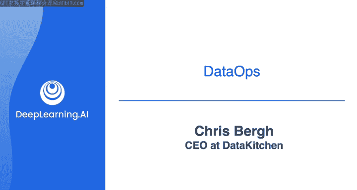

#  111：与Chris Bergh的对话 🎙️

## 概述

在本节课中，我们将与数据运维领域的专家Chris Bergh进行对话，探讨数据运维的核心概念、实践方法及其与DevOps的异同。我们将学习如何构建高效、高质量的数据交付系统，并了解如何避免数据工程师常见的职业倦怠问题。

---

你好Chris，很高兴能与你聊聊数据运维。我认为在这个领域，当提到数据运维这个词时，你是我最先想到的人，所以能与你交流真是太棒了。

当然。也许我应该为不了解你的人做一个简短的介绍。

我是Chris Bergh，在马萨诸塞州经营一家名为Data Kitchen的公司。我接受过工程师培训，曾在多家公司（如麻省理工学院林肯实验室、NASA和一些互联网初创公司）从事软件开发多年。后来在2005年，我萌生了一个好主意：我应该全职投入数据领域。于是我开始管理一个团队，团队成员包括我们现在所说的数据工程师、数据科学家和数据可视化专家。

我的生活一度变得很糟糕。系统总是出问题，我们永远无法满足客户的速度要求。我解雇了一些本不该解雇的人，将问题归咎于他人，而实际上这更多是我如何管理团队的管理问题。因此，在过去的近20年里，我一直在研究一个问题：如何让一个由技术人员组成的数据团队能够快速交付成果，快速提供新的洞察？如何以极高的质量交付数据和仪表板？以及如何过上不那么痛苦的生活？

我认为你开设数据工程课程很棒。我们两年前与Data.world合作，对700名数据工程师进行了一项调查，结果显示大约78%的人希望他们的工作能配备一名心理治疗师。也许我有点愤世嫉俗，但我觉得这个比例可能还偏低了。数据工程是一个充满挑战的职业，夹在疯狂的客户需求与难以驾驭的数据和基础设施之间，处境艰难。我正是从这样的背景出发，提出了数据运维的理念。

## 什么是数据运维？🤔

对于学习者来说，什么是数据运维？你会如何描述它？

可以把它看作一种方法，让你自己或你的团队能够向客户交付他们可以信赖的数据和洞察，并且能够以极低的风险、非常快速地更改这些洞察。其核心理念是：你能否建立一个“工厂”，持续产出完美的新数据集和新洞察，并能够随心所欲地快速调整这个“工厂”。

这听起来像是借鉴了精益思想。

是的。当我开始从事数据和分析工作时，有一件事让我感到惊讶。我原本是软件背景出身，当时觉得“数据这东西应该很简单”。但实际上，在很多方面，你就像在运营一条生产线。你可以把数据集的流入、存入数据库的多个层级、被模型和可视化使用、再到治理的每一步，都看作一个制造工位。而且你通常不止一条这样的“生产线”。

问题在于，如何让这条生产线产出“丰田汽车”，而不是70年代的“AMC Pacers”那种老式汽车。这是一个难题，在我的软件背景中并未涉及——即如何运营一条生产线。另一个奇怪的部分是，人们总是会向你提出新的需求，你的工作永无止境。向客户交付新洞察的最佳方式是：先完成80%，获取一些反馈，然后迭代改进。与其花几个月构建一个东西，不如尽早获得反馈。

这两件事是截然相反的：既要构建一条真正优秀的装配线，又要能非常快速地更换这条装配线。这很难做到。

但如果回顾像丰田这样的公司，他们能够在几天内（而不是传统大规模制造方式的几个月）完成生产线的更换。他们是如何做到的？并不是靠购买昂贵的机器人（虽然他们确实有机器人），关键在于他们如何思考自己的工作以及优化哪些方面。

许多团队试图优化“完成任务”本身，比如“我必须完成我的工作”。而“完成”的定义很有趣：“我完成了我的工作，我写好了SQL，我完成了。”但有人使用它重要吗？它下周会出问题吗？我不知道，反正我的工作完成了。归根结底，丰田也关注客户，关注如何让客户成功。不幸的是，许多数据和分析团队并不快乐，客户也对数据和分析团队不满意。

一个不为人知的小秘密是：大多数数据和分析项目都失败了。在我看来，这不是因为我们没有酷炫的技术，也不是因为人们不够聪明，而是因为人们工作的系统存在缺陷。因此，来自软件和制造业的这些原则，我认为非常适用。它们并非高深莫测，只是一些现成的、你可以拾起并使用的理念。

## 如何在实际工作中应用数据运维？💡

那么，如果有人刚接触数据领域，他们应该如何在自己的工作中思考这个问题？

我认为，思考你正在做的事情（比如我在写一些SQL），然后思考围绕这件事的相关事项。首先，当我写SQL时，我如何构建测试或验证来证明它是有效的？当我获得新数据时，我如何知道它没问题？

你为什么要这么做？因为测试是你送给未来自己的一份礼物。如果你不这样做，最终你将永远负责维护你的代码。如果出了问题，他们可能会在你度假时打电话找你，或者你不得不负责越来越多的代码。

当你刚开始时，很容易想成为英雄。“我是个英雄，我写了所有这些代码，我不断写，我对客户响应非常快。”你会进入完全的“英雄模式”。但随着时间的推移，你会精疲力尽，变得不快乐，想要一位心理治疗师。因此，数据运维的一个教训是：也许只有2-3%的时间可以当英雄，其余时间应该构建一个系统，这样你就不必成为英雄。这就是数据运维的意义：围绕你的代码构建一个系统——测试、可观测性、部署，这些都是围绕你编写的那一小段“柔软”代码的环境，它们能让你的生活变得可控。

## 数据运维宣言的灵感来源 📜

接下来，我们来谈谈数据运维宣言，是什么启发了它？

大约七八年前，我们去参加一个会议，没人知道我们在说什么。我解释了数据运维，他们问“那是什么？”。我当时想，天哪，这太糟了，没人真正理解我们在说什么。于是，我在飞机上写下了宣言的第一个版本，发给一些人征求意见，写了维基百科词条。多年来，我们写了很多东西来解释数据运维是什么。我们在网站上提供免费认证（你可以听我讲三个小时），但核心就是这个理念：构建工作系统非常重要，是为你的团队解决几个问题。

例如，看看这个问题：你团队新招了一个23岁的年轻人，他刚接触数据工程，可能拥有计算机科学学位。你希望这个人在头两周做什么？一个好的组织会说：第一，如果出了问题，他应该能够找到问题的根源——是数据问题、集成数据问题、模型问题还是可视化问题？第二，他能否进行一些小的修改？比如修复一个错误，并快速将其部署到生产环境。

在许多数据工程团队中，这些事情非常困难，你必须学习很多东西，几乎像学徒一样。因此，我认为数据运维要解决两个“23岁问题”：这个23岁的新人能多快找到问题？他能多快修复问题并以低风险将其部署到生产环境？可能还有一个“46岁问题”：你如何衡量你的团队？对我来说，数据运维就是关于这组问题，它们实际上与数据工程本身关系不大，而是关于如何管理一群协同工作的数据工程师。这就是我的出发点。当然，这其中也涉及很多工程任务，比如编写良好的数据质量验证测试很重要，部署速度很重要，做DevOps、管理环境、测试数据等都很重要。

## 数据运维与DevOps有何不同？⚖️

学习者肯定会有一个问题：数据运维与DevOps有何不同？

我认为，在很多方面，它们是相同的理念。都是关于如何让一群技术“极客”能够快速、高质量地交付成果。当然，两种方式都可能做得很糟糕。DevOps的理念是，你应该以小批量交付工作，不要花几个月时间做一件事。因为如果你那样做，很可能会错过客户的真实需求。

因此，DevOps和数据运维之间的主要相似点是：如果你的客户要求10件事，需要你花三个月，那么你应该在一周内交付其中一件。不要等到10件事都做完，因为很可能发生的情况是：他们只想要其中的4件，不想要另外6件，然后他们会说“不，我还想要另外3件”。这样你就产生了浪费——做了很多无关紧要的工作。

所以，我认为DevOps的理念是如何管理短周期的交付以及如何将其自动化。我认为其中也包含可观测性、减少生产环境错误等。但对于数据，无论你用什么词（数据运维或其他），核心理念是一样的：以低错误率运行，快速更改，并衡量你的工作。它们是非常相似的理念。所以，无论你称之为精益、全面质量管理、DevOps还是数据运维，它们都是同一回事：如何让“极客”们高效工作。而要做到这一点，你实际上需要做一些具体的事情，不仅仅是空谈，你需要构建一些东西，需要在你环境旁边构建“那条生产线”，需要构建“制造机器的机器”。

## 给学习者的建议与总结 🎯

非常感谢，这次对话非常有教育意义。最后，关于数据运维，你有什么希望自己早点知道的事情可以告诉年轻的自己，或者特别想告诉本课程的学习者吗？

我想说的是希望和英雄主义。第一点就像我之前说的，不要当英雄，这对你自己没有任何好处。第二点是，不要指望事情会自动运转良好。这听起来可能有点偏执，但不要信任你的数据提供者，不要信任你的服务器。要去测量和证明事情是有效的。因为在我的职业生涯中，我在这两方面都遇到过太多问题——要么指望事情能成，要么试图成为英雄。你可以围绕这些构建系统，这样你就可以保留一点希望，保留一点英雄主义，但最好是构建一个能够做到这些的高效组织。如果你做到了，你的生活将会好得多。你不会想陷入我们调查中80%的人那种境地，觉得“我的工作糟透了，我需要心理治疗师，压力太大了”。

太棒了，非常感谢你抽出时间，Chris。这对学习者会非常有帮助，谢谢你。

---

## 总结

在本节课中，我们一起学习了数据运维的核心思想。我们了解到，数据运维是一种旨在帮助数据团队快速、可靠地交付高质量数据洞察的方法论。它强调构建系统化的“生产线”，而非依赖个人英雄主义。关键要点包括：为代码编写测试和验证、实现快速且低风险的部署、培养可观测性，以及以短周期迭代的方式工作以获取早期反馈。我们还探讨了数据运维与DevOps在理念上的高度相似性，它们都源于精益思想，关注流程优化和客户成功。最后，Chris Bergh给出了宝贵的建议：避免陷入“英雄模式”，并通过构建系统和持续验证来建立可靠的工作流程，从而提升工作效率与职业幸福感。