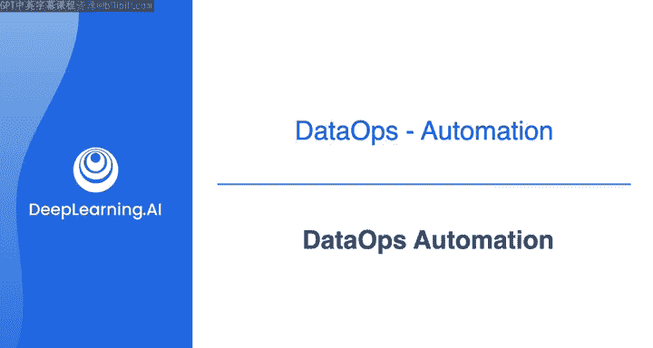
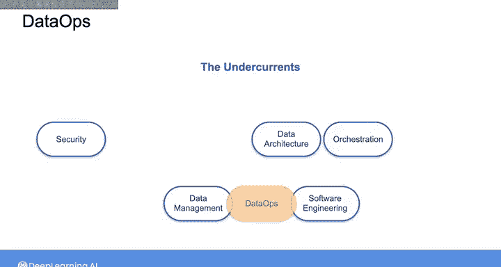

#  112：DataOps自动化 🚀

在本节课中，我们将学习DataOps的自动化支柱。我们将探讨DataOps如何借鉴DevOps的自动化实践，包括持续集成与持续交付、版本控制以及基础设施即代码等核心概念。这些实践对于构建高效、可靠的数据管道至关重要。

---

在上一节中，我们介绍了DataOps的起源及其与DevOps的关系。本节中，我们来看看DataOps在自动化方面的具体实践。

自动化在软件工程中的一个关键方面是**持续集成与持续交付**，简称**CI/CD**。在软件开发的语境下，CI/CD流程涉及建立系统，以自动审查和测试新代码，然后自动交付或部署经过审查和测试的生产代码。

对于DataOps，CI/CD实践可以直接应用于数据管道中的**代码和数据**。无论是用于应用特定数据转换的代码、填充数据库的代码，还是数据本身，你都可以像维护任何其他软件应用代码一样维护它们。

以下是CI/CD在DataOps中的主要应用点：
*   **代码自动化**：数据转换逻辑、管道配置等代码的自动化测试与部署。
*   **数据自动化**：数据质量检查、数据验证流程的自动化执行。
*   **管道运行**：数据管道执行流程的自动化编排。

关于实际运行数据管道的自动化，正如我在之前的课程中提到的，有多种实现方式。例如，完全不使用自动化，手动运行数据管道中的所有流程；或者根据特定时间表设置管道各阶段的运行；你还可以使用像Airflow这样的编排工具，将管道定义为**有向无环图**来进行编排。我们将在下周深入探讨DAG以及测试和部署的自动化。

现在，无论是软件产品还是数据产品，任何CI/CD系统的一个关键基础是**版本控制**。在版本控制中，代码的每个新版本都会被记录。这使得如果当前版本因某些原因无法按预期工作或出现其他问题时，可以轻松回滚到以前的版本。

你可能已经在自己代码的语境中熟悉了版本控制，或许正在使用像GitHub这样的平台。在DataOps中，**版本控制的概念同样适用于数据**。就像你可以跟踪代码中的更改并回滚到以前的版本一样，通过DataOps，你可以跟踪数据在管道中的变化，并在遇到问题时能够回滚到以前版本的数据。

DataOps在自动化方面从DevOps借鉴的另一个概念是**基础设施即代码**。无论你是使用云平台资源构建软件应用程序还是数据管道，都可以将基础设施的设计作为代码库来维护，就像对待任何其他应用程序代码一样。

你可以运行该代码来部署你的基础设施，或者修改代码以重新定义你的基础设施，然后再次运行它以部署更新后的基础设施。通过使用代码以编程方式定义基础设施，你就可以像对待任何其他代码或数据一样，对整个基础设施进行**版本控制**。这样，如果你需要回滚到以前版本的基础设施，就像回滚到以前版本的代码一样简单。

因此，DataOps自动化实践将以多种方式成为你作为数据工程师工作的一部分。你可以开始看到DataOps如何开始与数据工程生命周期的其他基础领域重叠。

例如，DataOps与软件工程密切相关，因为许多DataOps实践直接借鉴自DevOps。当涉及到对数据维护版本控制的DataOps实践时，这直接与**数据管理**这一基础领域相关联，因为它允许你在数据的整个生命周期中交付、控制和增强数据的价值。

接下来，我想在DataOps自动化的语境下更深入地探讨**基础设施即代码**。然后在下一个实验中，你将有机会练习编写代码来定义自己的基础设施。

---

本节课中，我们一起学习了DataOps自动化的核心支柱。我们了解了CI/CD流程如何应用于数据和代码，版本控制对于维护数据完整性的重要性，以及基础设施即代码如何实现可重复且可靠的基础设施部署。这些实践共同构成了现代、自动化数据工程工作流的基础。在下一节课中，我们将更详细地探讨基础设施即代码。