#  113：基础设施即代码 🏗️

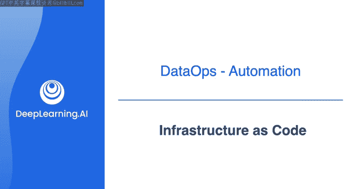

在本节课中，我们将要学习**基础设施即代码**的概念、工具及其在云数据管道中的应用。我们将了解如何使用代码来定义、部署和管理云基础设施，并重点介绍Terraform这一流行工具。

## 概述

上一节我们介绍了云数据管道的整体架构。本节中，我们来看看如何利用**基础设施即代码**来自动化创建和管理这些架构所需的资源。

正如前一个视频所提到的，你可以使用基础设施即代码，以编程方式定义、部署和维护你的云基础设施。这意味着你可以自动化创建云数据管道所需的所有资源，包括网络、安全、计算、存储以及其他数据管理和分析资源。

但基础设施即代码的概念实际上早于云计算，其更古老的根源可追溯到20世纪70年代的配置管理。即使在那个时候，工程师们也在努力高效地配置和管理一系列物理机，他们会编写Bash脚本来自动化一些配置任务。回顾过去，你可以将其视为基础设施即代码的原始雏形。

随着AWS在2006年发布EC2，任何人都可以随时轻松启动云计算资源。因此，工程师能够构建具有许多组件和复杂依赖关系的、更具可扩展性的应用程序。

在2010年代初期，软件工程师开发了诸如Terraform、CloudFormation和Ansible等基础设施即代码工具，使他们能够使用基于代码的配置文件来配置和部署基础设施。

如今，你可以使用这些工具，通过几行代码轻松管理云上的基础设施资源，而无需手动点击资源设置窗口或编写繁琐的批处理/Bash脚本。

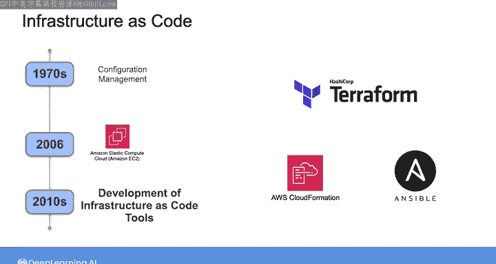

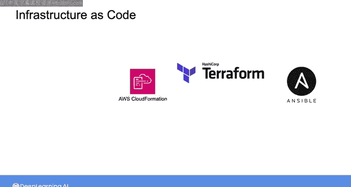

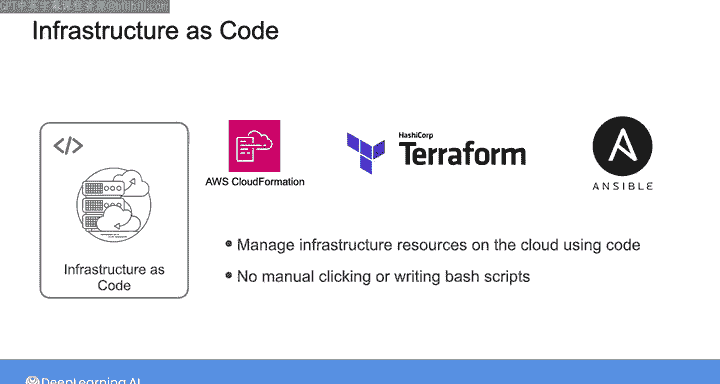

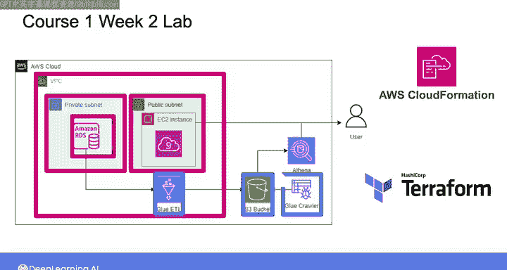

事实上，你在之前的一些实验课中已经实践使用了基础设施即代码工具。例如，在上一门课程的第一次实验中，你看到了正在构建的数据管道的架构图。在幕后，我们使用CloudFormation自动创建并配置了该实验所需的所有必要网络资源，包括VPC、子网和RDS数据库。然后，你还运行了一些Terraform脚本来部署该基础设施的其他部分，包括Glue ETL作业、S3存储桶和Glue爬虫。

在本周的材料中，我将主要关注Terraform，因为这将是你在后续实验中要使用的工具。但值得注意的是，CloudFormation是另一个流行的基础设施即代码工具，并且是AWS原生的。Terraform和CloudFormation都是得到良好支持的工具，并拥有完善的文档。根据你所在的组织，你可能会使用其中一种工具，在某些情况下，你甚至可能同时使用两种工具，就像我们在这些课程的实验中同时使用两种工具来支持一样。

## 深入Terraform配置文件

现在，让我们仔细看看你运行过的一些特定Terraform配置文件，它们用于创建数据管道中的Glue ETL和S3存储桶组件。

我们放大S3配置文件的一部分来仔细观察。通过第一段代码，你设置了S3存储桶。这个存储桶有一个唯一的名称，其前缀基于本实验中为你定义的变量。你使用第二段代码来配置该存储桶，并允许对其进行公共访问。

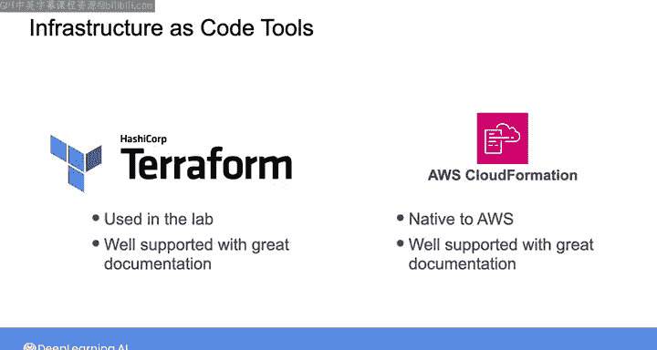

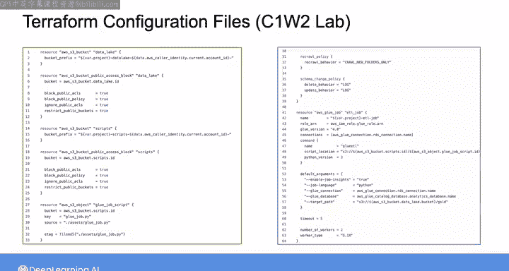

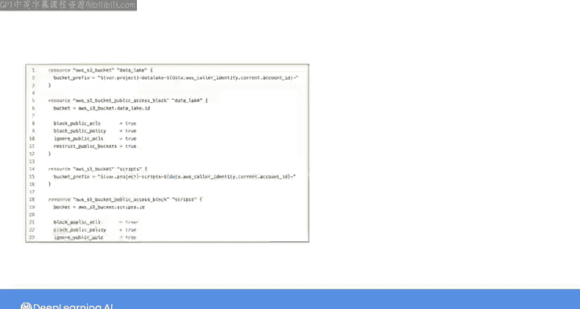

请注意，此配置文件中使用的语言相对易于解释。它遵循一个简单的模式：

以下是Terraform HCL配置的基本结构：
```hcl
resource "<PROVIDER>_<RESOURCE_TYPE>" "<RESOURCE_NAME>" {
  <CONFIGURATION_KEY> = <CONFIGURATION_VALUE>
  ...
}
```

你以关键字`resource`开始，然后指定资源类型和你想要给该资源的名称。因此，在这个例子中，`aws_s3_bucket`告诉Terraform你希望将AWS设置为提供商，并将S3作为你想要配置的资源。你将整个字符串`aws_s3_bucket`称为资源类型，而`data_lake`是你想给这个新创建资源的名称。然后，在大括号内，你可以使用键值对来指定这些配置选项。

这个配置文件是用一种称为HCL（HashiCorp配置语言）的领域特定语言编写的，以创建Terraform的公司HashiCorp命名。你可以将HCL语法与Terraform结合使用，来管理跨多个云供应商的基础设施资源。

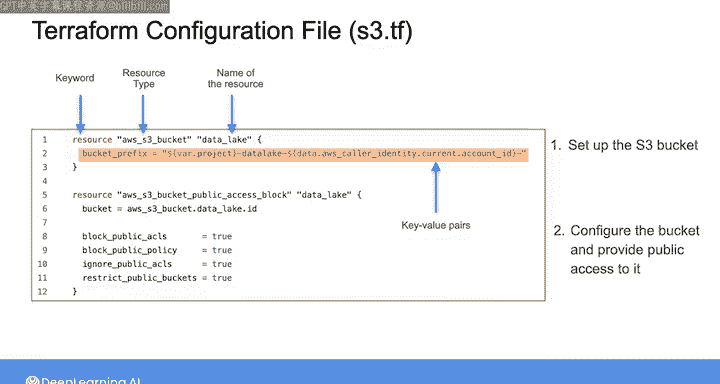

例如，以下是如何使用HCL在AWS中创建或更新一个VPC和一个EC2实例。注意，这段代码遵循了你在存储桶配置文件中看到的相同模式。

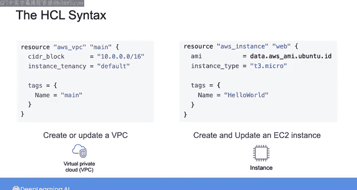

同样，以下是如何使用Terraform配置GCP计算实例。如你所见，代码遵循类似的模式，但在这种情况下，你指定GCP作为提供商。

## 声明式语言与幂等性

HCL被称为**声明式语言**，这意味着你只需要声明你希望基础设施是什么样子，例如，你想要创建什么资源，你希望配置参数取什么值。这也被称为基础设施的**期望最终状态**。然后，Terraform将找出实现此期望最终状态所需的确切步骤。

这使得Terraform具有**幂等性**，这意味着如果你重复执行相同的HCL命令，你的基础设施将保持与你第一次运行命令时相同的期望最终状态。

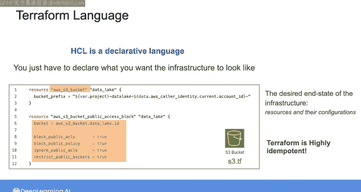

例如，假设你运行一个创建五个EC2实例的Terraform配置文件。Terraform将首先检查现有基础设施，看看具有这些特定配置的EC2实例是否已经存在。

如果它们不存在，Terraform将创建缺失的EC2实例。如果已经存在EC2实例，但其配置与你指定的不匹配，Terraform将更新现有的EC2实例以匹配期望状态。如果这些完全相同的EC2实例已经存在，Terraform将什么也不做，并让你知道它没有进行任何更改。

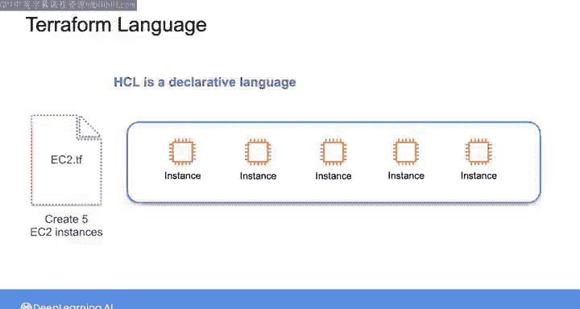

这与在批处理/Bash脚本和一些配置管理工具中使用的命令式或过程式语言形成对比，在后者中，你需要使用确切的配置任务序列。使用之前的相同例子，如果你使用命令式语言重复运行一组用于配置五个EC2实例的命令，那么每次都会创建五个新的EC2实例，无论它们是否已经存在。

因此，正如我之前提到的，在这些课程中谈论基础设施即代码时，我们将主要关注Terraform，因为它允许你跨多个云提供商管理基础设施，并且它是软件和数据工程师中非常流行的工具。只需注意，还有其他基础设施即代码工具存在。

## 总结

本节课中，我们一起学习了**基础设施即代码**的核心概念。我们了解到，它允许通过代码（如Terraform的HCL）**声明式地**定义基础设施的期望状态，工具会自动实现该状态并保证操作的**幂等性**。我们还回顾了其在自动化云数据管道资源（如S3、Glue）创建中的应用，并比较了Terraform与CloudFormation等工具。

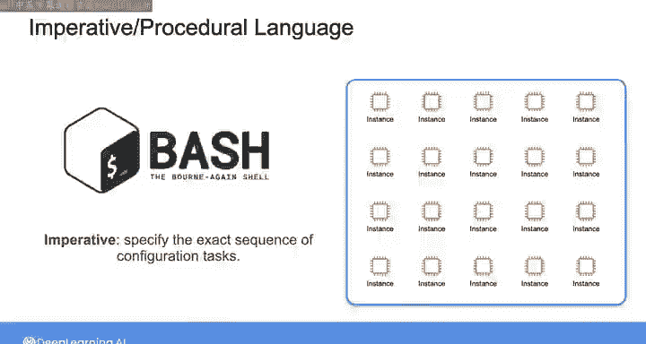

在接下来的课程中，我们将更深入地探讨数据可观测性与监控。但在那之前，我将引导你完成在Terraform中创建资源的步骤，然后你将在本周的第一个实验中获得一些使用Terraform的动手实践经验。