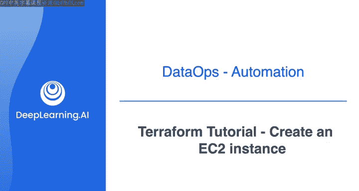
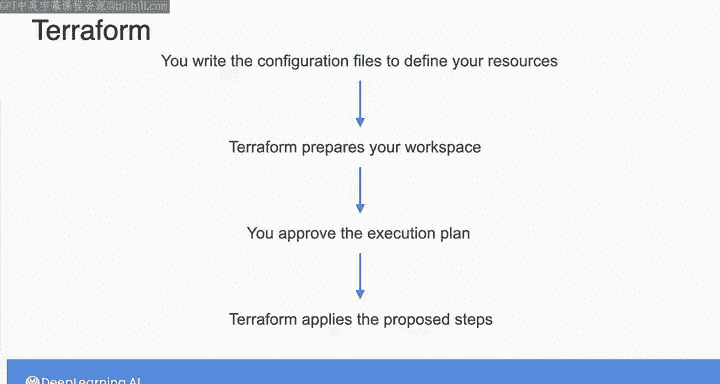
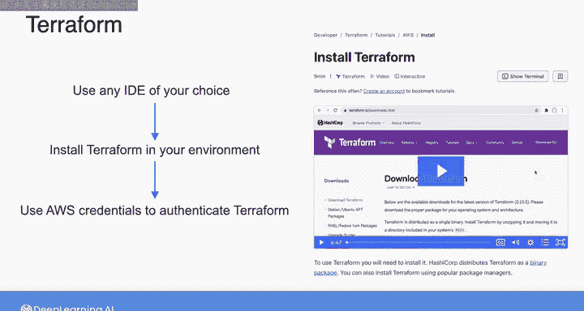
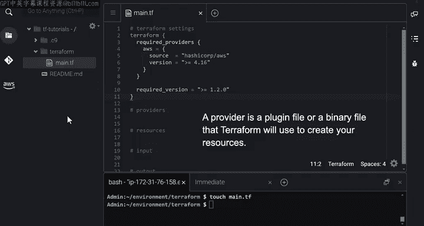
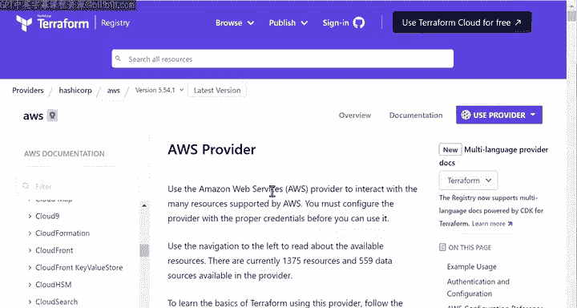
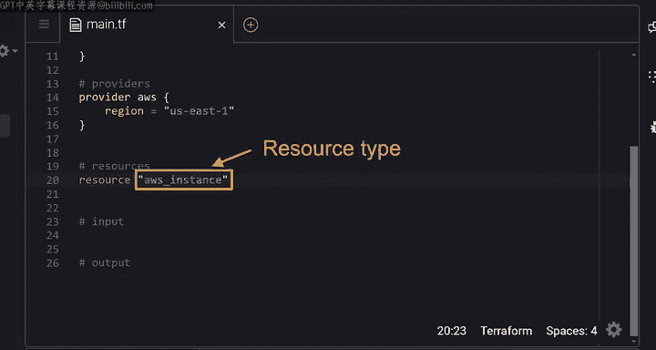
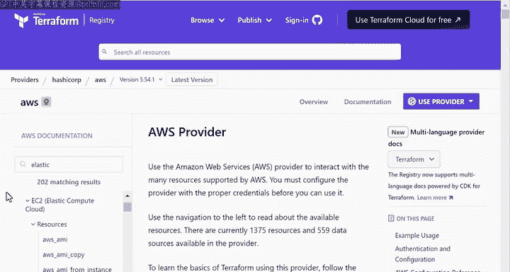
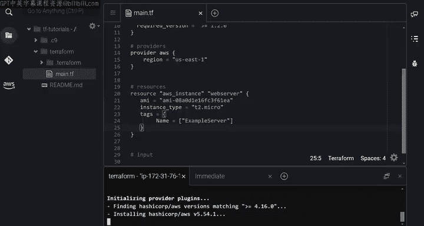
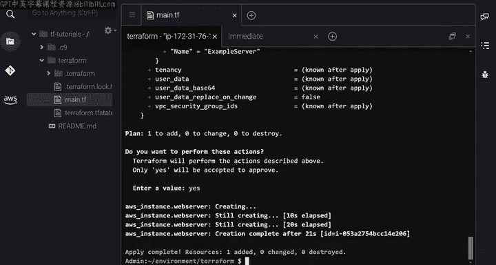

#  114：使用 Terraform 创建 EC2 实例 🚀

在本节课中，我们将学习如何使用 Terraform 编写配置文件，以在 AWS 上创建和管理一个 EC2 实例。我们将了解 Terraform 的核心工作流程、配置文件的结构以及如何执行 Terraform 命令来部署基础设施。

---

在之前的实验中，你通过应用提供的 Terraform 配置文件，在 Terraform 中创建并配置了一些资源。

你将始终遵循一个一致的工作流程。

首先，编写配置文件来定义你的资源。

然后，要求 Terraform 准备你的工作空间。Terraform 随后会安装必要的文件，以便与云 API 通信，并创建一个执行计划，描述它将创建、更新或销毁的资源。

一旦你批准了该计划，Terraform 就会应用其提议的步骤，并在本周的实验中配置你的基础设施。你将有机会编写和运行自己的 Terraform 代码。

因此，我准备了一系列教程来帮助你做好准备。在这第一个教程中，我们将详细介绍如何准备配置文件来创建一个 EC2 实例。

在此过程中，你将更深入地了解 Terraform 的内部工作原理，并准备好使用 Terraform 创建任何其他资源。在深入细节之前，先提醒一下，这可能会感觉信息量巨大，但请耐心跟随。你不需要在第一次就掌握所有细节，很快你将有机会亲自实践这一切。

---

假设你想创建一个 E2 实例，并将其启动在你所选区域的默认 VPC 中，如图所示。

在这个例子中，我将使用弗吉尼亚西部区域，即 US East1。

为了简单起见，我选择在默认 VPC 中启动 E2 实例。但请回想一下，在本课程的第一周，Morgan 提到，你通常希望在自己的自定义 VPC 中启动资源，而将默认 VPC 仅用于快速实验。

让我们从创建定义此 EC2 实例的配置文件开始。

要编写配置文件，你可以使用任何你选择的 IDE。

在你的环境中安装 Terraform，并使用你的 AWS 凭证对 Terraform 进行身份验证。

你可以在 Terraform 网站上找到关于这些步骤的更多信息，链接在本周最后的资源部分。

在实验中，所有这些都将为你设置好。你只需按照说明操作，打开 Cloud 9，就可以立即使用 Terraform。

---

这里我使用 Cloud 9 作为 IDE。我已经安装了 Terraform，并创建了这个文件夹，它代表我将保存配置文件的根目录。

---

让我们继续创建第一个配置文件，并将其命名为 `main.tf`。

任何扩展名为 `.tf` 的文件都会被 Terraform 识别为配置文件。

你可以将配置文件结构化为五个部分。

在前两个部分中指定 Terraform 设置和提供程序。

然后在下一部分定义你想要设置的所有资源。

最后两个部分可以选择性地定义任何输入变量和输出值。

然后，你将为每个部分内的实体创建代码块。在 Terraform 中，代码块具有类似 JSON 的结构，以一个告诉你块类型的关键字开头。

然后，根据块的类型，如果需要，块可以包含字符串形式的标签。

每个块都有一个由花括号分隔的主体。在主体内，你可以定义块的参数或进一步的块。

让我们从第一部分开始。

你在这里看到的 `terraform` 块指定了 Terraform 设置，包括 Terraform 将用于创建资源的必需提供程序。

我想暂停一下，多说几句关于提供程序的内容，因为我觉得第一次使用 Terraform 时这可能会有点令人困惑。

在 Terraform 的语言中，提供程序是一个插件文件或二进制文件，Terraform 需要安装它才能与外部资源交互。

---

你可以在 Terraform 注册表中找到所有可用的提供程序，如图所示。

一些提供程序允许 Terraform 与云平台交互，而另一些是实用程序提供程序，允许你在 Terraform 中使用附加功能。

需要明确的是，在 Terraform 中，“提供程序”这个词并不是指你正在设置资源的云提供商。相反，此上下文中的提供程序是 Terraform 为了与外部资源交互而需要的那个插件或二进制文件。

让我们点击 AWS 提供程序。再次强调，这里的 AWS 提供程序并不是指 AWS 作为云提供商。相反，这是允许 Terraform 与 AWS 上的资源交互的文件。

所以在这里，你可以看到提供程序的版本、源代码及其文档的链接。

如果你点击文档，你将看到此提供程序提供的所有资源列表及其使用示例。

在使用 Terraform 时，这份文档会非常有帮助，因为它向你展示了在这种情况下为任何 AWS 资源需要指定的参数。

现在，让我们回到代码。由于在这个例子中我们只使用 AWS 资源，你只需要声明 AWS 提供程序作为必需提供程序。

对于每个提供程序，你需要指定一个本地名称、源位置以及可选的版本约束。

本地名称是你在配置文件中各处用来引用该提供程序的唯一标识符。

例如，这里我使用 `aws` 作为 AWS 提供程序的本地名称，这是 AWS 提供程序文档中使用的首选名称。

源 `hashicorp/aws` 是 AWS 提供程序的全局标识符。它指定了当你运行此配置文件时，Terraform 可以从哪里下载此提供程序。

你也可以通过指定 `terraform` 块内的必需版本来为 Terraform 本身设置版本约束。

在下一部分，你可以创建一个 `provider` 块来配置你刚刚声明的提供程序。

---

所以在这个 `provider` 块中，我指定了 AWS 区域。

请注意，我在 `provider` 关键字旁边使用的名称是 `aws`，这是我在 `terraform` 设置块中为此提供程序分配的本地名称。

我知道这感觉有很多细节，但别担心，你总是可以查阅特定提供程序的文档，并复制 `terraform` 设置和 `provider` 块的代码。

接下来，让我们在 `resource` 块中定义 EC2 实例。你以关键字 `resource` 开始。

然后指定所谓的资源类型，这是一个包含提供程序和资源的字符串，由下划线分隔。

所以前缀 `aws` 指的是我们之前指定的 AWS 提供程序，资源类型 `aws_instance` 指的是我希望 Terraform 管理的 AWS EC2 实例。

---

你总是可以在 AWS 提供程序的 Terraform 文档中搜索资源类型，以找到你想要用 Terraform 配置的所需资源类型的名称。

---

这里的下一个字符串代表你选择给此资源起的名字。

这两个字符串一起构成了一个唯一的 ID，你可以在配置文件的其他块中使用它来引用你的资源。

例如，你可以使用 `aws_instance.web_server` 来引用这个 EC2 实例。

现在，在 `resource` 块内部，你需要指定资源的参数。同样，你可以在文档中找到每个资源的参数列表。

例如，对于 EC2 实例，你有这个很长的参数列表。

但就像编写 Python 代码一样，你不需要指定每一个参数，因为大多数参数是可选的。

EC2 实例的两个必需参数是 AMI 和实例类型。

AMI 是一个软件模板，包含有关实例操作环境的信息，例如操作系统和系统架构。

AWS 提供了很长的 AMI 列表，你可以在 AWS 控制台的 AMI 目录中找到。

在这个例子中，我获取了最新的基于 Linux 的 AMI 的 ID。

对于第二个参数，我使用 `t2.micro` 作为实例类型。我还设置了可选的标签，给实例命名为 `example-server`。

请注意，我没有指定要在哪个子网中启动 EC2 实例。这是因为我希望它在默认 VPC 的任何子网中启动。

你在此配置文件中看到的内容足以创建一个 EC2 实例。

---

那么，让我们实际创建这个 EC2 实例。

在这个例子中，我将从 `terraform init` 命令开始。当你运行此命令时，Terraform 会安装配置文件中定义的提供程序。

所以在这个例子中，Terraform 下载 AWS 提供程序，并将其存储在一个名为 `.terraform` 的隐藏子目录中。

---

一旦 Terraform 成功初始化，你就可以运行 `terraform plan` 命令。

当你运行此命令时，Terraform 会创建一个执行计划，详细说明 Terraform 计划根据你的配置文件创建、更新或销毁什么。

所以在这种情况下，加号意味着 Terraform 计划创建所有这些组件。在其他情况下，你可能会看到减号，表示将被销毁的内容，或者波浪号，表示将被更新的内容。

最后，你可以运行 `terraform apply` 命令。

Terraform 将再次向你显示执行计划，但随后会停下来等待你的批准。所以在这里我将输入 `yes`，并等待 E2 实例的创建。

好了，Terraform 刚刚根据这些配置规范创建了 EC2 实例。如果需要，你可以在控制台中检查该实例。

---

在这个第一个教程中，你看到了如何设置包含 `terraform` 和 `provider` 块的配置文件，然后如何使用 `resource` 块创建 EC2 实例。

在下一个视频中与我一起，了解更多关于 Terraform 中其他块的知识，以及如何更好地组织你的 Terraform 目录。

---

## 总结

本节课中，我们一起学习了 Terraform 的基础工作流程：编写配置文件、初始化、计划和应用。我们详细了解了配置文件的结构，包括 `terraform` 块、`provider` 块和 `resource` 块，并成功创建了一个 EC2 实例。这为后续使用 Terraform 管理更复杂的基础设施打下了基础。