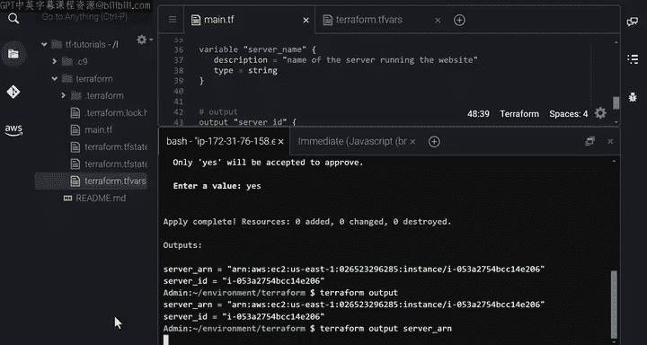
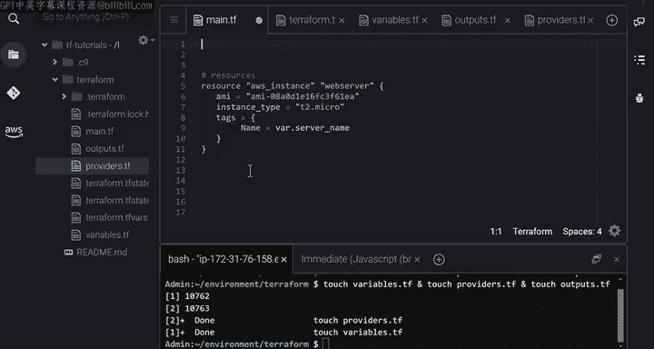

#  115：Terraform变量、输出与工作空间组织 🏗️

在本节课中，我们将学习如何为Terraform配置创建输入变量、如何利用输出值导出资源信息，以及如何有效地组织Terraform工作空间。这些技能将帮助你编写更灵活、更易于维护的基础设施代码。

上一节我们介绍了Terraform的基础配置。本节中，我们来看看如何通过变量和输出来增强配置的灵活性和可用性。

## 定义输入变量 📥

在之前的配置中，我们使用了硬编码的值，例如区域名称和EC2实例名称。为了避免在代码块中直接写入固定值，你可以创建输入变量来参数化你的配置。输入变量允许你自定义基础设施，并在创建资源时指定不同的变量值，而无需手动编辑配置文件。

以下是定义输入变量的方法：

*   **变量声明**：使用 `variable` 关键字声明变量。例如，`region` 和 `server_name` 是变量的标识符。
*   **可选参数**：每个变量可以包含三个可选参数：
    *   `description`：用于记录变量用途的文档。
    *   `type`：变量的类型（如 `string`）。
    *   `default`：为变量分配的默认值。
*   **变量引用**：如果未为变量分配默认值，则在Terraform应用配置前，系统会提示你指定其值。在其他代码块中，可以使用 `var.变量名` 的语法来引用变量。

例如，在提供者（provider）块中，将AWS区域的硬编码值替换为 `var.region`；在资源（resource）块中，将实例名称的硬编码值替换为 `var.server_name`。

## 为变量赋值 🔧

为了自动为变量赋值而无需提示，你可以使用命令行标志 `-var`。更方便的做法是，在一个以 `.tfvars` 为扩展名的特定文件中定义变量值。

例如，在包含配置文件的同一目录中，创建文件 `terraform.tfvars`，并在其中为变量 `server_name` 赋值。更新配置时，只需运行 `terraform apply` 命令。Terraform将使用 `.tfvars` 文件提取变量值，并使用提供的值更新配置。

## 定义输出值 📤

你创建的任何资源都包含一系列特性或属性。例如，你可以查阅EC2实例的文档，查看其所有属性的列表，如ID、ARN（亚马逊资源名称）和公共IP地址。

在某些情况下，你可能希望导出这些属性，例如在命令行中打印它们、在基础设施的其他部分使用它们，或在其他Terraform工作空间中引用它们。为此，你需要将它们声明为输出值。

以下是创建输出值的方法：

*   **输出声明**：使用 `output` 关键字声明输出值。例如，`server_id` 和 `server_arn` 是这些输出值的标识符。
*   **值参数**：对于每个输出值，需要通过将其分配给EC2实例的属性来指定 `value` 参数。
*   **属性访问**：你可以通过指定资源的标识符（即 `资源类型.资源名称`），然后使用 `.属性` 语法来访问属性的值。

例如，要访问EC2实例的ID属性，可以使用 `aws_instance.webserver.id`。对ARN属性也进行类似操作。

## 访问输出值 🔍

在命令行中，应用更新后，你可以看到Terraform检测到输出的变化，并告知你将创建这些输出值。输出值会显示在Terraform的消息中。

创建输出后，你可以使用 `terraform output` 命令查询所有输出，也可以通过指定其名称来查询单个输出。

## 组织工作空间 📁

目前，我们的配置文件中有多个代码块，每个块都有不同的用途。但是，如果你有多个资源、多个输入变量和多个输出值，将所有代码块声明在一个文件中，管理起来会变得非常繁琐。

更好的做法是将此配置文件拆分为多个文件。例如，你可以将所有输入变量声明在 `variables.tf` 中，所有输出值声明在 `outputs.tf` 中，所有提供者和Terraform设置声明在 `providers.tf` 中，所有资源声明在 `main.tf` 中。你还可以进一步划分 `main.tf`，将每个资源声明在单独的 `.tf` 文件中。

Terraform会自动将所有以 `.tf` 结尾的文件拼接起来，就像你将它们全部写在一个文件中一样。这样组织工作空间有助于维护你的基础设施。

本节课中我们一起学习了如何为Terraform配置定义和使用输入变量、如何声明和访问输出值，以及如何通过拆分文件来组织Terraform工作空间。这些实践将使你的基础设施代码更加模块化、可重用且易于管理。

在下一节视频中，我将展示如何使用模块来组织工作空间以及如何声明数据源。