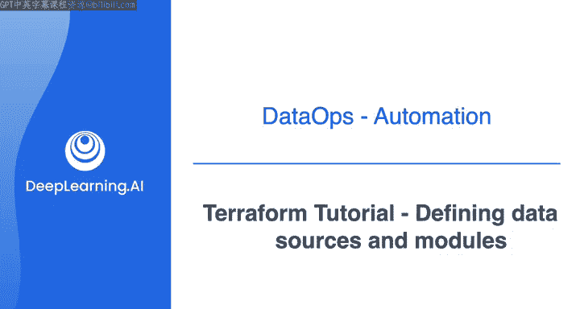
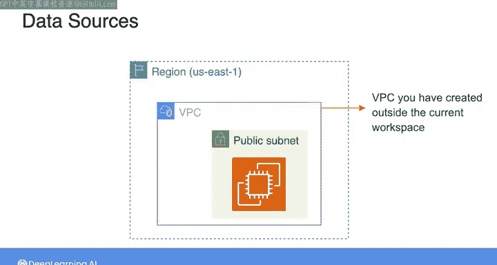
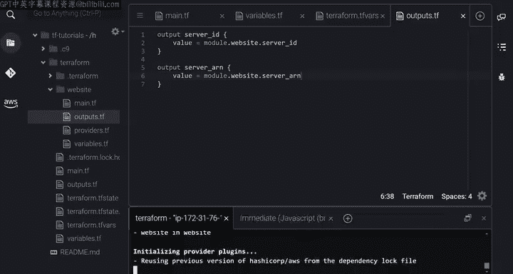

#  116：Terraform 定义数据源和模块 🧱



在本节课中，我们将要学习 Terraform 中两个重要的概念：数据源和模块。我们将了解如何使用数据块来引用外部资源，以及如何通过模块来组织和复用配置代码。


---

## 概述

上一节我们介绍了 Terraform 的资源块和输出块。本节中我们来看看如何声明数据块和模块。数据块允许你引用在 Terraform 外部或另一个工作区中创建的资源。模块则是一种将相关资源打包在一起以便复用的方式。

## 定义数据源

除了之前视频中看到的资源变量和输出块，你还可以在配置文件中声明数据块。在 Terraform 中，你可以使用数据块来引用在 Terraform 外部或另一个 Terraform 工作区中创建的资源。

Terraform 将这些资源称为数据源。你可以查阅提供商的文档和 Terraform 注册表来了解如何声明这些资源。你会发现，对于提供商中可用的每个资源，你都可以在 Terraform 中将其声明为资源或数据源，具体取决于你是要创建该资源还是从外部资源读取数据。

让我们来看两个使用数据块的例子。



### 示例一：引用现有子网

在之前的视频中，我创建了一个在默认 VPC 内启动 EC2 实例的配置文件。但现在，假设你想在已在此当前工作区外部创建的 VPC 的子网内启动 EC2 实例。

为了访问一个子网，我将声明一个数据块，如下所示。与资源块类似，在 `data` 关键字旁边，我将指定两个字符串。第一个字符串代表资源类型，你可以从提供商的文档中获取；第二个字符串是你为数据源选择的名称。现在，你可以在整个配置文件中通过这个名称来引用它。

以下是声明数据块的通用语法：

```hcl
data “<资源类型>” “<数据源名称>” {
  # 配置参数
}
```

你需要指定用于识别所需子网的参数。请务必查阅文档，以了解此数据源期望哪些参数。这里，我假设我知道子网的 ID，并将其分配给 `id` 参数。

声明数据源后，你就可以使用它的属性了。例如，要使用 `id` 属性，你可以这样写：

```hcl
data.aws_subnet.selected_subnet.id
```

在 EC2 实例的资源块中，有一个 `subnet_id` 属性，我可以使用这个表达式来指定它，以便在所需的子网内启动 EC2 实例。

当然，既然你已经知道子网 ID，你也可以直接在资源块中引用它。但这里我想展示一个如何使用数据块的例子，因为在某些情况下，你可能无法直接获得子网 ID。因此，在数据块中，你可以使用其他参数来识别所需的子网。

### 示例二：自动查找 AMI

作为另一个例子，你也可以使用数据源来自动识别 EC2 实例的 AMI 参数。

在第一个视频中，我提到我从 AWS 控制台获取了这个 AMI ID。如果我想通过让 Terraform 代表我搜索并检索最新的 Linux AMI 来自动化这个过程，我可以使用以下数据块。

这里，我要求 Terraform 查找由 Amazon 拥有的、具有指定系统架构且基于 Linux 的最新 AMI。现在，在 EC2 实例资源块内部，你可以像下面这样指定 AMI：

```hcl
resource “aws_instance” “example” {
  ami = data.aws_ami.latest_linux_ami.id
  # ... 其他配置
}
```

再次强调，你以关键字 `data` 开头，然后使用此数据源的资源类型和名称，最后指定你要访问 `id` 属性。

现在，让我们通过运行 `terraform apply` 命令来更新配置。你会看到 Terraform 计划销毁先前的实例，以创建一个具有更新网络设置的新实例。你还可以看到它执行了搜索以找到最新的 AMI，并且找到了我已经指定的同一个 AMI。现在，我将输入 `yes` 并等待更新完成。

## 使用模块

本教程中我想介绍的最后一个主题是 Terraform 中模块的使用。

模块是你的主目录中的一个子目录，你可以用它来将一起使用的资源分组。你可以将其视为打包这些资源的一种方式。在这个例子中，我将创建这个 `website` 模块，以分组用于创建网站的所有资源。

让我们将包含 Web 服务器定义的 `main.tf` 文件移动到 `website` 模块中。模块就像一个常规的根目录，因此它也期望你在其中声明提供商、输入变量和输出值。所以我需要将这些文件移动到 `website` 模块中。

模块充当一个包含资源、输入变量和输出值的文件夹。因此，你无法在根目录中直接访问这些信息。这意味着，如果你现在运行 `terraform apply`，它会报错，因为根目录将无法看到分配给输入变量的值。

为了解决这个问题，你需要在根目录中声明一个模块块来调用模块。如下所示，我选择 `website` 作为模块名称，并指定 `source` 参数，即模块目录。

现在，在这个模块块内部，我可以包含该模块的输入变量并指定具体值。这里，我需要为输入变量 `server_name` 指定一个值。为此，我将在主目录中创建这个 `variables.tf` 文件，并声明 `server_name_root` 变量。

然后，回到模块块中，我可以通过模块的输入变量将 `server_name_root` 变量的值分配给它。最后，在根目录的 `.tf` 文件中，我需要指定 `server_name_root` 变量的实际值。

最后，如果你还想将模块的输出 `server_id` 和 `server_arn` 也作为根目录的输出导出，你需要在根目录内创建一个输出文件。在这个文件中，你声明输出，并使用以下语法将它们分配给模块输出的值：

```hcl
output “server_id” {
  value = module.website.server_id
}
```

你以 `module` 开头，然后指定包含这些输出值的模块名称，接着指定你要访问的输出值的名称。



每当你添加、移除或修改模块块时，都需要重新运行 `terraform init`，以允许 Terraform 安装新模块或调整已安装的模块。所以这里我将运行 `terraform init`，然后运行 `terraform apply`。我们将输入 `yes` 并等待更新完成。

## 总结

本节课中我们一起学习了 Terraform 的数据源和模块。我们了解了如何使用 `data` 块来引用和管理外部资源，以及如何通过创建和调用 `module` 来组织和复用复杂的配置。这些功能有助于构建更清晰、更可维护的基础设施代码。我知道内容很多，但别担心，你可以随时回看这些视频来复习细节。本视频后我还附上了一些包含更多 Terraform 配置示例的可选阅读材料。我们将在下一个视频中快速浏览即将到来的实验。