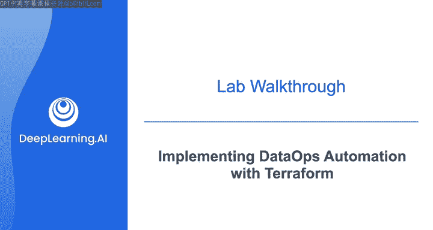
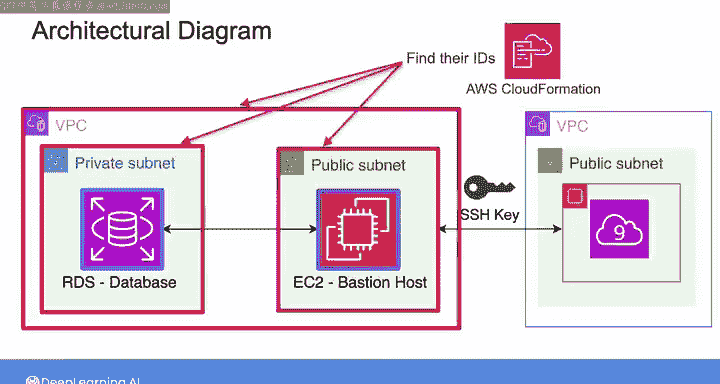
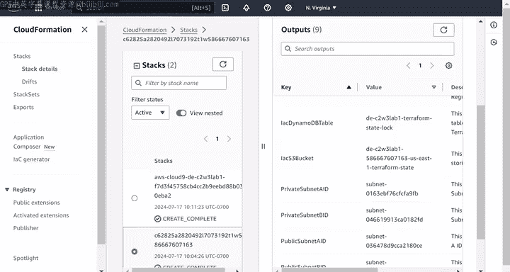
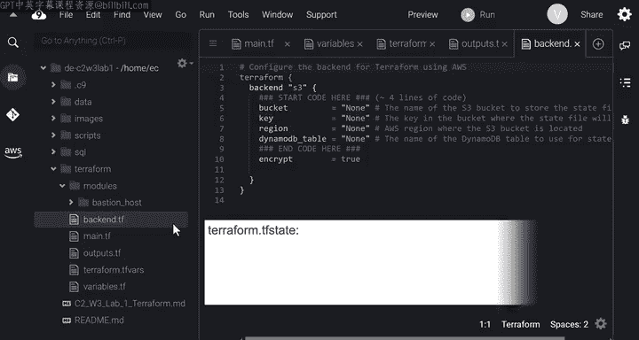
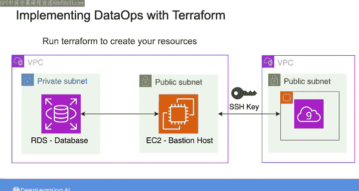
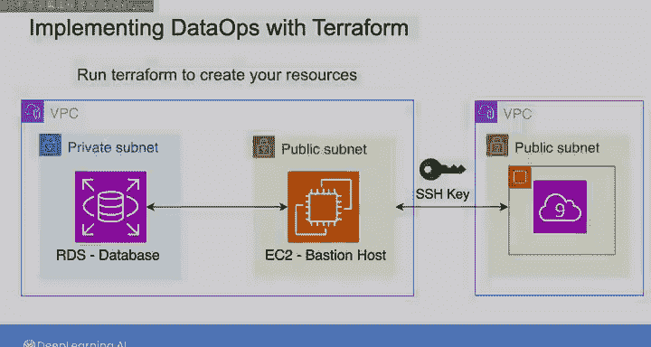

#  117：使用Terraform实现DataOps 🚀

## 概述

在本节课中，我们将学习如何使用Terraform工具，通过代码定义和部署一个包含堡垒机（Bastion Host）和RDS数据库的云基础设施架构。我们将了解架构的组成部分、Terraform配置文件的结构，并完成一个动手实验。

---

## 架构图与实验步骤概览

首先，我们来看一下将要部署的架构图。你将使用Terraform创建一个数据库实例，并通过一个堡垒主机（也称为跳板服务器）来部署和访问它。

堡垒主机充当一个桥梁，连接来自公共互联网的授权用户与私有网络内托管的资源。当授权用户想要访问私有网络时，他们必须首先与堡垒主机建立一个SSH（安全外壳）连接，并使用SSH密钥来安全地访问私有资源。

外部用户可以通过SSH密钥向堡垒主机证明其身份以建立连接。一旦用户通过身份验证，堡垒主机就可以将请求转发到内部网络。

以下是本实验中将要实现的堡垒主机架构图。它包含一个托管在指定VPC私有子网内的RDS数据库实例，以及一个充当堡垒主机的EC2实例。EC2实例位于同一VPC的公共子网中，以便它可以接收来自公共互联网的外部流量，然后将安全流量中继到内部的数据库。

在本实验中，包含私有和公共子网的VPC已经创建并为你提供。你将在Terraform配置文件中将它们定义为数据块，然后使用它们的信息来创建RDS数据库和EC2实例。

当你创建EC2实例时，还将生成一个SSH密钥对。该密钥对包含一个你将存储在EC2实例中的公钥，以及一个你将保存在单独文件中的对应私钥。这一对公钥和私钥用于在SSH连接期间加密和解密外部用户与堡垒主机之间的消息，以便外部连接在实验中证明其身份。

在你使用Terraform创建所有资源后，你将使用私钥从Cloud9终端通过堡垒主机连接到RDS数据库。

为了创建数据库和EC2实例，实验为你提供了需要完成的Terraform文件。首先，你需要获取已提供的VPC及其子网的ID。这些资源是作为实验设置的一部分使用CloudFormation创建的。

要访问它们，你可以进入控制台，在搜索栏中查找CloudFormation。在堆栈名称下，点击不以“cloud9”开头的堆栈名称。在右侧，点击“输出”选项卡。在这里，你将看到使用CloudFormation在后台创建的资源列表。向下滚动，你可以在“值”列下找到VPC及其子网的ID。你在这里看到的其他资源（如S3存储桶和DynamoDB）的用途，我将在视频后面提到。

现在，让我们快速浏览一下提供给你的Terraform文件。堡垒主机架构资源的配置文件收集在一个标记为“bastion_hosts”的模块中。Terraform文件按此处所示进行组织，分为变量、输出、提供者以及每个资源（EC2、RDS和网络）的文件。请记住，Terraform会将所有这些配置文件连接在一起，将它们拆分为单独的文件只是为了提高可读性和便于维护。

---

## Terraform配置文件详解

### 提供者文件

在提供者文件中，你会注意到所需提供者的列表不仅包括AWS，还包括其他提供者，如local、random和TLS。这些是实用程序提供者，提供了在创建资源时可以使用的功能。你将使用`random`来为数据库密码生成随机值，使用`TLS`来创建SSH密钥对，使用`local`来创建一个文件以存储SSH密钥对的私钥。我鼓励你在Terraform注册表中查看每个提供者的文档。

现在，在AWS块中，请注意区域和项目名称是通过使用变量来指定的。

### 网络文件

网络文件包含VPC及其子网的数据块。在实验中，你将完成这一部分，使用在`variables.tf`文件中声明的相应变量来指定子网和VPC的ID。向下滚动，你会看到网络文件还包含堡垒主机和RDS的安全组定义。安全组的配置使得堡垒主机可以从公共互联网接收SSH流量，而数据库只能接收来自堡垒主机的流量。你将在RDS和EC2配置中使用这些网络资源。

### RDS文件

在RDS文件中，你有三个资源块。第三个块包含创建RDS实例所需指定的参数，例如服务器实例类型、分配的存储、子网组、安全组ID、引擎类型（本例中为Postgres）、端口号、数据库用户名和密码。你将填写其中一些参数的值。

第一个资源块对应于来自`random`提供者的`random_id`资源。此资源将生成一个随机数，你将把它分配给数据库密码。第二个块将创建一个子网组，其中包含提供给你的两个私有子网的ID。你将使用此资源来配置RDS数据库的子网组。请注意，你必须指定两个私有子网而不是一个。这是因为RDS被设计为期望至少有两个子网，以防你以后想切换到多可用区部署。

### EC2文件

在EC2文件中，也有几个资源块。最后一个块包含EC2实例的配置。你已经在之前的视频中看到过一些属性，例如AMI、实例类型和子网ID。在本实验中，你还需要指定其他属性，例如其安全组的ID和密钥名称。密钥名称代表你需要与堡垒主机关联的SSH密钥对的名称。为此，你将使用第一个资源块`tls_private_key`来生成密钥对。第二个资源块`local_file`创建一个文件，用于存储密钥对中的私钥。而`aws_key_pair`资源块将在AWS中注册公钥，以便你可以在EC2实例的配置中使用其密钥名称。

### 变量与输出文件

这些资源文件期望一些在`variables.tf`文件中声明的输入变量。该文件包含指定项目名称、AWS区域、VPC及其子网的ID以及数据库用户名的变量。对应于VPC及其子网的变量没有默认值，因此你需要在模块外部的`terraform.tfvars`文件中为这些变量赋值。

该模块还有一些输出值，列在`outputs.tf`文件中。你的任务是完成此文件，以定义输出值，例如数据库主机、端口、用户名、密码以及堡垒主机的DNS。创建资源后，你需要导出此信息才能连接到数据库。

### 根目录配置

我们已经讨论过，模块中的所有内容都被封装并从根目录隐藏。因此，为了给模块变量赋值并使用其输出值，你需要在根目录中声明该模块。所以，在这个`main.tf`文件中，声明了模块。你可以看到，使用变量为其输入变量赋值。这就是为什么根目录也包含一个`variables.tf`文件，其中包含与模块变量类似的列表。对应于VPC及其子网的变量没有默认值。因此，你需要使用来自CloudFormation堆栈的ID，在`terraform.tfvars`文件中为这些变量赋值。

根目录还包含一个`outputs.tf`文件，其中包含从模块导出的输出列表。

你在这里看到的另一个文件是`backend.tf`文件，它包含一个后端块，允许你定义Terraform应将其状态数据文件存储在何处。每次运行Terraform时，都会创建或更新`terraform.tfstate`文件，以跟踪底层架构及其配置的状态。此文件包含将配置中声明的资源实例映射到实际AWS对象的信息。默认情况下，状态文件存储在本地。但是，如果你与团队在同一组资源上协作，则需要通过将状态文件存储在像S3存储桶这样的远程仓库中来与团队共享。在Terraform中，你可以定义一个S3后端，如你在此块中所见。S3存储桶已经提供给你，你可以从控制台的CloudFormation堆栈中找到其信息。你还可以在此块中指定DynamoDB表的名称。当你希望确保状态文件不会被两个人同时访问或修改时，需要使用一个表。DynamoDB表在状态文件更新时将其锁定，防止其他用户同时修改该文件。DynamoDB实例也通过CloudFormation堆栈提供给你。

---

## 总结

现在轮到你在本架构示例中练习使用Terraform了。完成配置文件后，你将运行Terraform来创建资源。最后，你将尝试通过堡垒主机连接到数据库。完成实验后，请加入下一课，学习DataOps的第二个支柱：数据可观测性与监控。