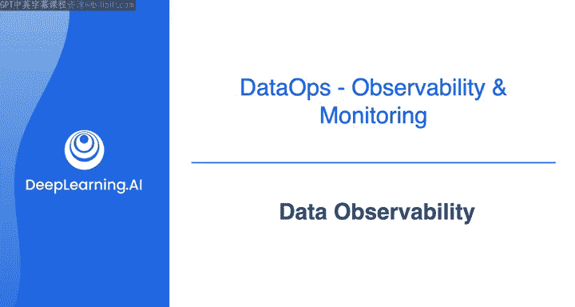
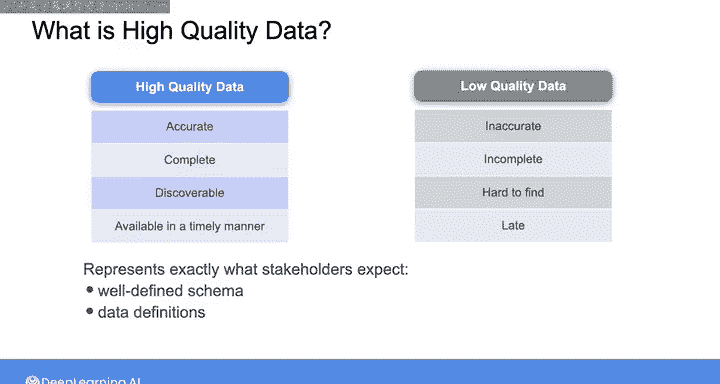
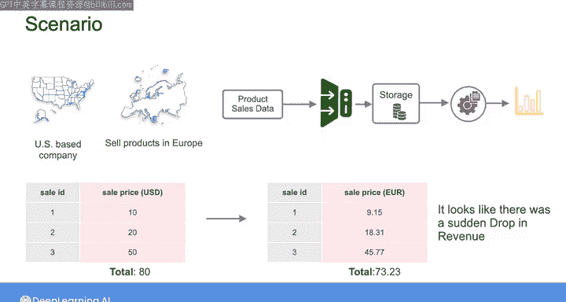

#  118：数据可观察性 📊

在本节课中，我们将要学习数据可观察性与监控的概念。这是数据运维（DataOps）的一个关键支柱，借鉴了软件开发领域的实践。我们将探讨为什么监控数据系统的“健康”状况至关重要，以及低质量数据可能带来的风险。最后，我们会介绍如何通过监控来及时发现数据问题。

## 可观察性原则的起源 🏗️

除了数据工程师借鉴和构建的自动化原则，可观察性和监控的原则与实践也是数据运维的关键支柱。这一理念同样起源于过去十年左右的软件开发领域。

随着云计算的兴起和向分布式系统的转变，软件工程师开发了可观察性工具。这些工具帮助团队了解其系统的运行健康状况。

## 软件系统的监控指标 📈

借助这些可观察性工具，团队能够监控诸如**CPU使用率**、**内存使用率**和**响应时间**等指标。这有助于快速检测异常、识别问题、防止停机，并确保软件产品的可靠性。

当涉及到数据可观察性和监控数据系统的健康状况时，软件团队所依赖的一些相同工具对数据工程师也可能有帮助。

## 数据工程师的独特监控需求 🔍

尽管如此，除了监控CPU使用率或系统响应时间等指标，作为数据工程师，你还需要了解数据的健康状况，或者说，数据的质量。

作为提醒，在之前的课程中，我们将高质量数据定义为**准确**、**完整**、**可发现**且**及时可用**的数据。此外，高质量数据在明确定义的模式和数据定义方面，完全符合利益相关者的预期。低质量数据则相反，它可能不准确、不完整或无法使用。

因此，当你能够向组织内的利益相关者提供高质量数据时，你就在为他们创造价值。但信不信由你，提供低质量数据实际上比根本不提供数据更糟糕。

当业务决策基于低质量数据做出时，对组织来说成本可能极高，并且可能导致利益相关者对数据团队的价值产生怀疑。

## 数据系统的隐蔽问题 ⚠️

提供低质量数据的数据系统从外部看可能完全正常。

例如，假设你有一个像移动应用或网站这样的软件应用程序。如果应用程序崩溃，或者你在尝试加载网页时收到404错误，很明显是出了问题。这些是可以触发软件工程师警报的事情，以便他们去修复问题。

对于数据系统，如果你的系统完全停止工作，并且你能够立即识别出它不工作，这实际上是潜在故障模式中最好的情况。在这种情况下，你可以调试问题并使系统重新启动运行。

另一方面，如果你的数据发生了破坏性变更，导致系统仍在工作但不再提供高质量输出，事情就会变得非常棘手。

为了更好地理解我的意思，让我们看一个假设的场景。

## 一个假设的数据质量场景 💸

想象一下，你是一家美国公司的数据工程师，该公司在欧洲销售某种产品。假设你正在摄取产品销售数据，并为下游分析用例提供数据。

现在，假设由于某种原因，管理记录产品销售的事务数据库的团队决定开始以欧元而非美元记录销售价格。

你的系统仍在工作，你仍在为流行的分析仪表板提供数据，这些仪表板中的数字甚至可能看起来合理。但现在，看起来收入突然下降了大约10%或20%，具体取决于当天美元兑欧元的汇率，这影响了所有在欧洲的销售。

这会触发领导团队的紧急会议，进而导致全员投入解决问题。

## 数据质量问题的本质 🎯

在数据质量方面，这将是一个例子，说明你的系统在眨眼之间就从提供高质量数据转变为提供不再准确的数据，或者至少不再是利益相关者所期望的数据。

当然，你可以争辩说这不是你的错。

## 数据工程师的责任 🤝

源系统所有者不应该做这样的事情，或者至少他们应该提醒你这种会影响你数据的变更。但正如我在这些课程中一直强调的，无论来自何处，你都应该预期并缓解那些扰乱或破坏你数据系统的上游变更。

一旦数据到了你手中，确保其质量就是你的责任。

那么，当你的数据系统受到干扰时，你如何确保尽快知道发生了什么？

这就是数据可观察性和监控发挥作用的地方。

## 总结 📝

本节课中我们一起学习了数据可观察性的重要性。我们了解到，数据系统的“健康”不仅指其运行状态，更关键的是其输出数据的质量。低质量的数据，尤其是那些系统看似正常运行时产生的错误数据，可能带来比系统完全故障更严重的后果。因此，数据工程师必须借鉴软件工程的可观察性实践，建立对数据质量本身的监控，以便及时发现上游变更等问题，确保交付给利益相关者的数据始终准确、可靠。