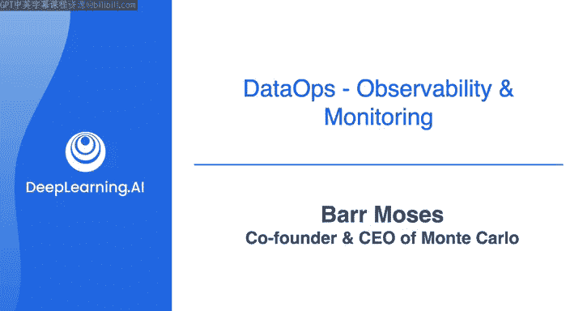

#  119：与Barr Moses的对话 🎙️

在本节课中，我们将与Monte Carlo公司的联合创始人兼CEO Barr Moses进行对话，探讨数据可观测性、数据质量以及数据工程师的职业发展。我们将学习如何理解数据系统的健康状况，以及如何与利益相关者有效沟通。

---

## 概述

数据可观测性是一个至关重要的概念，它帮助数据团队理解其数据系统的健康状况，并确保数据的可靠性和准确性。本节对话将深入探讨数据可观测性的定义、关键指标、成功案例以及数据工程师如何与利益相关者沟通。

---

## 什么是数据可观测性？

上一节我们介绍了课程的整体背景，本节中我们来看看数据可观测性的核心概念。

数据可观测性最好通过类比软件可观测性来理解。它旨在解决一个普遍存在的痛点：数据团队经常面临数据错误的问题，导致信任危机和运营中断。数据可观测性帮助数据团队恢复对数据的信心，理解数据的健康状况。

**核心公式**：`数据可观测性 = 理解数据系统健康状况 + 持续改进`

---

## 数据可观测性解决的核心问题

数据可观测性主要解决数据停机问题。数据停机指的是数据不准确或错误的时期。例如，Netflix在2016年因数据问题中断服务45分钟，这对收入和品牌声誉造成了重大影响。

数据问题可能出现在三个核心组成部分：
1.  **数据本身**：即摄入系统的原始数据。
2.  **代码**：用于转换数据的代码，通常由工程师编写。
3.  **系统**：运行作业的基础设施。

数据可观测性旨在全面监控这些部分，及时发现并解决问题。

---

## 关键指标

为了衡量和改善数据可观测性，数据团队应关注以下三个关键指标：

以下是数据团队应追踪的三个核心KPI：

1.  **事件数量**：每天发生的数据事件数量。
2.  **检测时间**：从问题发生到被察觉所花费的时间。
3.  **解决时间**：从发现问题到完全解决所花费的时间。

这些指标帮助团队量化其运营效率，并设定明确的改进目标。

---

## 成功案例：JetBlue航空

JetBlue航空公司是成功实施数据可观测性的一个典范。他们利用数据驱动内部运营和客户支持系统，例如确保行李准时到达。

JetBlue通过提升数据可观测性，显著提高了其**内部团队净推荐值**。NPS用于衡量内部客户（如运营和支持团队）对数据服务的满意度。更高的信任度直接促进了数据的使用效率和业务价值。

---

## 如何与利益相关者沟通

对于本课程的学习者而言，走出技术真空，与利益相关者沟通至关重要。

Barr Moses给出了两点关键建议：
1.  **主动对话**：在创建公司前，她与数百名数据从业者交流，以验证“数据停机”是否是一个普遍而紧迫的问题。直接沟通是了解真实需求的第一步。
2.  **共同验证**：不要仅仅停留在交谈。构建一个最小可行产品并与客户一起测试。客户的直接反馈是无可替代的，它常常会纠正你最初的设想。

---

## 在快速变化的行业中持续学习

数据领域变化迅速，就像“每隔几年就 reinvent 自己”。对于学习者，Barr Moses的核心建议是：

**保持好奇心，追随你的热情。** 她认为，外界的建议往往带有个人偏见，有时甚至相互矛盾。因此，最重要的是倾听客户的声音，了解市场的动向，并坚定自己的信念。她本人每周都与10-15位客户交流，这使她能够紧跟市场脉搏。

---

## 总结

本节课中，我们一起学习了数据可观测性的核心概念及其重要性。我们了解了衡量数据健康的关键指标，看到了JetBlue的成功实践，并获得了与利益相关者沟通以及在这个快速发展的领域保持学习的宝贵建议。记住，建立可靠的数据系统始于对其健康状况的深刻理解。