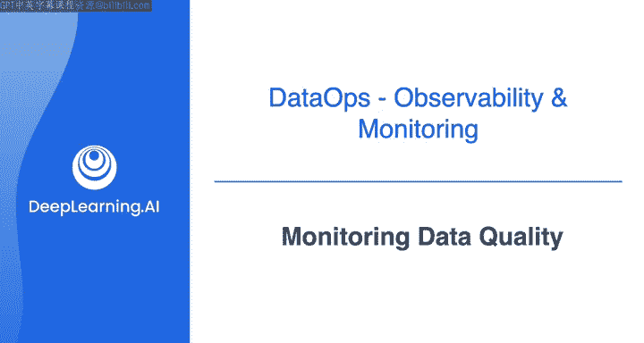
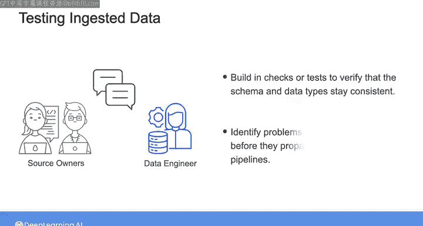

#  120：监控数据质量 📊

在本节课中，我们将学习如何为数据管道设计和实施有效的质量监控策略。我们将探讨监控哪些指标、如何确定优先级，并介绍一个用于自动化数据质量测试的强大工具。

---

通过前面的学习，我们确信数据可观测性和监控非常重要。

但在实际操作中，应该从哪里开始呢？

这正是本视频要讨论的内容。与我们在课程中讨论的许多其他事情一样，一切都始于利益相关者的实际需求。

从实践角度讲，对于数据管道，你可以决定监控的指标或质量标准范围很广。

例如，你可以监控每批或在某个时间间隔内调整的记录总数，或者监控特定列中的值范围是否保持在某个阈值内。

你也可以统计表中空值的总数，或者当前时间与数据中最新记录的时间戳之间的差值。

简而言之，你可以决定监控的事情非常多。

然而，与其为你能够测量或观察到的关于数据的每一个可能方面都设置监控和警报，你更应该识别最重要的事情并专注于它们。

如果你试图监控数据的每一个可以想象的方面，最终可能会造成混乱和警报疲劳，真正重要的东西会淹没在噪音中。

因此，在决定监控数据的哪些指标或方面时，第一个问题应该是：对于这个特定的用例，利益相关者最关心什么？

例如，利益相关者可能最关心查看当前数据，也许是不到24小时的数据。在这种情况下，你需要通过测量最新记录的摄取时间并验证其是否符合项目预期，来监控所谓的数据“新鲜度”。

当涉及到数据的准确性和完整性时，可以合理地假设这些对所有项目都很重要。

为了监控这些质量方面，你需要识别数据的哪些组成部分最重要，哪些不那么重要或可以安全忽略。

例如，如果你的利益相关者关注产品销售营收，那么数据中记录的购买金额必须准确、能够验证所有销售记录是否成功摄取、以及它们不包含空值，这些就至关重要。

相比之下，所有产品编号是否与产品描述匹配，或者每个产品的邮政编码是否正确记录，可能就不那么重要了。

正如你所想，数据的关键重要方面会因项目而异。

在整个课程中，我一直在强调你应该与源系统所有者沟通，以确保你了解未来需要预见或缓解哪些类型的变更。

虽然良好的沟通无可替代，但你也应该采取措施，在你的数据监控中建立检查或测试，以验证你正在摄取的数据的模式和类型是否保持一致。

如果一切顺利，这些检查可以作为很好的健全性检查，确保你摄取的数据仍然是你期望的格式。

这些检查还可以帮助在问题沿数据管道进一步传播之前，及早发现问题。

---

与数据工程中的许多事情一样，监控数据质量的方法有很多种。

你可以手动做一些事情，或者编写一些自定义代码来执行一组测试或触发警报。

在某些场景下，这些方法可能是有意义的，例如当你首次建立管道或进行原型设计时。

但如今，有许多工具可以用来确保数据质量，同时让你免于承担那些无差别的繁重工作。

接下来，是我的朋友Abe Gong的对话，他是Great Expectations的创建者之一。Great Expectations是一个开源工具，你将在下一个实验中使用它来测试数据质量。

---

这是一个可选视频，旨在为你提供关于此工具的更多背景信息。你也可以直接跳到下一部分，开始自己使用Great Expectations。

否则，我将在下一个视频中与Abe Gong的对话中与你再见。

---

**本节课总结**

在本节课中，我们一起学习了数据质量监控的核心原则。我们了解到，监控应从利益相关者的关键需求出发，优先关注对业务影响最大的数据维度，如新鲜度、准确性和完整性，而非试图监控一切。同时，建立对数据模式和类型的自动化检查，有助于在问题扩散前及时发现。最后，我们了解到可以利用像Great Expectations这样的专门工具来高效地实施这些质量检查，从而构建更可靠的数据管道。