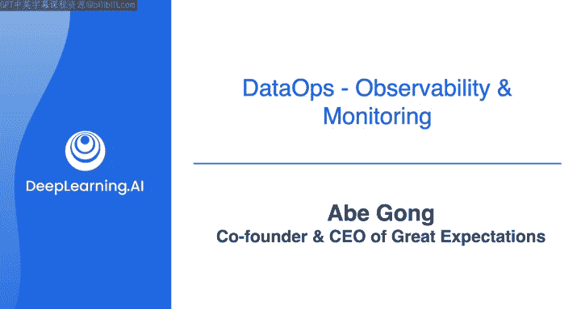
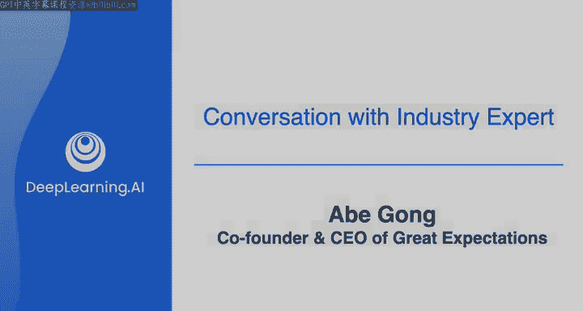

#  121：与Abe Gong关于数据质量与Great Expectations的对话 🎙️🔍



## 概述

在本节课中，我们将学习数据质量的核心概念，并了解开源工具Great Expectations如何帮助数据工程师确保数据的可靠性与适用性。我们将跟随吴恩达与Great Expectations联合创始人Abe Gong的对话，探讨数据质量的重要性、定义以及实践工具的应用。

***

## 数据质量的定义与重要性

上一节我们介绍了数据工程的宏观背景，本节中我们来看看数据质量的具体含义。

数据质量必须基于“适用性”这一核心理念。这意味着数据应能满足特定用途的需求，无论是用于回答问题、构建机器学习模型还是其他任务。数据质量的目标是确保这些任务能够可靠、一致地运行，并且结果是可信的。

不同的数据系统对质量的要求可能截然不同。例如，一个报告常规指标的仪表板需要确保上游数据被正确记录、聚合，并且没有过大的时间延迟。而训练机器学习模型时，则需要更多地关注数据分布和偏差等问题。

***

## Great Expectations项目的起源

以下是Great Expectations项目诞生的背景故事。

这个项目的灵感来源于处理数据质量问题的漫长夜晚。Abe Gong曾是一个数据科学爱好者小组的成员，其中包括Great Expectations的另一位联合创始人James Campbell。在一次会议中，Abe提出了一个想法：应该能够像测试软件一样测试数据管道。有趣的是，James也带着完全相同的想法来到了那次会议。

他们从一开始就秉持着简单的设计理念，旨在让这个工具能够在多种环境中部署，并轻松地与数据探索流程集成。

***

## Great Expectations如何工作

Great Expectations的基本理念与软件测试相同，但针对数据进行了特定调整。

现代DevOps运动的一个重要部分是，对于构建的任何软件，都需要有可靠的测试来保证其持续工作。Great Expectations将这一理念应用于数据领域。

每个“期望”都允许你在数据管道的特定时刻、特定位置断言某些数据特征应该为真。其核心思想可以概括为：

```python
# 示例：一个简单的Great Expectations检查
expect_column_values_to_be_between(
    column="age",
    min_value=0,
    max_value=120
)
```

***

## 给学习者的建议

对于本课程的学习者，以下是如何有效使用Great Expectations的一些关键考虑因素。

Great Expectations非常灵活，可以在许多不同的场景中部署。一个关键的起始问题是：谁需要处理这些数据“期望”或要求？

*   **场景一：个人或小团队**。如果只是你自己或你的团队使用，你可以将期望紧密集成到现有工具链中，例如将期望存储在Git中。
*   **场景二：需要跨团队协作**。如果需要与其他利益相关者（如业务人员）协作，他们可能需要提供输入和更新要求，而你又不希望成为同步这些期望的中间人，那么你需要寻找其他方式来实现。有些团队使用笔记本来完成这项工作。

***

## 关于数据质量的最终建议

对于刚刚进入数据领域的学习者，请认真对待数据质量。

如果你尚未构建并维护过一个系统，数据质量问题可能尚未显现。但这是一个非常重要的问题，如果你不提前规划，它总会在某个时刻带来麻烦。这是一件不能忽视的事情。

***

## 总结



本节课中，我们一起学习了数据质量“适用性”的核心定义，了解了Great Expectations项目如何将软件测试的理念应用于数据管道，以确保数据的可靠性。我们还探讨了在实际工作中开始使用此类工具时需要考虑的关键因素，并强调了从一开始就重视数据质量的重要性。