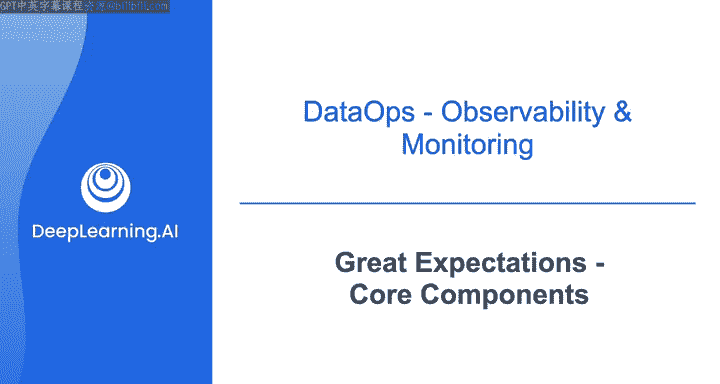
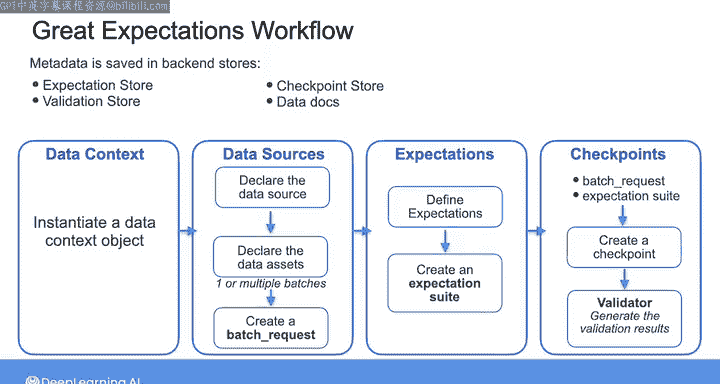

#  122：Great Expectations核心组件 🧪

在本节课中，我们将学习Great Expectations的核心组件及其典型工作流程。Great Expectations是一个用于数据质量测试的开源工具，它能帮助我们确保数据符合预期标准。

## 概述

在接下来的实验中，你将使用Great Expectations进行数据质量测试。在此之前，我们先通过一个示例工作流程来概述其核心组件。

使用Great Expectations时，工作流程通常从指定待测试的数据开始，然后定义要对数据执行的期望或测试，最后根据这些期望验证数据。

为了实现这样的工作流程，你需要与Great Expectations的核心组件进行交互，这些组件包括数据上下文、数据源、期望和检查点。这些组件用于访问、管理和操作工作流程中所需的对象和过程。

## 核心组件详解

上一节我们介绍了工作流程的总体步骤，本节中我们来详细看看每个核心组件。

### 1. 数据上下文

要启动工作流程，你首先需要实例化一个数据上下文对象。数据上下文是Great Expectations API的入口点，它包含了一系列类和方法，允许你创建对象、连接数据源、创建期望以及验证数据。

通过数据上下文，你可以配置和访问Great Expectations项目的属性、对象以及元数据。

### 2. 数据源与数据资产

实例化数据上下文对象后，你需要声明数据源对象，它告诉Great Expectations从何处获取要验证的数据。数据源可以是SQL数据库、本地文件系统、S3存储桶，甚至是Pandas DataFrame。

连接到数据源后，你需要告诉Great Expectations需要关注数据的哪一部分。这是通过从数据源声明数据资产来实现的。

数据资产是数据源内记录的集合。它可以是SQL数据库中的一张表、文件系统中的一个文件，也可以是一个连接了多张表的查询资产，或者是匹配特定正则表达式模式的文件集合。

你可以进一步将资产中的数据划分为批次。例如，如果你的数据资产代表表中某一年度的销售记录，你可以将记录划分为月度批次并分别验证，或者按门店ID进行划分。你也可以将数据资产的所有记录作为一个批次来处理。

为了检索数据资产的批次（无论是单个还是多个），你需要从资产中创建一个批次请求对象。批次请求是从数据资产检索数据的主要方式，也是你需要提供给Great Expectations其他组件的内容。

### 3. 期望与期望套件

接下来，你需要定义你的期望。期望是一个用于验证数据是否满足特定条件的声明。

例如，你可以定义一个期望来检查某列是否不包含空值。你可以自定义期望，也可以使用期望库中已有的声明。例如，`expect_column_min_to_be_between`、`expect_column_values_to_be_unique`和`expect_column_values_to_be_null`都是可以直接使用的测试示例。

你可以为数据资产定义多个期望，并将它们收集在一个期望套件对象中。

### 4. 验证器与检查点

现在，为了验证你的数据，你需要创建一个验证器对象。验证器需要一个批次请求及其对应的期望套件。

你可以直接与验证器交互来手动验证数据，也可以通过使用检查点对象来简化验证流程。检查点接收一个批次请求和一个期望套件，并自动将它们提供给验证器，由验证器生成验证结果。

在此过程中，关于你项目的元数据将被生成，Great Expectations会将其保存在一些后端存储中。

### 5. 存储

Great Expectations支持不同类型的存储。最常见的存储包括：
*   **期望存储**：用于存放你的期望套件。
*   **验证存储**：用于存放根据期望套件验证数据时生成的对象信息。
*   **检查点存储**：用于存放你的检查点配置。
*   **数据文档存储**：用于存放关于期望、检查点和验证结果的报告。

你可以通过数据上下文对象访问这些存储及其设置。

## 总结

本节课中，我们一起学习了Great Expectations的核心组件及其在典型工作流程中的作用。我们了解了从数据上下文和数据源开始，到定义期望、创建验证器和检查点，最后利用各种存储保存元数据的完整过程。在接下来的视频中，我们将在一个示例数据集上应用这些步骤。