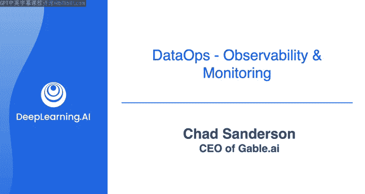

#  124：与Chad Sanderson探讨数据合约 📝

在本节课中，我们将学习数据合约的概念。数据合约是一种确保数据源质量的重要方法。我们将通过与行业专家Chad Sanderson的对话，了解数据合约的定义、重要性以及如何在实际工作中应用。

---

在之前的实验练习中，你通过测试来确认数据管道是否满足数据质量预期。

还有其他方法可以与上游利益相关者共同维护数据质量预期，包括使用所谓的“数据合约”。让我们与我的朋友Chad Sanderson进行一次对话，探讨数据合约如何帮助确保数据源的质量保持高水平。这是一个可选视频，让你有机会听取行业专家的见解，但如果你愿意，也可以直接跳到本周的最后部分，听Morgan介绍你将在本周最后一个实验中使用的可观测性工具Amazon CloudWatch。

---

让我们开始吧，Chad。
你好，Joe。我很好，很高兴见到你。
我也很高兴见到你。
我们今天在这里讨论数据合约，这是课程中涵盖的一个主题。我认为你在向更广泛的社区推广数据合约及其可见性方面处于领先地位，我非常感谢这一点。我认为你是讨论数据合约的绝佳人选。对于本课程的学习者，如果你还不了解你，请简单介绍一下自己。

当然。我叫Chad Sanderson，目前是一家名为Gable.AI的数据基础设施初创公司的首席执行官。在此之前，我在微软、Convoy、丝芙兰等几家公司领导数据平台团队。我曾担任过分析师、数据科学家和数据工程经理。我在数据领域以及所有相关问题上花费了大量时间。

确实，这里有很多问题。让我们深入探讨一下。那么，什么是数据合约？

数据合约最简单的形式是数据的接口，是数据的API。其理念是，如果你是一名软件工程师，其他人以某种方式访问你的服务，你会提供一个接口。你不希望他们直接访问你编写的原始代码，你会围绕该接口提供文档、服务等级协议等期望。但在数据世界中，这个概念并不真正存在。我们从数据生产者那里提取数据，这些数据来自他们的应用程序、Excel电子表格、Salesforce或SAP。我们将这些数据加载到分析数据库和笔记本中，并对这些生产者产生硬依赖。因此，当情况发生变化时，生产者和消费者之间没有合同来规定什么可以改变、如何改变以及期望是什么。这种期望的违反最终导致了大多数数据质量问题。

是的，没错。那么，请带我了解一下数据合约出现之前的生活是怎样的，并分享一下你在工作中建立数据合约的经验。

我在大多数公司看到的情况是，我认为有几类不同的公司。第一类公司更像是你传统的集中式数据组织，由数据架构师领导，他们考虑数据建模、实体关系图，并与DBA团队以及最终的分析师团队合作。他们就像一个卓越中心，负责建立所有的ETL、架构。在那个世界里，数据合约的必要性稍低一些，因为整个基础设施从一开始就是为了服务于特定功能而构建和监督的。

但在云计算的现代数据世界中，我们拥有数据湖和所有这些新理念，我们采用了一种更联邦式的数据摄取方法。软件工程师可以构建他们想要的任何服务，这些服务会产生大量数据。我们将所有数据扔进某个数据湖，然后由数据工程团队进入，构建提取过程并将数据加载到其他系统中。这实际上就产生了问题。你现在有两组人：生产所有数据的生产者，以及消费所有数据并对其进行处理的消费者。这两方彼此之间没有沟通。当缺乏沟通存在，而服务仍在不断变化时，唯一的选择就是某种程度的混乱。这就是发生的情况。因此，下游数据团队不得不在他们的机器学习模型和管道中构建大量验证，因为他们预期会发生变化，并不断预期出现破坏性问题。当数据质量问题出现时，数据工程团队必须进行非常耗时的根本原因分析，比如某个仪表板的所有者抱怨某个指标看起来不对。问题被抛给数据工程团队，数据工程团队必须查看查询，思考所有潜在原因，必须一直追溯到源头，必须理解发生了什么变化，必须要求生产者修复它。一旦修复完成，他们还必须进行整个回填过程。基本上，数据工程工作就变成了这样。我认为很多人会将数据工程与我刚才描述的这套步骤联系起来。我并不认为这是理想的数据工程工作。

是的，看起来确实如此。在我的经验中，通常你受制于生产者。你常常受制于他们的突发奇想和变化，当事情出错时，你就得去清理。但有了数据合约，我相信本课程的学习者会有一个问题：数据合约的这个接口看起来是什么样子的？我该如何使用数据合约？使用它具体是什么感觉？

这个接口就是我们所说的数据合约的规范。我认为从高层次来看，合约本身有几个不同的组成部分。一个是规范，它非常类似于API规范，比如如果你做过任何实际创建API的工作，就会知道Swagger。另一方面，你有你的执行机制，即我们如何确保遵循该规范，以及如果发生违规，你有一些方法来记录和跟踪它。但就规范本身的样子而言，它通常由两个主要类别组成，你可以无限扩展它，但主要类别是数据对象的结构和数据的内容。在结构方面，你有构成模式的模式和业务逻辑。这些包括列名、存在的列数以及构成列的实际逻辑。在数据内容方面，你有你的数据质量规则、服务等级协议、个人身份信息等这类东西。你可能会附加额外的策略，比如合规性，例如我们期望数据始终以某种方式被使用，或者如果有人针对此数据编写查询，它应遵循特定格式。这就是进入合约的内容，它确实是无限可扩展的。但我的建议始终是确保合约中的所有约束都是可操作和可执行的，否则它就会变成一纸空文或握手协议。

嗯哼。😊，我认为，例如，握手协议。所以，“合约”这个词可能隐含了某种解释，即这个数据合约可能是某种具有法律约束力的协议或团队之间的握手协议。你如何回应这类看法？我想接下来的问题是，数据合约在多大程度上是沟通，在多大程度上是技术？

我认为这是个很好的问题。我绝对认为它不是法律合同。实际上，我听说过一些团队希望与供应商签订具有法律约束力的数据合约的例子。所以，如果你同意为始终以某种方式提供的数据支付一定金额，而事实并非如此，这对你的公司产生了实质性影响，那可能就是你想要请律师处理的事情。但如果你在公司内部运作，真的没有，甚至对内部另一个团队采取法律行动也不是一个好主意。因此，通常合约的执行更多是关于该执行的程序化性质。例如，集成测试是一种执行形式，或者向消费数据的人发送警报和监控，让他们知道发生了合约违规，是另一种执行形式。

然后是这个问题：这在多大程度上是协作和人的问题？我认为主要是人的问题。技术部分真正关乎的是使采用合约、同意合约以及根据合约采取行动的过程变得非常非常容易。我见过的一个常见模式是，数据工程师试图通过要求应用程序开发人员拥有数据工程流程来解决这个问题。例如，“作为软件工程团队，你现在拥有这套表”，或者“我们希望你们拥有DBT”。通常这效果不佳，因为应用程序开发人员对Snowflake或DBT一无所知，这被视为他们时间和精力的成本与负担，会拖慢他们的速度。没有软件工程师希望被拖慢。因此，技术在这个问题上的帮助方式是，它允许数据合约在开发人员已经在使用的工作流程中实施和执行，并使遵守该合约变得微不足道。这实际上我们在其他行业也看到过。安全领域遵循了一个非常相似的模式，你有一个非常小的安全工程师团队，组织中没有很多人，他们需要考虑很大的范围，并且他们某种程度上受制于应用程序开发人员做正确的事。DevSecOps是一种新兴模式，它不是希望公司里的每个人都遵循安全最佳实践，而是有一层技术位于DevOps工作流程中，对代码进行检查，并说：“嘿，我们正在发布的代码是否遵循这些最佳实践？”如果没有，就需要向相关人员发出沟通。

学习者还应该了解关于数据合约的哪些内容？另外，我认为一个后续问题是，如果他们想实施数据合约，他们该如何开始？就需要注意的事项而言，我认为有很多不同的方式可以实施合约，其中一些方式比其他方式更可能成功。因此，我认为带着“我们将创建一个庞大的合约，它将包含所有这些、一百万个不同的约束，并将此交给软件工程师，而他们没有任何技术来实际拥有这个合约”的想法去实施，是一种很好的方式让人们不把你当回事。这会显得工作量很大，非常可怕，并且不清楚他们将如何将其纳入现有的流程中。所以，我认为在你去找生产者进行对话之前，你需要对这个问题有一个好的答案。我认为另一件重要的事情是，软件工程师喜欢做重要的事情，实际上任何人都一样。我认为你不想做无关紧要的随机工作。我见过一些团队去找他们的工程同行说：“嘿，伙计们，你们需要拥有从服务中发出的所有数据。”即使只有10%的数据对分析团队有用。这就会变成一个奇怪的问题：“嗯，如果你只使用其中的10%，为什么要求我拥有100%？你拖慢了我的速度，让我思考模式演进和所有其他事情，而我并没有得到任何回报。我没有为你做任何事情。”所以，我认为有选择性地从合约开始，确保你专注于最重要的管道，即如果数据质量变差会产生明显影响的管道，是一个非常好的起点。就实际开始实施而言，说实话，纸质合约和仅仅进行对话就是一个非常好的开始。我交谈过的大多数数据生产者会说：“我根本不知道我的数据在公司里被用在哪里。如果我不知道它发生了什么，我很难想要拥有这些数据的所有权。”所以，仅仅是克服这个障碍，说：“嘿，A工程团队，你知道你的数据被用在机器学习模型X和CFO每天早上都会看的仪表板Y中吗？”这是一个很好的开始，让他们意识到对他们来说是副产品的东西如何影响更广泛的业务。

这太棒了，非常好的建议。Chad，谢谢你的时间。我相信学习者会从这次讨论中收获很多，谢谢你。
谢谢，Joe。