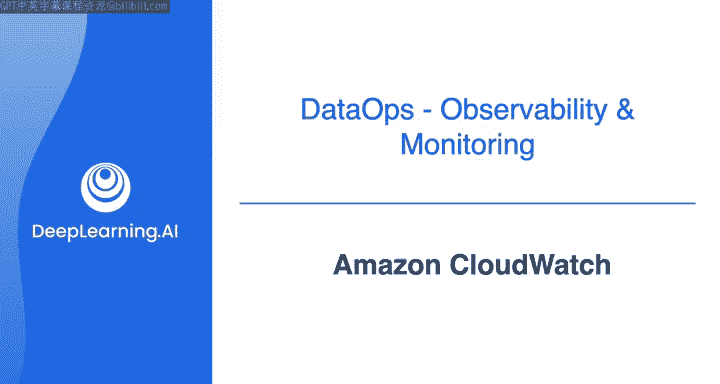
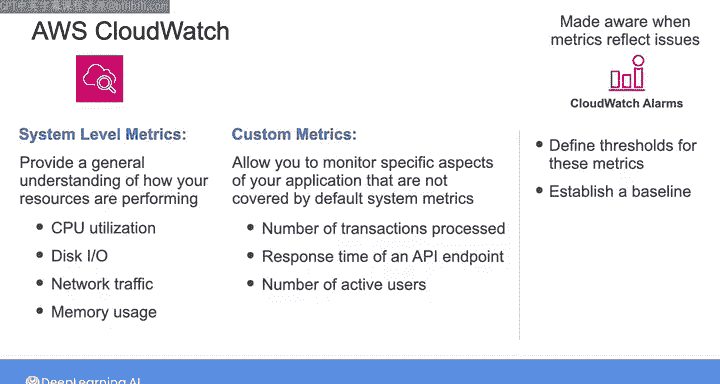
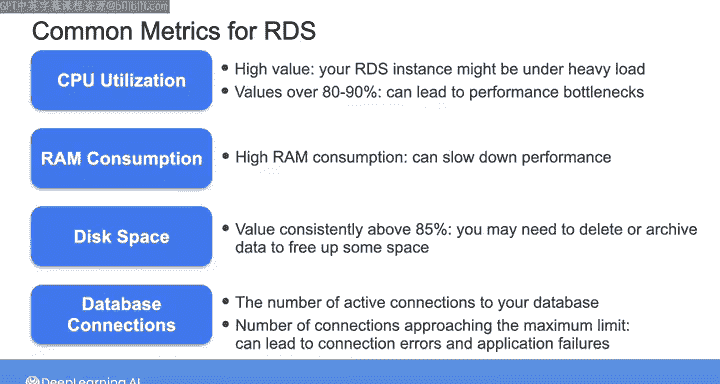

#  125：Amazon CloudWatch监控入门 🛠️

在本节课中，我们将学习如何使用Amazon CloudWatch来监控数据系统的健康状况。我们将了解监控的重要性、CloudWatch的基本工作原理、关键监控指标，以及如何为即将进行的实验做好准备。

## 概述：监控与可观测性的重要性

本周，您已经从Joe和其他讲师那里了解到，监控和可观测性对于确保数据系统健康至关重要。

在接下来的实验中，您将使用Amazon CloudWatch来监控AWS上的一个数据库。

因此，这里我想向您展示一些CloudWatch的工作原理细节，以便您为实验做好准备。

## 监控数据系统健康意味着什么

监控数据系统的健康意味着确保数据系统内的各个组件按预期运行。

如果系统的某个组件出现问题，成功的监控意味着您能在问题出现时立即知晓，甚至能在问题发生之前预测并纠正它们。

## CloudWatch的自动监控机制

当您在AWS上使用资源时，许多资源会自动开始向CloudWatch发送指标，而无需您进行任何设置。

大多数情况下，这些是系统级指标，例如：
*   **CPU利用率**
*   **磁盘I/O**
*   **网络流量**
*   **内存使用率**

这些指标可以帮助您大致了解资源的性能，并在潜在问题变得严重之前识别它们。

在最终用户发现问题之前识别问题非常重要，而健全的监控设置可以帮助您做到这一点。

## 自定义指标与仪表板

虽然许多AWS服务会自动向CloudWatch发送指标，但在某些情况下，您可能希望发送自定义指标。

自定义指标允许您监控应用程序中未被默认系统指标覆盖的特定方面。例如，您可能希望跟踪：
*   已处理的事务数量
*   API端点的响应时间
*   活跃用户数量

您可以使用CloudWatch仪表板来可视化和监控您认为最重要的指标，并将系统中多个组件的指标聚合到一个统一的视图中。

这个视图将帮助您在问题出现时识别和诊断它们。此外，仪表板还可以向您展示随时间变化的数据，从而使您更容易识别模式和异常。

## 告警与基线设定

您可能不会一直坐着看仪表板。相反，您需要一种方式，在指标开始反映问题时得到通知。

您可以为此创建针对特定指标的CloudWatch告警。您可以定义这些指标的阈值，以便在阈值被突破时收到警报或自动执行其他操作。

在确定要为指标设置什么合理的阈值之前，您需要建立一个基线。

为此，您需要在不同时间、不同负载和条件下测量系统的性能，并确定什么是正常状态。

CloudWatch配置为最多保留15个月的指标数据，因此您可以在确定系统基线之前收集一段时间的指标。

通常，指标的可接受值取决于您的应用程序相对于基线的运行情况。

## 监控RDS的常见指标

在接下来的实验中，您将监控在本周第一个实验中设置的RDS实例。

以下是您可能需要为RDS监控的一些常见指标：

以下是您可能需要为RDS监控的一些常见指标：

*   **CPU利用率**：CPU利用率过高可能表明您的RDS实例负载过重，需要扩展规模，或者查询需要优化。持续的高CPU利用率（例如超过80%到90%）可能导致性能瓶颈，从而减慢数据库操作。
*   **内存消耗**：这是RDS需要密切监控的另一个常见指标。高内存消耗也会降低性能，并可能表明您需要升级到具有更多内存的实例类型。
*   **磁盘空间**：另一个需要关注的指标是磁盘空间。如果磁盘空间持续高于85%，那么您可能需要考虑删除数据或将数据归档到其他系统以释放空间。
*   **数据库连接数**：监控数据库连接数也很重要。此指标显示到数据库的活动连接数。如果连接数接近最大限制，可能导致连接错误和应用程序故障。关注此指标有助于您管理连接池，并在需要时扩展数据库以处理更多连接。

以上是RDS向CloudWatch发送的几个简单指标示例，以及您需要监控它们的原因。

## 其他监控工具

除了CloudWatch，还有其他流行的第三方监控服务，例如**Datadog**或**Splunk**，您也可以使用它们来监控您的系统。

在监控其他AWS服务时，请记住，每个AWS服务都会发送不同的指标，哪些指标对您重要取决于具体的使用场景。

## 总结

本节课中，我们一起学习了数据系统监控的核心概念。我们了解到，监控旨在确保系统组件正常运行，并在问题发生时或发生前及时预警。Amazon CloudWatch是AWS上强大的监控工具，它能自动收集系统级指标，也支持自定义业务指标。我们通过仪表板可视化关键数据，并通过设置基于基线的告警来实现自动化监控。最后，我们以RDS数据库为例，探讨了CPU、内存、磁盘和连接数等需要关注的具体指标。希望这些知识能帮助您在接下来的实验中顺利使用CloudWatch。