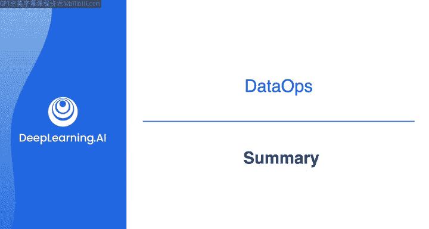
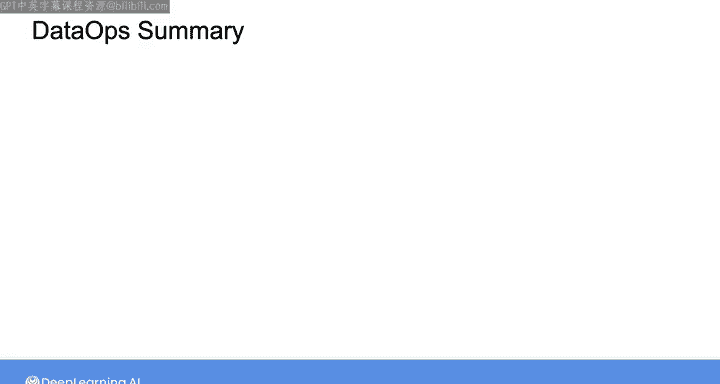
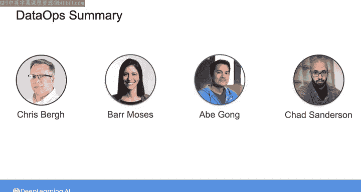
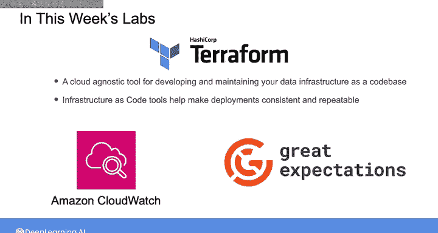

#  126：数据工程（导论，源系统、数据摄取和管道，数据存储和查询｜1-2-3课）｜第3周总结 📊

在本节课中，我们将总结第三周关于数据运维（DataOps）的核心内容。本周重点探讨了如何通过基础设施即代码实现自动化，以及如何对数据和数据管道进行可观测性与监控，以确保为利益相关者持续交付价值。

## 本周核心学习内容 🎯

上一节我们介绍了课程的整体背景，本节中我们来看看本周具体学习了哪些关键主题。

本周你学习了数据可观测性的关键支柱、如何测试数据质量，以及如何通过数据契约与上游利益相关者达成一致。

以下是本周涵盖的具体知识点：

*   **数据可观测性关键支柱**：来自Bar Moses的理论，帮助你全面监控数据健康度。
*   **数据质量测试**：学习了来自Abegong的方法，确保数据的准确性与可靠性。
*   **数据契约**：通过Chad Sanderserson的分享，了解了如何与上游团队建立明确的数据供应协议。
*   **DataOps实践对话**：回顾了与Chris关于数据运维实践的讨论。

## 实践工具与应用 🛠️

在理解了核心概念后，我们通过实践工具将这些理论应用于实际场景。

在本周的实验环节，你使用了Terraform和一系列监控工具来构建和守护数据基础设施。

以下是本周使用的主要工具及其作用：

*   **Terraform**：一个云无关的工具，用于以代码形式开发和维护数据基础设施。使用`terraform apply`等命令可以确保部署的一致性和可重复性，避免了手动配置云资源的繁琐与易错。
*   **CloudWatch**：用于监控RDS实例的运行健康状况。
*   **Great Expectations**：用于监控数据质量，通过定义数据测试断言（如`expect_column_values_to_not_be_null`）来验证数据是否符合预期。

借助这些工具，你可以设置仪表板来可视化数据管道各阶段的运行状态，并配置警报以便在出现潜在问题时及时获得通知。

## 下周展望：工作流编排 🚀

本周我们聚焦于基础设施的自动化与监控，为可靠的数据管道打下了基础。下一周，我们将在此基础上引入工作流编排（Orchestration）的概念。

通过编排，你将为数据管道的自动化、监控、可观测性和版本控制工具箱增添更强大的工具。我们下周将深入探讨如何协调和管理复杂的数据工作流。

## 课程总结 📝

本节课中我们一起学习了数据运维的核心实践。我们掌握了通过基础设施即代码实现自动化部署，利用各类工具监控基础设施与数据质量，并理解了数据可观测性与契约的重要性。这些技能是构建可靠、可维护且能持续交付价值的数据系统的基石。