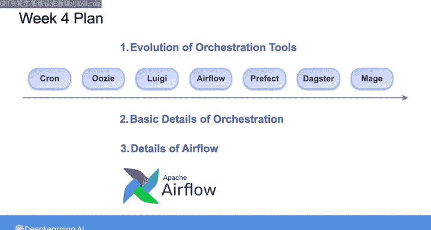

#  127：数据工程导论（第4周概览）🎯

在本节课中，我们将要学习数据工程生命周期中的一个核心概念——编排（Orchestration）。编排是自动化、可观测性和监控等数据运维（DataOps）支柱的关键组成部分，对于构建高效、可靠的数据管道至关重要。

## 从数据运维到编排 🔄

上一节我们介绍了数据运维的三大支柱：自动化、可观测性和监控。本节中我们来看看编排如何与这些支柱紧密相连。

编排与数据运维密切相关，因为它直接关联到自动化与可观测性这两大支柱。同时，编排也与数据管理和软件工程等数据工程生命周期的其他底层概念紧密相关。鉴于编排在数据工程师工作中的核心地位，我们将其视为数据工程生命周期中一个独立的底层流程。

## 编排工具的演进历程 🛠️

在深入编排细节之前，我们先回顾一下编排工具的发展历程。

以下是编排工具演进的主要阶段：
1.  **手工脚本阶段**：在专用编排工具出现之前，工程师使用简单的脚本（如Shell脚本、Python脚本）来手动触发和管理数据管道任务。
2.  **任务调度器阶段**：出现了如`cron`（Linux）或任务计划程序（Windows）等系统级调度工具，可以定时运行任务，但缺乏任务间的依赖管理和复杂的错误处理。
3.  **第一代工作流引擎**：出现了如`Apache Oozie`、`Azkaban`等工具，开始支持任务依赖关系图（DAG）和更复杂的工作流管理。
4.  **现代编排平台**：以`Apache Airflow`为代表，提出了“管道即代码”（Pipelines as Code）的理念，通过Python代码定义、调度和监控工作流，极大地提高了管道的可维护性和可扩展性。

## 编排的核心概念与实现 🧩

了解了历史后，本节我们来看看编排的基本原理和实现方式。

编排的核心目标是自动化数据管道中各个任务的执行顺序、依赖关系、错误处理和重试机制。一个基本的编排系统需要管理任务的有向无环图（DAG）。

**DAG** 可以用以下公式抽象表示：
`G = (V, E)`
其中，`V` 代表任务节点的集合，`E` 代表任务间依赖关系的有向边集合。对于任意边 `(u, v) ∈ E`，表示任务 `u` 必须在任务 `v` 开始之前成功完成。

在代码中，一个简单的任务依赖可以这样定义（以伪代码示意）：
```python
task_a = PythonOperator(task_id='extract_data', ...)
task_b = PythonOperator(task_id='transform_data', ...)
task_c = PythonOperator(task_id='load_data', ...)

# 定义依赖：A -> B -> C
task_a >> task_b >> task_c
```

## 聚焦行业标准：Apache Airflow 🌪️

理论之后是实践。目前业界最主流的编排工具是Apache Airflow，因此我们将重点学习它。

Airflow允许你使用Python代码将工作流定义为DAG。它的核心优势在于“管道即代码”、丰富的算子库、可扩展的架构以及强大的Web UI用于监控和运维。在本周的实验环节，你将亲自使用Airflow来构建和管理数据管道。

以下是使用Airflow时通常会涉及的几个关键组件：
1.  **DAG**：定义工作流的Python文件，包含了任务集合及其依赖关系。
2.  **Operator**：描述单个任务执行逻辑的模板，例如`BashOperator`用于执行Shell命令，`PythonOperator`用于执行Python函数。
3.  **Task**：Operator的一个实例，是DAG中的一个具体节点。
4.  **Task Instance**：Task的一次特定运行，具有状态（如成功、失败、运行中）。
5.  **Scheduler**：Airflow的核心服务，负责按照DAG定义和调度计划触发Task Instance。
6.  **Web Server**：提供图形化界面，用于查看DAG、监控任务状态、触发运行等。

## 总结 📚

本节课中我们一起学习了数据工程第四周的核心主题——编排。




我们首先明确了编排与数据运维（DataOps）中自动化、可观测性支柱的紧密联系。接着，回顾了编排工具从手工脚本到现代平台（如Airflow）的演进历程。然后，探讨了编排的基本原理，特别是基于有向无环图（DAG）的任务调度与管理。最后，我们将焦点对准了行业标准的Apache Airflow平台，概述了其核心概念与组件，为接下来的动手实验奠定了基础。编排是协调复杂数据管道、确保其可靠高效运行的关键技能。