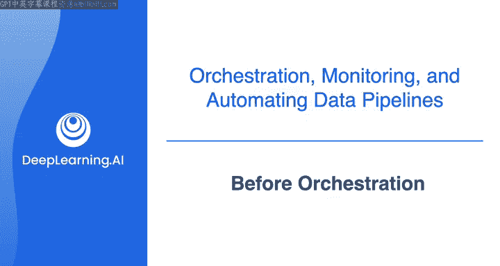
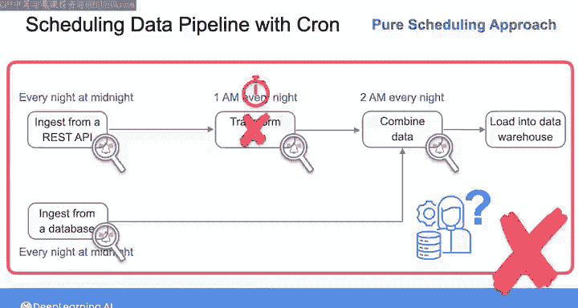
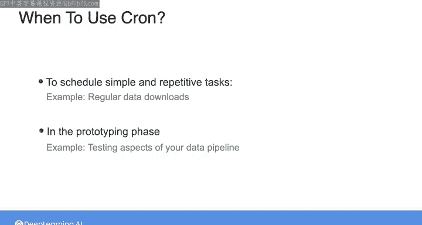

#  128：编排工具出现前的数据管道自动化 🕰️



在本节课中，我们将学习在现代化的编排工具出现之前，数据工程师是如何自动化运行数据管道的。我们将重点介绍使用 **Cron** 进行任务调度的传统方法，并分析其优缺点。

---

## 概述：什么是数据管道自动化？

在深入探讨编排工具之前，我们先退一步，了解一下如何在没有这些工具的情况下设置和运行数据管道。自动化数据管道（或任何软件任务集）最简单、最传统的方法是建立一系列 **Cron 作业**。

Cron 是一个命令行工具，最早出现于 20 世纪 70 年代，用于在指定的日期和时间执行特定命令。

---

## Cron 作业详解

要使用 Cron 调度任务，你需要编写一个称为 **Cron 作业** 的命令或条目。其基本结构是：指定五个由空格分隔的数字，后面跟着你想要调度的命令。

Cron 作业的结构如下所示：
```
* * * * * command_to_execute
```
从右到左，这五个数字分别代表：
*   **分钟** (0-59)
*   **小时** (0-23)
*   **日** (1-31)
*   **月** (1-12)
*   **星期几** (0-6，其中 0 代表星期日)

你还可以使用星号 `*` 代替任何一个数字，表示对该字段没有限制。

例如，以下 Cron 作业：
```
0 0 1 1 * echo “Happy New Year”
```
这行命令会在每年 1 月 1 日的午夜零点，在运行该命令的计算机终端上打印 “Happy New Year”。前两个 `0` 表示第 0 小时的第 0 分钟（即午夜），接下来的 `1 1` 表示一月的第一天，而星期几字段的 `*` 表示不关心具体是星期几。

---

## 使用 Cron 调度数据管道任务

那么，如何用 Cron 来调度数据管道中的任务呢？我们来看一个假设的例子。

假设你有一个数据管道，需要从 REST API 摄取数据。你希望每晚午夜执行一次摄取操作，并且有一个名为 `ingest_from_rest_api.py` 的 Python 脚本来完成此步骤。

在这种情况下，你可以编写如下 Cron 作业：
```
0 0 * * * python ingest_from_rest_api.py
```
这里的 `0 0` 表示在午夜执行，其他位置的 `*` 表示无论日期、月份或星期几都执行。

接下来，你可能需要对 API 数据进行一些即时清洗或处理。假设你有另一个 Python 脚本 `transform_api_data.py` 来执行此步骤，并且你知道从 API 摄取所有新数据总是花费不到一小时。

那么，你可以将下一步（即时转换）设置为每天凌晨 1 点运行，Cron 作业如下：
```
0 1 * * * python transform_api_data.py
```
同时，假设你还需要在每晚午夜从数据库摄取数据。那么你需要另一个 Cron 作业：
```
0 0 * * * python ingest_from_database.py
```
最后，你可能希望将转换后的 API 数据与数据库数据合并。你可以再设置一个 Cron 作业，例如在每天凌晨 2 点运行，以确保它在前面的作业完成后才开始：
```
0 2 * * * python combine_api_and_database.py
```
通过这种方式，你可以编写所有必需的 Cron 作业，精心安排它们的执行时间，以顺序方式实现整个管道。这种方法被称为 **点对点调度**，在编排工具出现之前，许多数据管道正是通过这种方式实现自动化的。事实上，至今许多简单的数据管道仍然采用这种方式。

---

## Cron 方法的局限性

需要明确的是，我并非建议你放弃编排工具而只用 Cron 作业来设置数据管道。这种设置方式存在许多可能导致失败的问题。

例如，如果一个任务运行失败、耗时超出预期或产生了意外结果，你的整个管道都可能失败。如果没有实现测试和调试来确定问题所在，你基本上无法准确知道它是如何或为何失败的。

更糟糕的是，由于没有任何内置的监控或警报来告诉你运行状况，你可能直到下游利益相关者来找你，询问为什么数据看起来不对劲时，才会发现故障。

---

## 为什么还要了解 Cron？



既然不推荐，为什么还要讨论 Cron 调度呢？

首先，对于理解数据管道自动化的含义来说，这是一种非常直观的方式。对于一些简单的任务，Cron 作业可以工作得很好，例如需要定期执行且没有下游依赖的数据下载任务。

其次，如果你正处于原型设计阶段，正在测试数据管道的各个方面，使用 Cron 可以是一种快速、简单的入门方式。

---

## 总结

本节课中，我们一起学习了在现代化编排工具普及之前，如何使用 **Cron** 进行数据管道的任务调度。我们了解了 Cron 作业的基本语法，并通过一个例子模拟了数据管道的调度过程。同时，我们也认识到这种点对点调度方法在**错误处理、任务依赖和监控告警**方面的局限性。



在接下来的视频中，我们将总体介绍编排工具，探讨它们近年来的发展，并开始学习如何使用 **Airflow** 来编排你的数据管道。