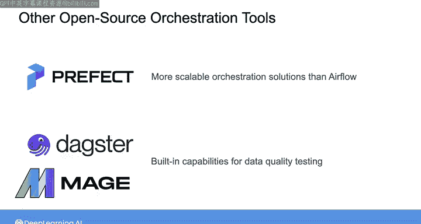

#  129：编排工具的演变 🚀

在本节课中，我们将学习数据编排工具的发展历程。编排是数据处理中的关键能力，我们将了解它如何从仅限大公司使用，发展到如今拥有多种开源和托管解决方案。课程将重点介绍Apache Airflow的崛起、其优势与不足，并概览其他新兴的编排工具。

---

## 编排的早期阶段

编排长期以来一直是数据处理的关键能力。但在过去十年左右的时间里，编排实际上只对最大的公司开放。这是因为当时尚不存在开源或托管的编排工具，构建自己的内部解决方案既复杂又昂贵。

## 开源编排工具的兴起

在21世纪后期，情况开始改变。Facebook开发了一个名为Dataswarm的内部工具，他们至今仍在使用。另一个名为Apache Oozie的工具在2010年代变得非常流行，但它设计用于在Hadoop集群内工作，在更异构的环境中更难使用。

受这些早期工具（特别是Dataswarm）的启发，Airbnb在2014年推出了Airflow，它已成为当今行业标准的编排工具。目前还有许多其他编排工具正在开发中，编排领域的格局无疑将在未来继续演变。

## 为何聚焦于Airflow

在整个课程中，我们大部分时间都主动避免过于深入地讨论任何特定的工具或技术。相反，我的目标是专注于那些无论你在哪里担任数据工程师都将广泛适用的技能和知识。

然而，在某些情况下，我会为一个你很可能在工作中使用的工具或技术破例，Airflow就是这样一个工具。目前，在编排方面，使用Airflow的团队比使用任何其他工具的团队都多。因此，这是招聘人员正在寻找的技能组合。

话虽如此，Airflow并非没有缺点。我对编排领域出现的一些其他较新的开源工具感到兴奋，因此我也会提到其中的几个。

## Apache Airflow的诞生与优势

Airflow由Maxime Beauchemin和Airbnb的其他合作者开发。他们主要致力于满足自己内部的数据编排需求。然而，从一开始，他们就将Airflow构建为一个非商业的开源项目，愿景是他们为满足Airbnb内部需求而开发的工具，对其他面临类似挑战的团队也有用。

该框架迅速在Airbnb之外获得了巨大的关注度，于2016年成为Apache孵化器项目，并于2019年成为完整的Apache赞助项目。

如今，Airflow作为一个编排平台提供了许多优势，这主要得益于其在开源市场的主导地位。Airflow使用Python编写，使其几乎可以扩展到任何可以想象的用例。

此外，Airflow开源项目非常活跃，提交率高，对错误和安全问题的响应时间快。与数据工程中的许多开源工具一样，Airflow也可以通过包括AWS、GCP和Astronomer在内的多家供应商作为托管服务提供，适合那些寻求更全面支持的用户。

## 其他编排工具概览

尽管如此，Airflow肯定不是唯一的编排工具。在可扩展性、确保数据完整性和流式处理管道等方面，Airflow要么没有解决这些问题，要么有巨大的改进空间。

存在许多其他有趣的开源编排项目，例如Luigi和Conductor。较新的工具如Prefect、Dagster和Mage也获得了关注，因为它们旨在模仿Airflow核心设计的最佳元素，同时在关键领域进行改进。

以下是几个新兴工具及其特点：
*   **Prefect**：提供了比Airflow更具可扩展性的编排解决方案。
*   **Dagster** 和 **Mage**：在其他功能中，为数据质量测试和数据转换提供了内置能力。
*   **其他工具**：专注于为流式处理管道提供更好的编排支持。

## 总结与建议

我认为，在未来几年，这些较新的编排工具中的一个或多个完全有可能作为Airflow的替代品被广泛使用。根据你正在设置的管道类型，其中一个替代工具也可能更好地满足你的需求。

话虽如此，我目前的建议是学习Airflow，因为这是当今许多人正在使用的工具。但同时也要持续学习其他工具，并关注编排领域的新发展，以便在事物不断演变的过程中保持与时俱进。

---

本节课中，我们一起学习了数据编排工具从专有到开源的演变历程，深入了解了当前行业标准Apache Airflow的起源、优势与面临的挑战，并概览了Prefect、Dagster等新兴工具的特点。理解这一演变过程有助于我们选择适合当前需求的工具，并为未来的技术发展做好准备。