#  130：编排基础 🧭

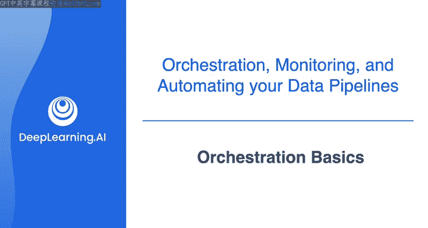

在本节课中，我们将学习数据管道编排的核心概念。编排是协调和管理数据管道中多个任务自动执行的过程。与简单的定时调度相比，编排提供了更强大的功能，如任务依赖管理、错误处理和监控。

## 什么是编排？🤔

上一节我们介绍了使用Cron进行任务调度的基础。本节中我们来看看更高级的编排概念。

编排涉及一系列通用的概念和组件，无论你使用哪种工具来实现，这些概念都是相通的。虽然为数据管道设置恰当的编排比简单的Cron调度带来更多的运维开销，但它也带来了设置任务依赖、获取警报以及在出现意外时创建备用计划的能力。

## 有向无环图 📊

在之前的课程中，我们多次提到，数据管道通常被可视化为一种称为**有向无环图**的结构，简称 **DAG**。

你可以将每个任务视为图中的一个**节点**，用图论的术语来说，连接这些节点的箭头称为**边**。你可以看到数据在图的节点或任务之间只朝一个方向流动。因此，你的数据管道有一个整体的方向感，图中没有循环或回路。这就是图被称为“有向”和“无环”的含义。

记住，使用Cron调度时，我们也可以设置这样的管道。但如果一个任务的运行时间比预期长，而下一个任务在前一个任务完成之前就启动了，这可能会破坏下游的所有环节。

## 任务依赖关系 ⛓️

现在，在编排中，这就是**依赖关系**概念的用武之地。例如，你可以在这个管道中的任务之间建立依赖关系，要求前一个任务完成后，下一个任务才能开始。

大多数编排框架允许你，并且事实上要求你将数据管道定义为DAG。在许多情况下，它们还包含一个用户界面，你可以在其中可视化你的DAG，以及调试、故障排除和监控你的数据管道。

## 在Airflow中定义DAG 🐍

在Airflow中，你将通过编写Python代码以编程方式定义你的DAG。

以下是定义数据管道中所有任务和依赖关系的代码示例：

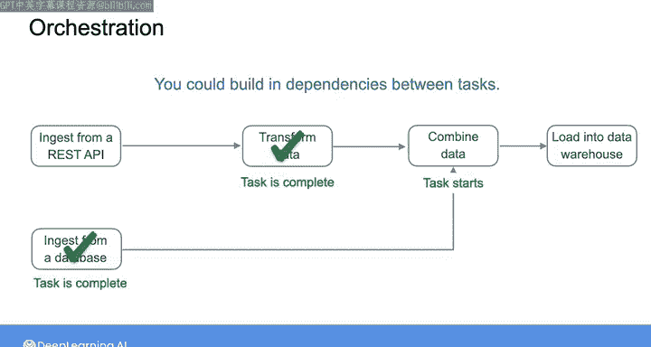

```python
# 示例：在Airflow中定义一个简单的DAG
from airflow import DAG
from airflow.operators.python_operator import PythonOperator
from datetime import datetime

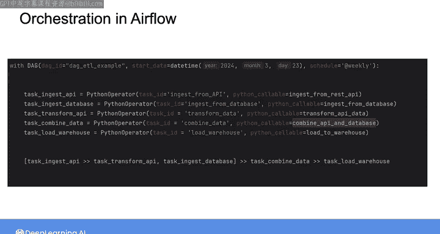

def my_task_function():
    # 你的任务逻辑在这里
    print("任务执行中...")

# 定义DAG
dag = DAG(
    'my_example_dag',
    schedule_interval='@daily',  # 每天运行
    start_date=datetime(2023, 1, 1),
    catchup=False
)

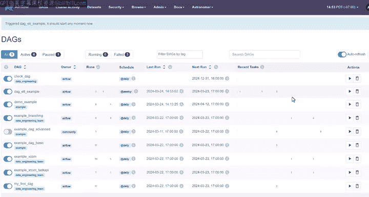

# 定义任务
task = PythonOperator(
    task_id='my_task',
    python_callable=my_task_function,
    dag=dag
)
```

你可以使用Airflow UI来可视化你定义的管道，它看起来像这样。在这里，你可以触发DAG运行、监控任务进度、可视化之前代码中定义的DAG，并排查任何问题。

## 运行条件与触发器 ⏰

当你将管道定义为DAG后，你可以设置DAG应该运行的依赖关系或条件。这些条件可以是基于时间的（如果你想在特定计划上运行DAG），也可以是基于事件的（如果你想基于事件触发DAG）。

例如，在Airflow中，你可以通过将参数`schedule`设置为`daily`来定义一个应该在每天午夜运行的DAG。要使你的DAG基于事件触发，你可以使用相同的`schedule`参数，但以不同的方式定义它。更具体地说，通过定义一个数据集的名称，你可以在数据更新时安排DAG运行。

你也可以让DAG的一部分等待某个外部过程完成。例如，某个外部过程将把一个CSV文件上传到S3存储桶，然后你可以设置你的DAG等待该文件在S3存储桶中出现。

以下是你可以如何在Airflow中定义一个名为“传感器”的任务，用于监听文件上传事件：

```python
from airflow.providers.amazon.aws.sensors.s3 import S3KeySensor

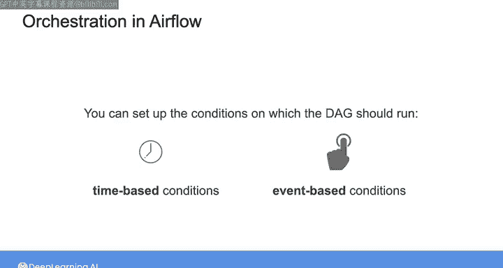

wait_for_file = S3KeySensor(
    task_id='wait_for_my_file',
    bucket_key='s3://my-bucket/myfile.csv',
    aws_conn_id='aws_default',
    mode='poke',
    poke_interval=60,  # 每60秒检查一次
    timeout=600,       # 超时时间600秒
    dag=dag
)
```

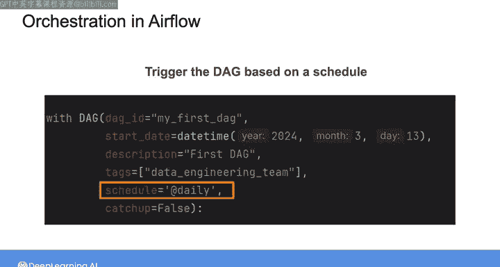

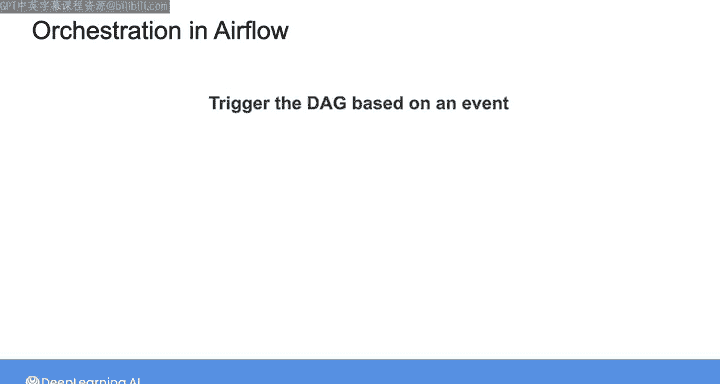

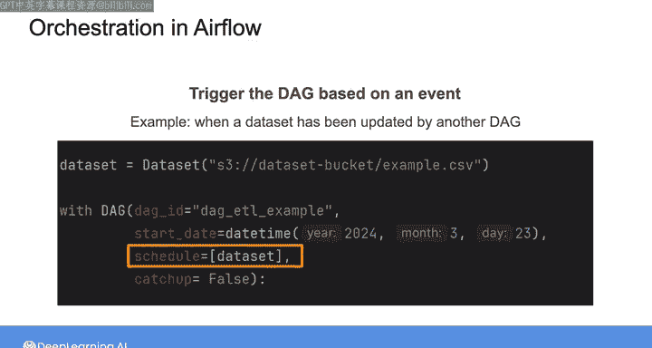

以这个任务开始的DAG部分将不会运行，直到`myfile.csv`在S3存储桶中可用。

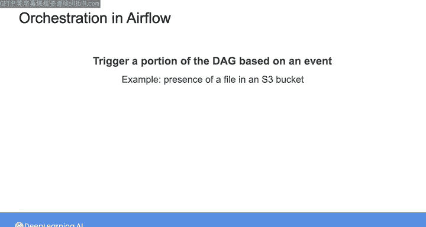

## 监控、日志与数据质量检查 🔍

你还可以为DAG中的任务设置监控、日志记录以及警报。例如，你可能希望在特定任务失败时收到警报，或者监控一个任务运行了多长时间。

你还可以在此过程中设置数据质量检查，以确保流经数据管道的数据符合你的期望。这可能包括检查诸如空值的种类、某些数值的范围，或者只是验证你摄取的数据模式是否符合预期。

```python
# 示例：一个简单的数据质量检查任务（概念性）
def data_quality_check(**context):
    # 从上游任务获取数据
    data = context['ti'].xcom_pull(task_ids='previous_task')
    # 执行检查，例如检查空值
    if data.isnull().sum().sum() > 0:
        raise ValueError("数据中存在空值，质量检查失败！")
    # 检查数值范围
    if not (data['value'].between(0, 100).all()):
        raise ValueError("数值超出预期范围！")
    print("数据质量检查通过。")
```

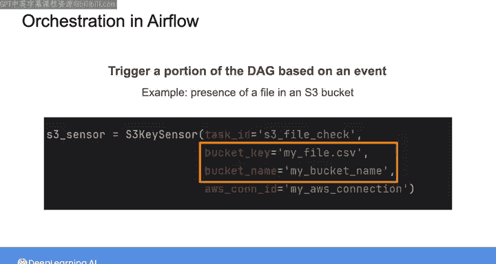

再次说明，我现在展示的所有内容都是在Airflow中进行的，但我演示的这些概念是你可以从任何编排平台中期望的功能。

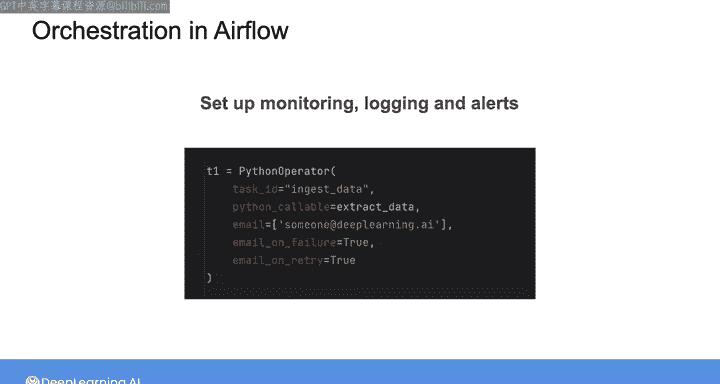

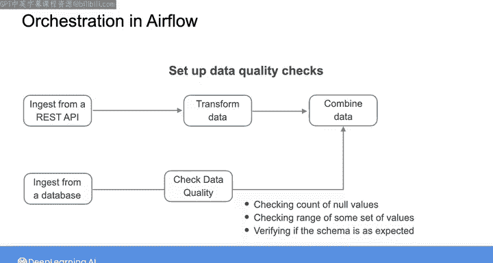

## 总结 📝

本节课中我们一起学习了数据管道编排的基础知识。我们了解了**有向无环图**是定义管道任务和依赖关系的核心模型。我们探讨了如何通过设置**任务依赖**来确保执行顺序，以及如何基于时间或事件来**触发DAG运行**。我们还介绍了**监控、警报**和**数据质量检查**的重要性，这些都是构建健壮、可靠的数据管道的关键组成部分。

在接下来的几个视频中，我将逐步指导你在Airflow中设置数据管道编排的步骤。