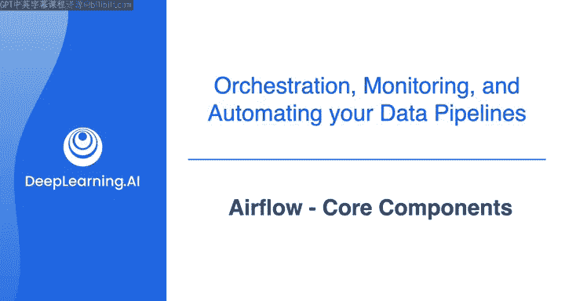
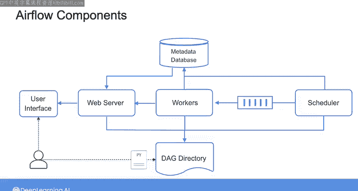
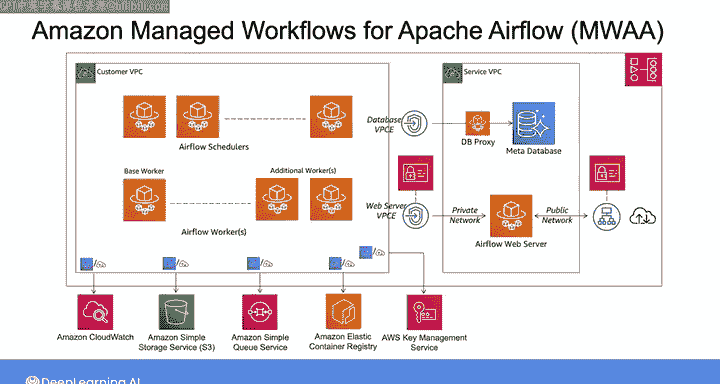
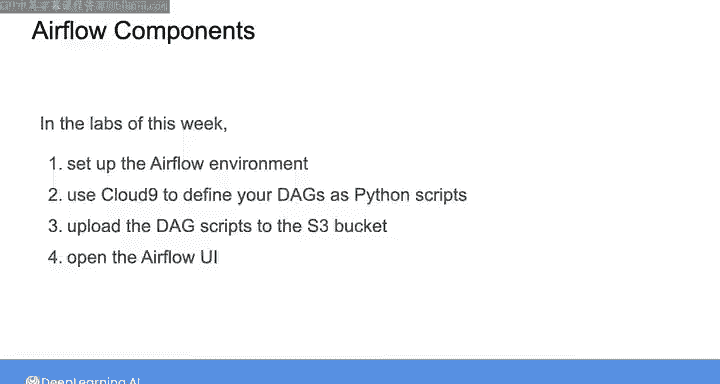

#  131：Airflow核心组件 🧩



在本节课中，我们将学习Apache Airflow的核心架构与组件。理解这些组件如何协同工作，是构建和运行可靠数据管道的基础。

## 概述

在开始本周的第一个实验之前，我们将花一些时间介绍Airflow。通过本系列视频的学习，你将了解如何构建一个简单的Airflow有向无环图，并为第一个实验做好准备。

在这个视频中，我们将从Airflow的底层架构开始。当你在Airflow中编写DAG时，有多个组件在幕后协同工作，以自动运行你的DAG，检查任务间的依赖关系是否满足，并将DAG的状态传递到Airflow用户界面。

## Airflow核心架构

下图展示了Airflow的主要组件，包括运行Airflow用户界面的Web服务器、调度器、工作节点、元数据数据库以及DAG目录。


当你创建Airflow环境时，无论是直接安装Airflow还是使用Airflow托管服务，所有这些组件都将存在于你的设置中。你将主要与DAG目录和用户界面交互，其余组件将在后台运行。

## 核心组件详解

上一节我们介绍了Airflow的整体架构，本节中我们来详细看看每个核心组件的作用。

### DAG目录

DAG目录是一个文件夹，用于存储定义DAG的Python脚本。这个DAG目录连接到运行Airflow UI的Web服务器。因此，对于你创建并添加到DAG目录的任何DAG，你将自动能够在UI中可视化它。

不仅如此，你还可以使用UI来监控、手动触发和排查DAG及其内部任务的行为。

### 调度器与执行器

但你并不总是需要从UI手动触发DAG。你也可以基于时间表或事件来触发它们，这需要借助Airflow的调度器组件。

调度器默认每分钟一次，持续监控你在DAG目录中定义的所有DAG及其对应任务。调度器检查是否有任何任务应该被触发，这取决于特定的时间表或检查其依赖项是否完成。

一旦调度器识别出一个准备触发的任务，它会将该任务推送到队列中，并使用执行器来管理任务的执行。执行器是调度器的一部分，它从队列中提取任务，并将它们发送给运行任务的工作节点。

以下是调度器检查任务的简化逻辑：
```python
if task.dependencies_met and (task.schedule_triggered or event_triggered):
    scheduler.queue_task(task)
```

### 工作节点与状态流转

当调度器触发一个给定任务时，你将看到任务的状态从“已调度”变为“已排队”。然后，一旦工作节点执行该任务，你将看到状态变为“运行中”，最终变为“成功”或“失败”。

调度器和工作节点将任务的状态以及DAG的状态存储在元数据数据库中。随后，Web服务器从数据库中提取这些状态，并在UI中显示给你。

## 托管服务示例：Amazon MWAA

以上是对Airflow核心组件的快速介绍。当你选择Airflow的托管服务时，例如Amazon Managed Workflows for Apache Airflow，所有这些组件都将自动为你创建和管理。

你可以在架构图中看到Amazon MWAA如何在云上组织Airflow的核心组件。





例如，它使用Amazon S3存储桶作为DAG目录，使用Aurora PostgreSQL数据库作为元数据数据库。其他组件包括AWS网络组件和支持数据安全、环境日志记录与监控的额外AWS服务。

## 实验准备

在本周的实验中，你将首先被引导设置Airflow环境。然后，你将使用Cloud9 IDE将DAG编写为Python脚本，将它们上传到S3存储桶，最后打开UI来查看创建的DAG。




理解Airflow环境以及组件之间如何交互，将帮助你在问题发生时进行排查。

## 总结

本节课中我们一起学习了Apache Airflow的核心组件及其协作方式。我们了解了DAG目录、Web服务器、调度器、执行器、工作节点和元数据数据库各自的作用，并预览了在托管服务（如Amazon MWAA）中的具体实现。理解这些是有效使用和排查Airflow的基础。请继续学习下一个视频，我们将浏览Airflow UI的一些功能。