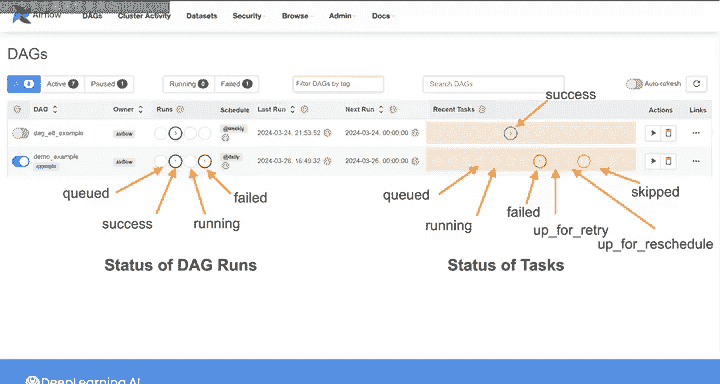
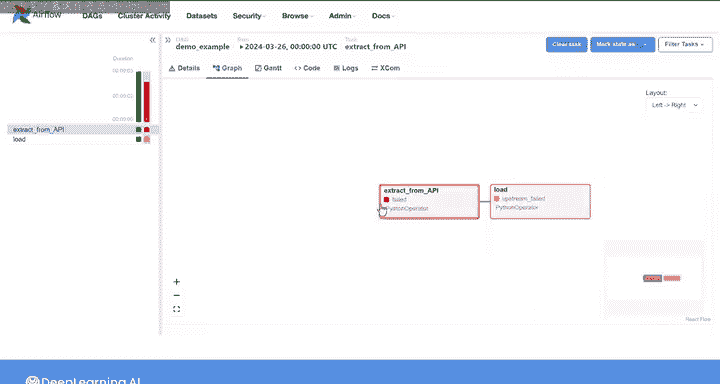
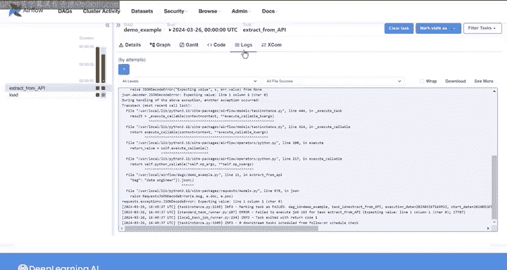
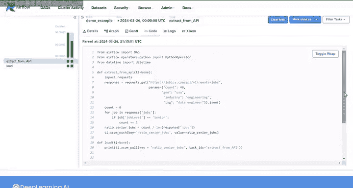

#  132：Airflow用户界面(UI) 🖥️

在本节课中，我们将学习Apache Airflow的核心交互工具——用户界面(UI)。你将了解如何通过UI监控工作流、查看历史运行记录以及排查管道问题。

## DAG视图概览

当你打开Airflow UI时，首先会进入DAG视图页面。此页面列出了你在DAG目录中创建的所有有向无环图(DAG)。

以下是DAG视图中显示的基本元数据：
*   **DAG ID**: DAG的唯一标识符。
*   **标签**: 为DAG分配的自定义标签。
*   **所有者**: DAG的负责人。
*   **调度计划**: DAG的运行频率。
*   **最近运行时间**: DAG上次执行的时间。
*   **运行状态**: 显示当前排队、运行中、成功或失败的DAG运行数量。

对于每个DAG，还有一个更详细的视图，可以查看所有任务的状态，包括排队、运行中、成功、失败、跳过、等待重试或重新调度的任务数量。

在DAG视图中，你可以进行以下交互操作：
*   使用左侧的开关**暂停**或**取消暂停**一个DAG。
*   点击右侧按钮**手动触发**一个DAG运行，或将其从视图中**删除**。
*   根据状态或自定义标签**筛选**显示的DAG。

点击DAG ID可以获取该DAG的详细信息。

## 网格视图详解

点击DAG ID后，你将进入**网格视图**。此视图提供了每个DAG运行及其对应任务实例的详细信息。

视图左侧是一个条形图，展示了该DAG的所有历史运行记录。条形的高度代表每次运行的持续时间，颜色代表运行状态（例如，红色表示失败，绿色表示成功）。对于每次运行，你还可以查看所有独立任务实例的结果。

视图右侧包含四个标签页：**详情**、**图形**、**甘特图**和**代码**。

### 详情标签页

**详情**标签页显示历史DAG运行的详细信息，例如：
*   总运行次数
*   成功运行次数
*   失败运行次数
*   DAG运行的最短、平均和最长持续时间

这些指标可以作为评估管道健康状况的依据。要查看特定DAG运行（例如失败的那次）的详细信息，可以在左侧条形图中选中它，然后在右侧查看其具体信息。

### 图形标签页

**图形**标签页以可视化方式展示你的DAG结构，帮助你理清任务间的依赖关系是否正确配置。当前看到的DAG可视化图不与任何特定运行实例对应。

如果你想查看特定DAG运行（例如失败的那次）中各个任务的状态，可以在左侧点击该次运行。此时，图中的每个任务会根据其在该次运行中的状态进行颜色编码。

假设你想了解任务“extract_from_API”失败的原因。点击该任务，顶部会出现一个名为**日志**的新标签页，其中包含了所有错误信息。根据这些信息，你可以尝试修复DAG代码。

修复完成后，如果需要重试该任务，可以点击**清除任务**。如果该任务成功运行并完成，管道中所有剩余的任务也将随之运行。

### 甘特图标签页

**甘特图**标签页展示了特定DAG运行中每个任务的**排队持续时间**（灰色部分）和**运行持续时间**。当你需要识别管道中的性能瓶颈时，这个图表会非常有用。

### 代码标签页

**代码**标签页显示对应DAG的源代码。请注意，这不是你编辑DAG代码的地方，但你可以通过此标签页确保UI中显示的代码与DAG目录中的代码保持一致。

## 课程总结

本节课我们一起探索了Apache Airflow用户界面(UI)的核心功能。我们学习了如何在**DAG视图**中总览和管理所有工作流，以及如何在**网格视图**中通过详情、图形、甘特图和代码等标签页深入分析每次DAG运行的细节、任务依赖、执行时间线和源代码。这些功能是监控工作流状态、排查问题和管理数据管道的基础。在下一课中，我们将实际动手构建一个简单的DAG。