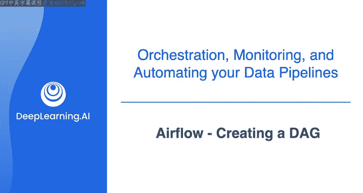
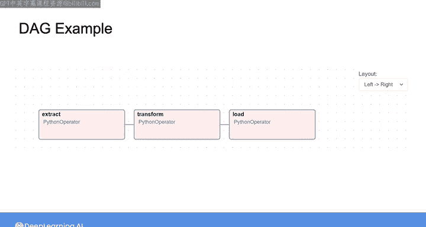
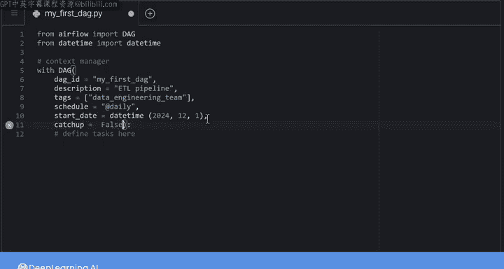
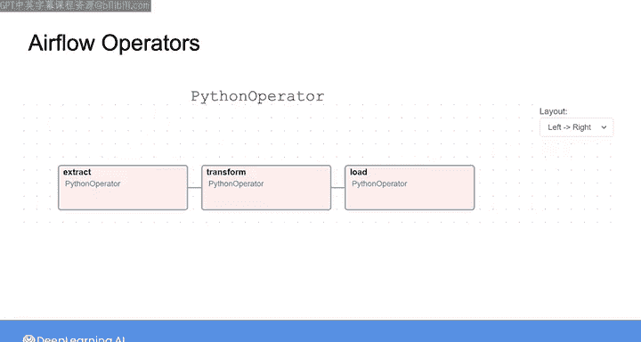
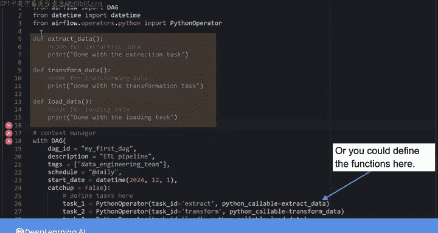
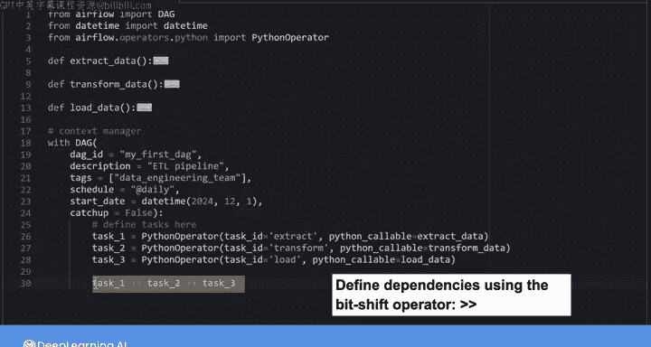

#  133：使用Airflow创建DAG 🛠️



在本节课中，我们将学习如何使用Airflow的核心概念，如DAG和操作器类，来构建一个简单的有向无环图。我们将通过一个ETL过程的例子，详细说明创建DAG的每个步骤。

---

## 概述

我们将创建一个代表ETL过程的DAG，该过程包含三个任务：提取、转换和加载。本教程将重点介绍DAG的结构设置，而非每个任务的具体实现细节。

---



## 创建DAG实例

首先，我们需要创建一个DAG实例。这需要导入必要的包并使用上下文管理器来定义DAG。

```python
from airflow import DAG
from datetime import datetime

with DAG(
    dag_id='my_first_dag',
    description='一个简单的ETL流程示例',
    tags=['data_engineering_team'],
    schedule='@daily',
    start_date=datetime(2023, 1, 1),
    catchup=False
) as dag:
    # 任务将在此处定义
```

以下是DAG实例的关键参数说明：

*   **`dag_id`**：在Airflow UI中用于识别DAG的唯一名称。
*   **`description`**：DAG的描述，鼠标悬停在DAG名称上时会显示。
*   **`tags`**：标签列表，可用于在UI中过滤DAG。
*   **`schedule`**：定义DAG的运行时间，可以使用Cron表达式（如`0 8 * * *`）或预设值（如`@daily`）。
*   **`start_date`**：DAG首次执行的日期。
*   **`catchup`**：布尔值参数。如果设置为`True`，当DAG从暂停状态恢复时，调度器会为错过的执行间隔触发DAG运行。

---

## 定义DAG任务

上一节我们介绍了如何创建DAG实例，本节中我们来看看如何定义其中的任务。我们需要使用Airflow的操作器来定义每个任务。

操作器是Python类，用于封装任务的逻辑或数据在管道中的处理方式。以下是一些常用的操作器：

*   **PythonOperator**：用于执行包含任务逻辑的Python脚本。
*   **BashOperator**：用于执行Bash命令。
*   **EmptyOperator**：用于组织DAG，例如标记管道的开始和结束。
*   **EmailOperator**：用于通过电子邮件发送通知。
*   **传感器**：一种特殊类型的操作器，可用于使DAG由事件驱动。

在本例中，我们将使用`PythonOperator`来定义三个任务。



```python
from airflow.operators.python import PythonOperator

def extract_data():
    print("执行数据提取")

def transform_data():
    print("执行数据转换")

def load_data():
    print("执行数据加载")

# 在DAG上下文管理器中定义任务
extract_task = PythonOperator(
    task_id='extract',
    python_callable=extract_data
)

transform_task = PythonOperator(
    task_id='transform',
    python_callable=transform_data
)



load_task = PythonOperator(
    task_id='load',
    python_callable=load_data
)
```

每个`PythonOperator`实例需要两个主要参数：

*   **`task_id`**：任务的名称，用于在Airflow UI中引用该任务。
*   **`python_callable`**：一个Python函数，包含该任务需要执行的操作。

---

## 定义任务依赖关系

现在我们已经定义了DAG和任务，接下来需要指定任务之间的依赖关系，即任务的执行顺序。

我们可以使用位移运算符来定义依赖关系：

```python
extract_task >> transform_task >> load_task
```

这行代码意味着`extract_task`必须在`transform_task`开始之前执行并完成，而`transform_task`必须在`load_task`开始之前执行并完成。

---

## 总结

本节课中我们一起学习了如何使用Airflow构建一个简单的DAG。我们涵盖了以下步骤：





1.  创建DAG实例并配置其参数（如`dag_id`, `schedule`, `start_date`）。
2.  使用`PythonOperator`等操作器定义DAG中的各个任务。
3.  通过位移运算符定义任务之间的执行顺序。

完成DAG脚本后，您可以将其上传到Airflow的DAG目录（例如S3存储桶），然后在Airflow UI中检查和监控其运行状态。