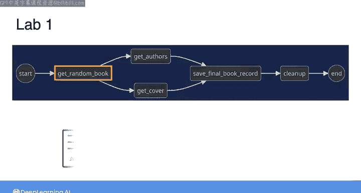
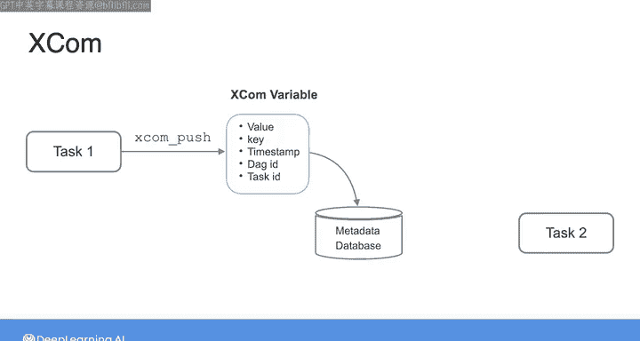
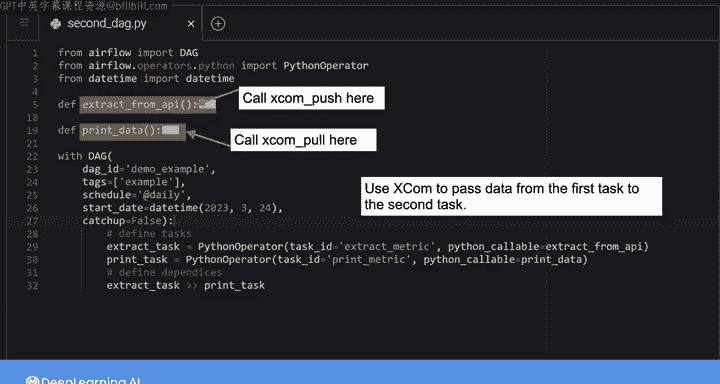
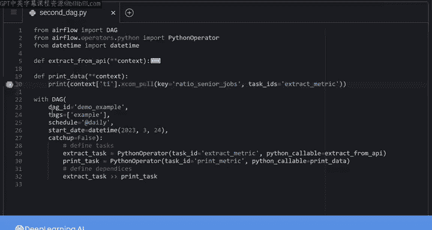
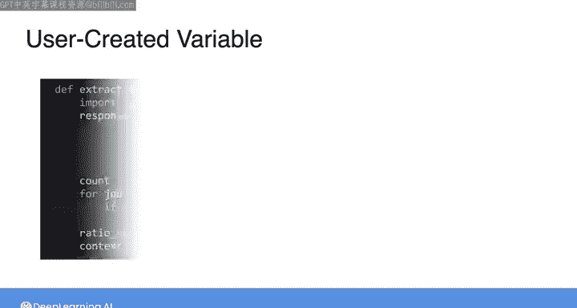
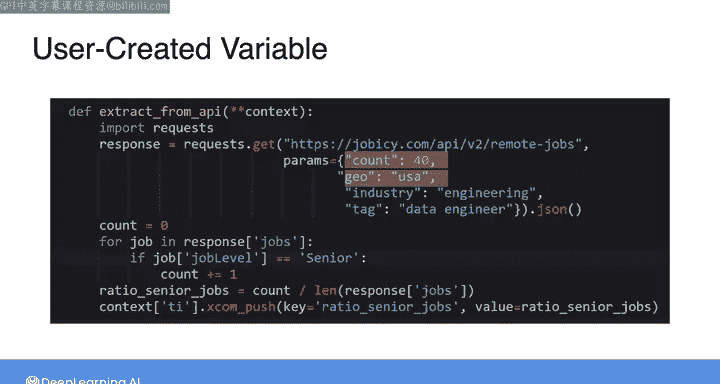
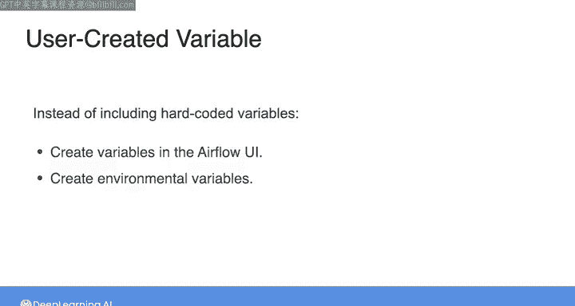
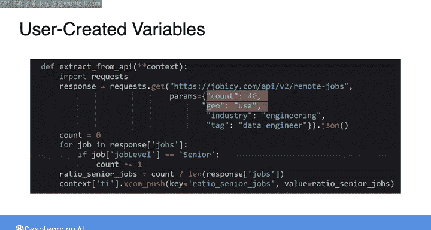
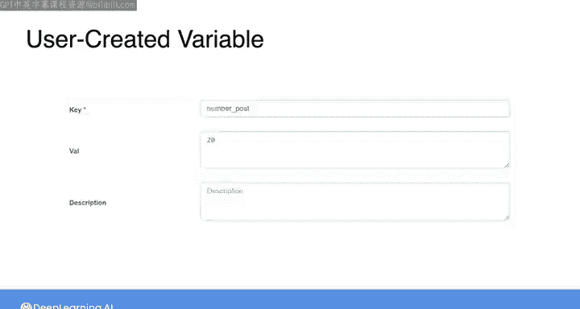
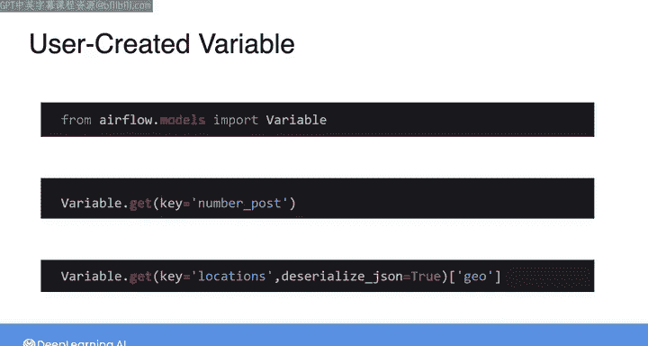

#  134：XCom与变量 🚀


## 概述

在本节课中，我们将学习Airflow的两个核心功能：**XCom**（用于任务间传递小数据）和**变量**（用于管理全局配置）。我们将了解它们的工作原理、适用场景以及如何在代码中实现。

---

## 回顾：任务间数据传递的现有方法

在上一节中，我们通过实验构建了DAG，并与Airflow UI交互，解决了DAG中的问题。现在，我们准备探索Airflow的更多功能，并了解使用Airflow实现编排的最佳实践。

在之前的实验中，我们实现了一个DAG。在任务`get_random_book`中，我们从书籍API请求随机书籍的数据，然后将数据存储在S3桶中，供后续任务使用。这种方法通过中间存储（S3桶）在任务间传递数据。当需要在任务间传递大型数据集时，此方法很合适。

---

## 引入XCom：轻量级数据共享



但对于少量数据，有另一种称为**XCom**的方法可以使用。

**XCom**是“cross-communication”的缩写，是Airflow中用于在任务间共享数据的关键功能。它设计用于在给定DAG的任务之间传递信息，例如元数据、日期、单值指标或简单计算结果。

在任务中，如果您有一个值想在另一个任务中使用，可以将其存储在XCom变量中。

### XCom的工作原理

以下是XCom的核心操作：

*   **存储数据（推送）**：在任务中调用`xcom_push`方法，将数据推送到元数据数据库。
*   **提取数据（拉取）**：在任何任务中调用`xcom_pull`方法，提取存储在XCom变量中的值。

每个XCom包含以下信息：变量名称（键）、存储的值、创建时间戳、所属DAG ID以及生成该变量的任务ID。

---



## 实战示例：使用XCom传递指标

让我们看一个例子。这里的DAG由两个任务组成。

*   **任务一：`extract_metric`**：连接API，发送请求获取数据，然后基于返回数据计算一个指标。
*   **任务二：`print_data`**：打印第一个任务计算的指标。

由于需要在第一个和第二个任务之间传递数据，我们可以在这里使用XCom功能。第一个任务使用函数`extract_from_api`，这是需要调用`xcom_push`的地方。第二个任务使用函数`print_data`，这是需要调用`xcom_pull`的地方。

### 深入代码：推送（Push）数据

这是`extract_from_api`函数的代码。

```python
def extract_from_api(**context):
    # 调用REST API，获取美国地区最新的40个远程数据工程师职位发布
    # 计算其中要求高级数据工程师的职位比例
    senior_ratio = compute_senior_ratio(api_response)
    
    # 将计算出的值存储在XCom变量中
    task_instance = context['ti']
    task_instance.xcom_push(key='senior_ratio', value=senior_ratio)
```



我调用了一个招聘网站的REST API，获取美国地区最新的40个远程数据工程师职位发布。然后，我计算了其中要求高级数据工程师的职位比例。现在，我想将这个值传递给第二个任务。

首先，需要通过调用`xcom_push`方法将获得的值存储在XCom变量中。此方法需要两个参数：变量的键和计算出的值。`xcom_push`是与任务实例关联的方法。这意味着您需要一个任务实例（左侧）才能调用该方法。任务实例是代表当前运行任务的对象。

Airflow有一组内置变量，包含当前运行任务的信息，包括任务实例。此信息存储在名为`airflow context`的字典中，您需要将其作为参数传递给`extract_from_api`函数。要从上下文字典中获取任务实例对象，可以使用`context[‘ti’]`，其中`ti`代表任务实例。然后，您可以在获得的任务实例对象上调用`xcom_push`。

### 深入代码：拉取（Pull）数据

然后，要在第二个任务中访问XCom变量中计算出的比例，需要调用`xcom_pull`。

```python
def print_data(**context):
    # 提取XCom变量中存储的值
    task_instance = context['ti']
    senior_ratio = task_instance.xcom_pull(key='senior_ratio', task_ids='extract_metric')
    print(f"Senior Data Engineer Ratio: {senior_ratio}")
```

传入变量的键和创建XCom变量的任务ID。与在`extract_from_api`函数中所做类似，您也需要一个任务实例才能调用`xcom_pull`。因此，将上下文字典作为参数传递给`print_data`函数，然后使用`context[‘ti’]`再次获取任务实例，最后在此对象上调用`xcom_pull`方法。

运行DAG时，您可以通过单击Airflow UI中的“Admin”，然后导航到“XComs”来检查您的XCom。这里可以看到我们刚刚创建的XCom变量及其对应的值。



---

## 重要注意事项：XCom的局限性

关于使用XCom，我想提醒您注意：**XCom并非设计用于在任务间传递大型数据集（如数据帧）**，因为它们会降低DAG和元数据数据库的性能。如果您需要在任务间共享大型数据集，应遵循上一实验中的做法，使用S3等中间存储。

---

## 引入变量：管理全局配置

现在，让我们讨论另一个Airflow功能。以同一个DAG为例，如果您检查第一个任务的API请求，会发现某些参数（如`count`和`geo`）的值是硬编码的，这意味着它们直接包含在代码中。

但是，如果您不希望这些值是固定的呢？因为您可能需要在未来的DAG运行中更改它们，或者您想尝试多个值。您可以更新代码中的值，但这种方法可能容易出错，并且效率不高，特别是如果这些值在代码中重复多次。

与其在DAG或任务定义中包含硬编码值，不如在Airflow UI中创建**全局变量**，或在开发环境中创建环境变量，并在代码内部使用这些变量。

### 在Airflow UI中创建变量







让我们在Airflow UI中创建两个变量：一个用于帖子数量，另一个用于位置。

1.  单击“Admin”选项卡，然后选择“Variables”选项，您将看到变量列表。
2.  要创建新变量，可以单击加号，然后指定变量的键和值。
    *   对于位置变量，我将感兴趣的国家/地区列表指定为JSON对象。
    *   对于帖子数量变量，我将其值赋为20。

### 在代码中使用变量

要在代码内部使用这些变量，您需要导入`Variable`模块。

```python
from airflow.models import Variable

def extract_from_api(**context):
    # 检索变量
    num_posts = Variable.get("number_of_posts") # 返回字符串 "20"
    locations = Variable.get("location", deserialize_json=True) # 返回反序列化的字典
    
    # 在API请求中使用变量
    # ... 使用 num_posts 和 locations 构建请求 ...
```

然后在代码内部，使用`Variable.get()`方法来检索帖子总数和位置列表。如果您希望此方法将JSON对象作为字典而不是字符串返回，请将参数`deserialize_json`设置为`True`。







---

## 总结与下节预告

在本节课中，我们一起学习了Airflow的两个重要特性：
1.  **XCom**：用于在任务间高效传递少量数据或元数据，通过`xcom_push`和`xcom_pull`方法实现。
2.  **变量**：用于集中管理配置参数，避免代码硬编码，通过Airflow UI创建并通过`Variable.get()`方法调用。

在下一个实验中，您将练习在Airflow UI中创建变量，使用Airflow内置变量，并使用XCom变量在任务间传递数据。在进行下一个实验之前，请务必查看本视频后的阅读材料，其中列出了编写DAG的一些最佳实践，以确保您的代码高效、可读且可复现。