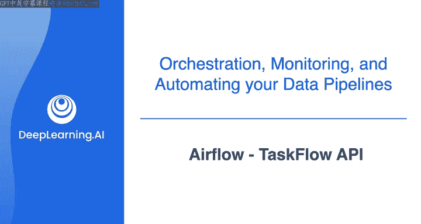
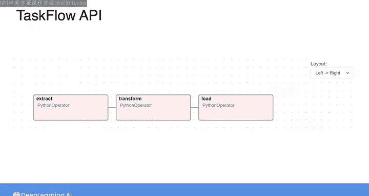
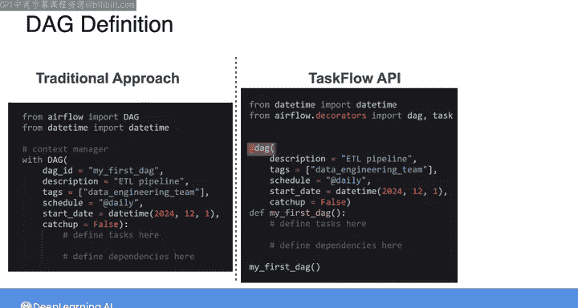
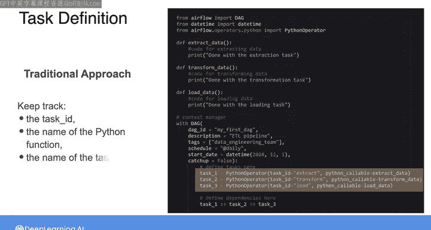
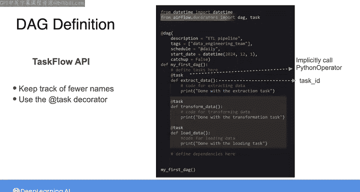
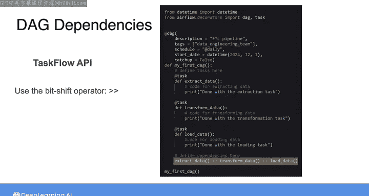
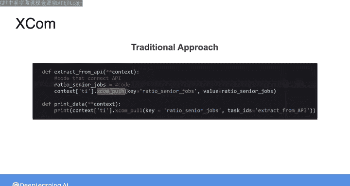
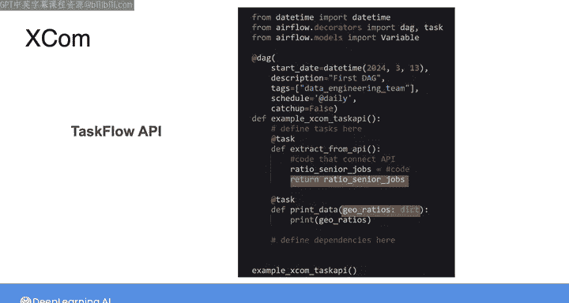
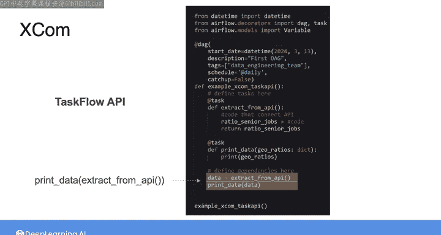
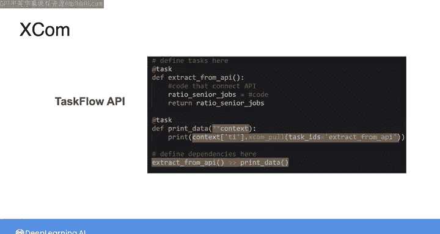

#  135：Airflow TaskFlow API 🚀



在本节课中，我们将学习Airflow的TaskFlow API。这是一种新的编程范式，旨在让编写DAG（有向无环图）变得更简单、更简洁，特别是当DAG大量使用Python函数时。我们将通过对比传统的操作符范式，来理解TaskFlow API的优势和用法。

---

## 概述

到目前为止，我们定义DAG的方式是实例化一个DAG对象，并使用Python操作符来创建任务实例，这被称为**传统范式**。Airflow 2.0引入了另一种范式，称为**TaskFlow API**。这个新范式的目标不是取代传统范式，而是让编写DAG更容易、更简洁。

TaskFlow API依赖于**装饰器**的使用，它帮助创建DAG及其任务，同时简化了代码编写。需要澄清的是，TaskFlow API中的“API”与REST API无关，你可以将其视为一个提供更友好编程体验的接口。

---

## 使用TaskFlow API定义DAG

上一节我们介绍了TaskFlow API的基本概念，本节中我们来看看如何使用它来定义一个DAG。

在传统范式中，我们显式调用DAG构造函数。而在TaskFlow API中，你可以使用`@dag`装饰器，并将DAG参数传递给装饰器，然后将DAG的内容定义为一个Python函数。

```python
from airflow.decorators import dag, task

@dag(
    schedule_interval='@daily',
    start_date=datetime(2023, 1, 1),
    catchup=False
)
def my_dag():
    # 任务定义将放在这里
    pass

# 必须调用DAG函数，否则DAG不会出现在Airflow UI中
dag_instance = my_dag()
```

`@dag`装饰器的作用是隐式调用DAG构造函数来创建DAG实例。函数名将用作DAG ID，在Airflow UI中标识该DAG。

---

## 使用TaskFlow API创建任务

在传统范式中，我们使用PythonOperator来创建任务。而在TaskFlow API中，我们使用`@task`装饰器来定义任务。

以下是创建任务的步骤：

1.  使用`@task`装饰器标记一个Python函数。
2.  函数名将自动用作任务ID。
3.  装饰器会隐式调用PythonOperator，从而简化代码。





```python
@dag(...)
def my_pipeline():
    @task
    def extract_data():
        # 提取数据的逻辑
        data = fetch_from_source()
        return data  # 返回值会自动推送到XCom

    @task
    def transform_data(data):
        # 转换数据的逻辑，`data`参数来自上一个任务的XCom
        transformed = process(data)
        return transformed

    @task
    def load_data(transformed_data):
        # 加载数据的逻辑
        save_to_destination(transformed_data)
```

要使用`@task`装饰器，需要从`airflow.decorators`中导入。

---

## 定义任务间的依赖关系

定义了任务之后，我们需要指定它们的执行顺序。在TaskFlow API中，我们仍然使用相同的位移运算符（`>>`）来定义依赖关系，但这次我们调用代表每个任务的函数。

```python
@dag(...)
def my_pipeline():
    extract = extract_data()
    transform = transform_data(extract)
    load = load_data(transform)

    # 定义依赖关系：extract -> transform -> load
    extract >> transform >> load
```

或者，你也可以将函数调用和依赖关系定义合并成一行：

```python
    extract_data() >> transform_data() >> load_data()
```



这种方式与传统范式达到的结果相同，但TaskFlow API让你的代码更简洁。

---

## 在TaskFlow API中使用XCom传递数据

XCom是Airflow中用于任务间传递小量数据的机制。我们来看看如何在TaskFlow API中使用它。

在传统方法中，你需要在函数中调用`xcom_push`来存储数据，然后在需要使用数据的任务函数中调用`xcom_pull`。

使用TaskFlow API，这个过程被大大简化：

*   **推送数据**：只需在任务函数中使用`return`语句。返回值会自动存储为XCom变量。
*   **拉取数据**：在后续任务的函数中，直接将其定义为一个输入参数。Airflow会自动将前一个任务的XCom值传递给它。

```python
@dag(...)
def my_pipeline():
    @task
    def extract_from_api():
        data = call_external_api()
        return data  # 自动推送到XCom，键为‘return_value’

    @task
    def process_data(data):  # `data`参数自动从extract_from_api任务的XCom拉取
        result = perform_calculation(data)
        return result

    # 定义依赖并传递数据
    raw_data = extract_from_api()
    processed_result = process_data(raw_data)
```

你仍然可以在TaskFlow任务中显式使用`xcom_pull`和`xcom_push`，例如通过访问Airflow上下文，但这通常不是必需的。





---




## 混合使用传统范式与TaskFlow API



需要特别注意的是，`@task`装饰器并不能替代所有类型的操作符。因此，根据你的用例，你可能仍然需要在同一份代码中结合使用两种范式。

例如，你可能有一个使用`PythonOperator`的复杂任务，同时其他任务使用`@task`装饰器。你仍然可以使用位移运算符来定义它们之间的依赖关系。

```python
from airflow.operators.python import PythonOperator

@dag(...)
def mixed_dag():
    @task
    def taskflow_task():
        return “Hello from TaskFlow”

    def traditional_function(**context):
        value = context[‘ti’].xcom_pull(task_ids=‘taskflow_task’)
        print(f“Got: {value}”)

    traditional_task = PythonOperator(
        task_id=‘traditional_task’,
        python_callable=traditional_function
    )

    # 定义依赖
    taskflow_task() >> traditional_task
```

在开始最后一个实验之前，请务必查看本视频后提供的关于**分支（Branching）**的阅读材料，它将帮助你在实验中创建动态管道。

---

## 总结



本节课中，我们一起学习了Airflow的TaskFlow API。我们了解到：




1.  TaskFlow API是Airflow 2.0引入的一种新范式，使用`@dag`和`@task`装饰器来简化DAG和任务的定义。
2.  与传统范式相比，TaskFlow API减少了需要跟踪的名称（如task_id），并通过隐式调用操作符和自动处理XCom使代码更简洁。
3.  我们学习了如何使用装饰器定义DAG和任务，以及如何设置任务间的依赖关系。
4.  我们探讨了如何在TaskFlow API中优雅地使用XCom在任务间传递数据，通常只需使用`return`语句和函数参数。
5.  最后，我们认识到TaskFlow API与传统范式可以共存，根据实际需求混合使用能提供最大的灵活性。

完成实验后，Morgan将带你了解在AWS上编排数据工程任务的一些可选方案。