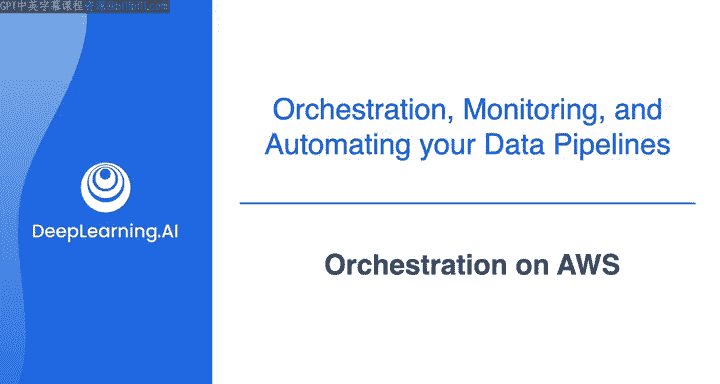
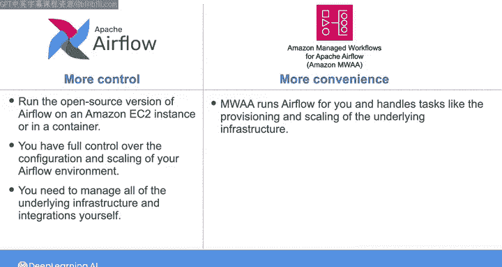
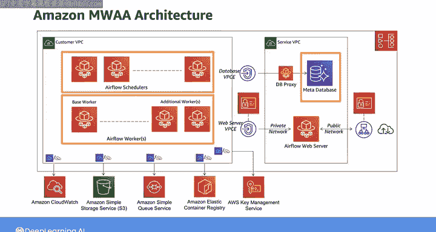
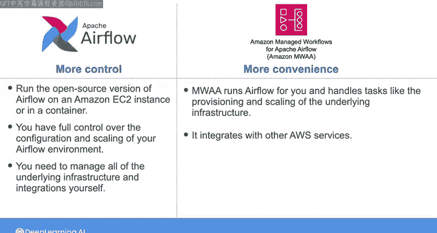
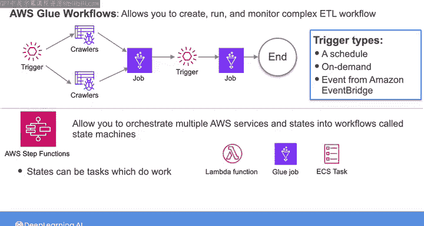
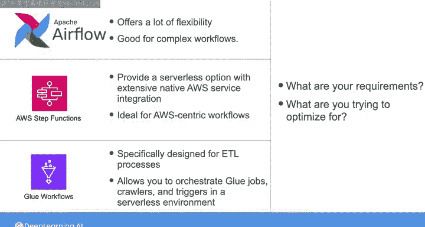

#  136：AWS上的编排 🚀

在本节课中，我们将学习在AWS云平台上编排数据工程任务的不同选项。我们将介绍Apache Airflow的几种部署方式，以及AWS原生的编排服务，帮助你根据项目需求选择最合适的工具。

上一节我们介绍了使用Airflow编排数据管道的基础知识。本节中，我们来看看在AWS环境中，你有哪些具体的编排工具选择。

## 在AWS上运行Airflow的选项

首先，对于Airflow本身，在AWS上托管和运行工作流有多种方式。

最需要手动操作的方式是，你可以在Amazon EC2实例上或容器中运行开源版本的Airflow。在本周的实验中，你使用的就是运行在EC2实例上一组容器中的开源Airflow。

采用这种方法，你可以完全控制Airflow环境的配置和扩展。但这同时也意味着你需要承担更多责任，因为你必须自己管理所有底层基础设施和集成。

正如我之前所说，在选择构建数据管道的工具和服务时，通常需要在便利性与控制力之间进行权衡，并考虑特定用例的需求。

如果你在AWS上运行Airflow的目标不是追求控制力，而是优化便利性，那么你可以选择使用Amazon Managed Workflows for Apache Airflow（MWAA）。这是一项托管服务，它为你运行Airflow，并处理底层基础设施的供应和扩展等任务。

当你使用MWAA时，它会为你设置一个Apache Airflow环境，使用的用户界面和开源代码与你从互联网上下载的相同。

下图展示了MWAA的架构。你现在熟悉的调度器和工作器组件托管在AWS Fargate的容器中，它们可以访问托管在Amazon Aurora上的Airflow元数据数据库，用于存储任务状态和DAG的状态。

MWAA还集成了其他AWS服务。例如，MWAA将Airflow日志和指标发布到Amazon CloudWatch，使用Amazon S3作为存放Python脚本的DAG目录，并使用AWS密钥管理服务对数据进行加密。

除了MWAA，AWS上还有其他支持类似功能的编排服务。

## AWS原生编排服务

以下是AWS提供的其他编排选项。

**AWS Glue工作流** 与Airflow类似，它允许你创建、运行和监控复杂的ETL工作流，其中多个Glue作业和爬虫程序可能相互依赖。一个Glue工作流包含作业、爬虫程序和触发器。

你可以在构建工作流之前先构建这些组件，然后使用AWS Glue控制台以可视化方式构建并查看工作流图的结构。你可以基于触发器运行这些Glue工作流，触发器可以是按计划、按需或来自Amazon EventBridge的事件。

**AWS Step Functions** 是AWS上的另一个编排选项。Step Functions允许你将多个AWS服务和状态编排成称为状态机的工作流。

状态机中的状态可以执行各种操作。状态可以是任务，例如处理数据的Lambda函数、转换数据集的Glue作业或运行容器化应用程序的ECS任务，仅举几例。状态还可以根据其输入做出决策，执行基于这些输入的操作，然后将输出传递给其他状态。

因此，与Airflow类似，Step Functions旨在协调任务并管理它们之间的依赖关系，允许你定义涉及多个步骤或状态的复杂工作流。

## 如何选择编排工具

当需要在Airflow（托管版或开源版）、Step Functions、Glue工作流或其他完全不同的编排工具之间做出选择时，就像其他任何选择一样，最终将取决于你的需求以及你试图优化的目标。

基于Python DAG和插件生态系统的Airflow提供了很大的灵活性，适用于复杂的工作流。Step Functions提供了一个无服务器选项，具有广泛的原生AWS服务集成，这对于以AWS为中心的工作流可能是理想的选择。而AWS Glue工作流专为ETL流程设计，允许你在无服务器环境中编排Glue作业、爬虫程序和触发器。

正如Joe之前提到的，编排工具的格局正在迅速发展。

因此，除了练习使用Airflow等流行工具外，你最好的策略是随时了解替代工具和新兴工具的最新动态，以便在你未来的数据架构中做出最佳选择。

本节课中，我们一起学习了在AWS上编排数据工程任务的多种途径。我们探讨了Airflow的不同部署模式（从自我管理到全托管服务），并介绍了AWS Glue工作流和Step Functions这两种原生服务。理解这些工具的优缺点，将帮助你在构建数据管道时，根据对控制力、便利性、复杂度和云服务集成的需求，做出明智的技术选型。