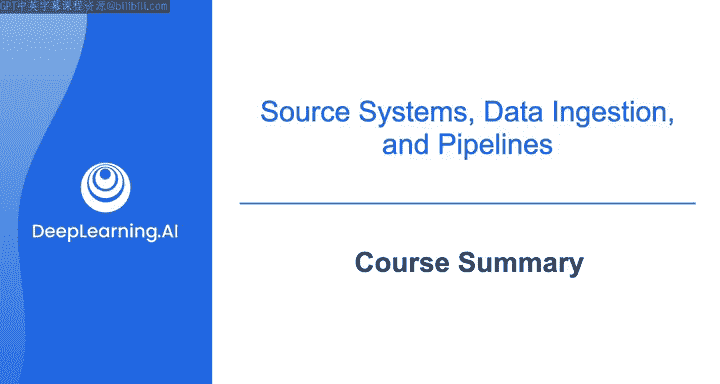
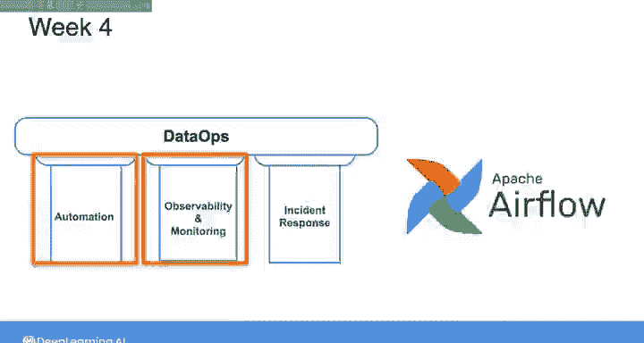

#  137：第2课总结 🎉

在本节课中，我们将回顾数据工程专项课程第二课的核心内容。你已经完成了从高层次框架到具体技术实践的广泛学习，为成为一名成功的数据工程师奠定了坚实基础。

## 课程完成祝贺 🎊

恭喜你完成数据工程专项课程的第二课。至此，你已经完成了四门课程中的两门。实际上，考虑到你已经涵盖的大量内容，你的学习进度已远超一半。

## 课程内容回顾 📚

上一节我们介绍了数据工程生命周期的高层次框架，本节中我们来看看你在第二课中具体完成的工作。这些工作涵盖了从源系统、数据摄取到数据运维与编排的多个关键领域。

以下是你在本课程各周学习的主要内容：

*   **第一周：源系统**
    *   探索了数据工程师将接触的各种源系统。
    *   实践操作了关系型数据库、非关系型数据库以及对象存储。

*   **第二周：数据摄取架构**
    *   深入研究了批处理与流式摄取架构的细节。
    *   设置了从REST API进行批处理摄取，并使用Amazon Kinesis建立了流式摄取。

*   **第三周：数据运维与自动化**
    *   在数据运维的背景下探讨了自动化、可观测性与监控。
    *   使用Terraform开发了基础设施即代码。
    *   使用Great Expectations实施了数据质量检查。
    *   使用CloudWatch设置了监控与告警。

*   **第四周：数据管道编排**
    *   在自动化、可观测性与监控方面更进一步。
    *   使用Airflow为数据管道实现了编排功能。

## 学习成果与展望 🚀

综上所述，你已经涵盖了广泛的知识领域，并且在培养成为成功数据工程师的核心技能方面进展顺利。

展望未来，在下一门课程中，你将专注于如何在数据管道中使用现代存储系统和存储抽象。我们下一课再见。😊

---

**本节课中我们一起学习了**数据工程第二课的全部核心模块，包括源系统处理、批流摄取架构、数据运维自动化工具链以及管道编排。你已掌握了构建可靠数据管道的关键实践技能，为后续深入学习数据存储与查询做好了准备。