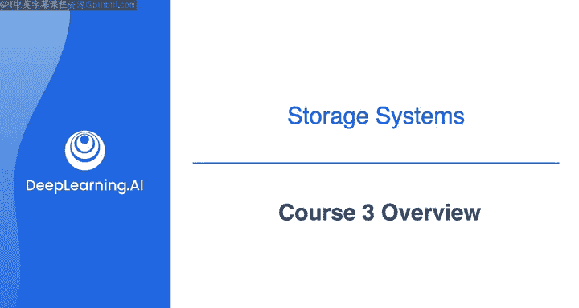
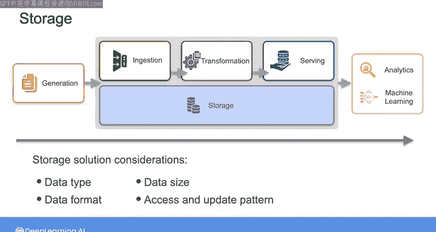
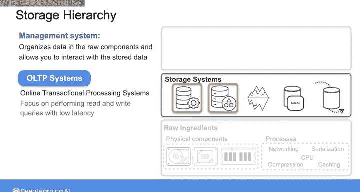
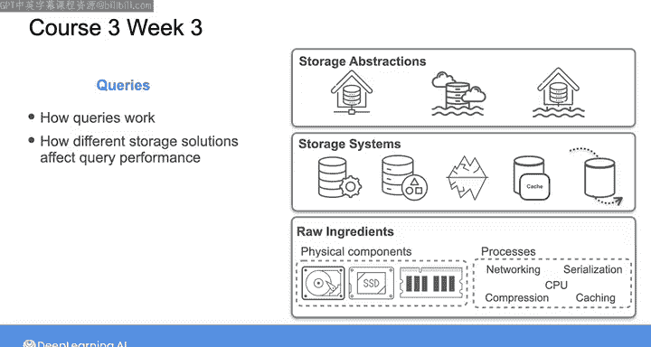

#  139：数据工程（导论，源系统、数据摄取和管道，数据存储和查询｜1-2-3课） - 第3课概览 🗂️

在本节课中，我们将要学习数据工程生命周期中至关重要的一个环节：数据存储。我们将探讨存储的层次结构，从物理硬件到高级抽象，并了解如何根据数据特性和业务需求选择合适的存储方案。

---

存储可以说是数据工程生命周期中最复杂的组件。这是因为数据在生命周期中会多次被存储，而您选择的存储解决方案将影响从成本、性能到最终用户体验的方方面面。因此，数据存储确实贯穿了生命周期的所有阶段，从数据工程师控制范围之外的源系统，到数据摄取、转换，最终到为最终用户提供数据服务。

在本课程中，我们将重点关注数据工程师直接处理的存储环节，即从数据摄取到数据服务的过程。要为您的数据架构选择合适的存储解决方案，您需要了解数据的特性，包括其**类型、格式、大小**，以及不同利益相关者在不同时间点将如何**访问和更新**数据。

回想一下，您可以将存储视为一种层次结构。

---

## 存储层次结构解析

### 底层：原始组件 🧱

在底层，是构成任何存储系统的原始“原料”。这些组件包括用于物理存储数据的**磁盘、固态硬盘和内存**，以及存储和传输数据所需的过程，例如**网络、序列化和压缩**。

您通常不会直接与这些物理存储组件或过程交互，而是与由这些原始组件构建的存储系统进行交互。

### 中间层：存储系统 💾

一个存储系统包含一个内部管理系统，用于组织您的数据并允许您与存储的数据进行交互。您已经在课程2的背景下了解过其中一些存储系统，例如**数据库和对象存储**。

当时我们主要讨论了用于处理事务的**OLTP系统**，其重点是实现低延迟的读写查询。然而，支持事务处理的存储系统与支持**在线分析处理（OLAP）** 的系统不同。OLAP系统专注于对数据应用**聚合和汇总**等分析活动，以支持业务决策。

如今，我们还有更专业的存储系统，如**图和向量数据库**，它们可以支持机器学习和分析用例。

### 顶层：存储抽象 🏗️

在存储层次结构的顶层，存储系统被组装成存储抽象，包括**云数据仓库、数据湖和数据湖仓**。

因此，在本课程的第一周，我们将重点关注前两层：原始组件和存储系统。

---

## 课程内容安排

### 第一周：深入存储基础

我们将更深入地研究物理存储技术的特性，并探讨**序列化和压缩算法**的技术细节。然后，我们将探索**块、对象和文件存储**的云存储范式。我们还将涵盖分布式存储系统，最后讨论各种类型数据库中数据存储的细节。

您将比较**行式数据库和列式数据库**之间的性能，以理解它们在OLTP和OLAP系统中的用例。接着，您将探索数据在**NoSQL、图和向量数据库**中是如何存储的，类似于您在课程2中探索关系型和NoSQL数据库作为源系统时所做的那样。

在本周的第二课中，您将获得使用**Cypher语言**查询Neo4j数据库的实践经验，这是一个具有向量搜索功能的图数据库。

**第一周的主题**是评估原始组件和存储系统层面在**存储成本与性能**之间的权衡，以便您在设计数据架构时能够开始做出明智的存储决策。

### 第二周：聚焦存储抽象

在第二周，我们将重点关注顶层——存储抽象。您将学习如何为利益相关者在**摄取、转换和服务阶段**所需的数据选择合适的抽象存储方式。

### 第三周：查询与性能优化

在本课程的最后一周，我们将探讨查询如何工作以检索存储的数据，不同的存储解决方案如何影响查询性能，以及改进查询性能的技术。

---

## 总结

本节课中，我们一起学习了数据存储的核心概念及其在数据工程生命周期中的重要性。我们介绍了存储的层次结构模型，从物理硬件到高级抽象，并概述了本课程三周的学习路线：第一周深入存储基础技术，第二周学习如何选择存储抽象，第三周探讨查询机制与性能优化。尽管本课程只有三周，但内容非常丰富。请继续观看下一个视频，我们将从数据存储的“原始组件”开始学习。

