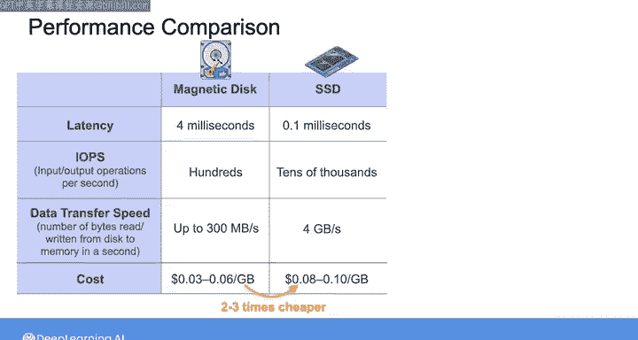
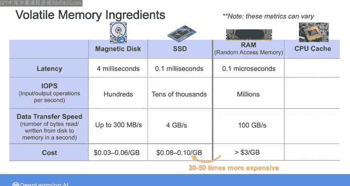
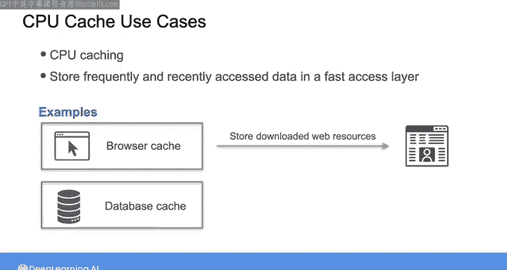

#  140：数据存储的物理组件 📚

在本节课中，我们将要学习数据存储系统的物理基础组件。理解这些“原材料”的特性、性能、数据持久性和成本，对于数据工程师选择适合特定应用场景的存储系统至关重要。

数据在管道中流转时，会经过持久化存储介质（如磁盘）和易失性内存（如RAM）。本节我们将详细比较这些不同的物理组件，帮助你理解它们之间的差异。

---

## 磁性硬盘驱动器（HDD）💽

磁性硬盘驱动器，通常称为硬盘或HDD，使用涂有磁性薄膜的旋转盘片来存储数据。其工作原理类似于老式唱片机，需要通过移动磁头来定位盘片上的特定磁道。

每个盘片包含圆形的磁道，磁道被分割为称为扇区的存储单元。磁道号和扇区号共同构成一个唯一地址，用于组织和定位数据。

执行写入操作时，读写头通过改变磁场方向来磁化薄膜，从而在特定地址物理编码二进制数据。磁场指向一个方向代表存储比特“1”，指向相反方向代表存储比特“0”。读取数据时，同一个读写头检测指定地址的磁场并输出比特流。

**核心概念：数据寻址**
`数据地址 = 磁道号 + 扇区号`

---

## 固态硬盘（SSD）⚡

固态硬盘使用闪存单元中的电荷来存储数据。带电的单元代表比特“1”，不带电的单元代表比特“0”。

由于消除了机械部件，SSD可以通过纯电子方式更快地读写数据。

---

## HDD与SSD性能对比 ⚖️

上一节我们介绍了HDD和SSD的基本原理，本节中我们来看看它们在性能上的具体差异。

HDD读取数据的延迟取决于两个机械操作的时间：
1.  **寻道时间**：读写头物理定位到正确磁道所需的时间。
2.  **旋转延迟**：目标扇区旋转到读写头下方所需的时间。

这些机械操作存在物理限制。目前，典型的商用HDD转速约为每分钟7200转，这意味着获取数据的平均延迟约为4毫秒。因此，HDD每秒最多只能执行几百次I/O操作。

相比之下，通过SSD中的电荷读取数据要快得多。新型SSD通常每秒可执行高达数万次I/O操作，数据获取延迟约为0.1毫秒。这使得SSD更擅长随机访问，即可以非常快速地读取或更新任何位置的数据。

在数据传输速度方面，HDD每秒可从磁盘向内存或RAM读写高达300兆字节的数据，而SSD的速度可能比这快10倍以上。

通过分布式存储系统和并行处理，可以获得更好的读写性能。例如，可以将数据分布在许多HDD和集群上，并同时从这些集群读取。在这种情况下，传输速度主要受网络性能限制，而非磁盘本身的物理限制。对于SSD，可以通过将存储分割为多个分区，并让大量存储控制器并行运行，以同时处理更多数据事务。采用并行处理方法，SSD的传输速度可达每秒数千兆字节。我们将在本周晚些时候深入探讨分布式存储和并行处理。

---

## HDD与SSD成本与选型建议 💰

现在我们已经从性能上比较了HDD和SSD，接下来考虑一下成本。

对于存储相同容量的数据，商用HDD通常比SSD便宜2到3倍。这就是为什么即使数据传输速度较慢、延迟较高，HDD仍然构成了大部分数据存储系统的骨干。

以下是选择存储介质时的建议：

*   **选择HDD**：如果你的应用需要以每次1兆字节或更大的块进行不频繁的数据访问，且不需要超快的读写速度，那么HDD是更具成本效益的选择。
*   **选择SSD**：SSD常用于OLTP系统的商业部署，因为它们允许关系数据库每秒处理数千笔事务。然而，由于其较高的成本，SSD并不总是分析型存储的最佳选择。

---

## 易失性内存：RAM与CPU缓存 🧠

让我们转换视角，看看易失性内存组件，即随机存取存储器（RAM）和CPU缓存。

为了让CPU处理数据，需要将数据从持久化磁盘存储（如SSD和HDD）传输到RAM。RAM通常直接连接到CPU，因此速度非常快，能比磁盘存储更好地匹配CPU的处理速度。

目前，RAM的数据传输速度约为每秒100千兆字节，数据获取延迟非常低，约为0.1微秒，这使其能够执行数百万次I/O操作。这些指标可能因硬件和配置规格而有很大差异。

但RAM并非无所不能。由于它连接到CPU，其单位存储数据的成本更高，通常比SSD贵30到50倍。它也是易失性的，意味着如果断电，存储在RAM中的数据可能在不到一秒内丢失。因此，通常只使用RAM来存储CPU执行的代码以及该代码直接处理的数据，而不是需要持久保存的内容。这使得RAM非常适合用于缓存、数据处理或索引，我们将在本课程后面讨论。

一些数据库将RAM作为主要存储层，因为它允许非常快的读写性能。在这些应用中，必须始终牢记RAM的易失性。即使数据在集群中的内存间进行了某种复制，导致多个节点宕机的停电也可能造成数据丢失。

比RAM更快的一种内存是CPU缓存，它直接位于CPU处理芯片上。你希望使用CPU缓存来存储频繁访问的数据，以便在处理过程中进行超快速检索。由于其位置优势，它的数据获取延迟约为1纳秒，数据传输速度高达每秒1太字节。

缓存不仅用于CPU。你还可以在多种应用中使用缓存，将频繁和最近访问的数据存储在快速访问层。例如，可以使用浏览器缓存来存储下载的网页资源，以便更快地加载网页；也可以使用数据库缓存来存储常用查询的结果。

---

## 总结 📝

本节课中，我们一起学习了物理存储数据的不同组件之间的性能和成本权衡。作为数据工程师，扎实理解这些权衡有助于你评估不同的存储技术，确保它们满足数据处理工作负载的性能要求。

在下一个视频中，我们将探讨序列化和压缩等其他对现代数据系统中存储数据至关重要的组件和过程。