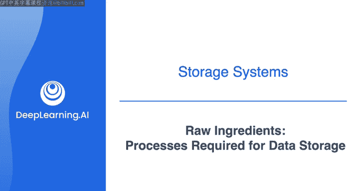
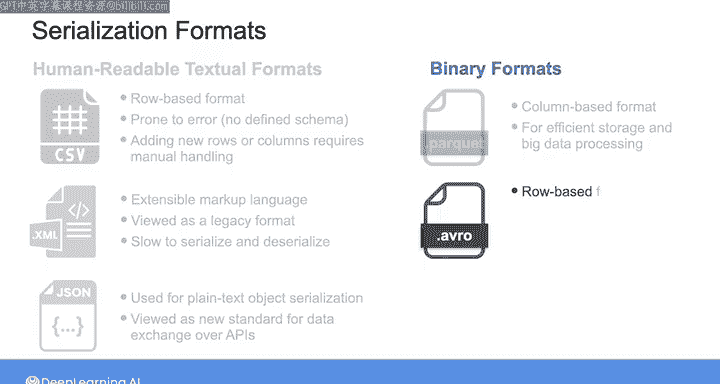
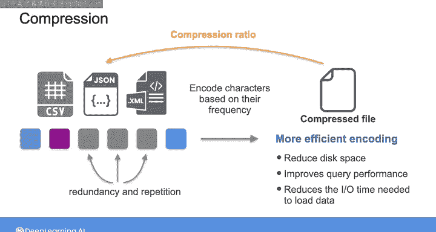

#  141：数据存储所需的过程 🗄️

在本节课中，我们将要学习数据存储系统底层除了物理介质外，还包含哪些关键组件和过程。我们将重点探讨网络、CPU、序列化与压缩在现代数据系统中的作用，理解它们如何共同构成数据存储的“原材料”。

## 概述

之前讨论存储层次结构时，我们聚焦于最底层的物理存储介质。然而，底层还包括了在现代数据系统中存储和传输数据所必需的其他组件和过程。本节视频将详细解析网络、CPU、序列化与压缩如何在云时代的存储系统中发挥作用。

## 网络与CPU：分布式存储的基石

在云时代，存储系统日益趋向分布式。这意味着数据可以被拆分、复制并分布在许多互联的服务器上，以提升读写性能、数据持久性和可用性。

因此，你可以将网络以及处理读写请求细节所需的CPU视为存储解决方案的“原材料”之一。这些细节包括跨多台服务器聚合读取结果和分发写入操作。我们将在后续课程中更深入地学习分布式存储系统。

## 数据序列化：格式转换的关键

无论你是将数据存储在单台服务器还是分布式存储系统中，当你将数据存入文件、数据库或通过网络发送时，都需要将其转换为不同的格式。

这是因为存储在内存中的数据与存储在磁盘中的数据具有不同的表示形式。在系统内存中，数据以经过优化的数据结构形式存储，便于CPU高效访问和操作。但这种格式并不适合持久化存储到磁盘或通过网络传输。

因此，你需要使用一个称为**序列化**的过程，将数据转换为一种标准格式（通常是一个字节序列），以便高效存储或在网络上共享。当你想读取数据时，则会使用**反序列化**过程，从序列化格式中重建原始的数据结构。

### 序列化的两种主要方式

以下是两种主要的序列化方法：

*   **基于行的序列化**：在这种方式下，你逐条记录地对表格数据进行编码和存储，使得一个连续的字节序列代表一行数据。如果你编码的是半结构化数据，则逐个对象或逐个文档进行编码，使得代表单个对象或文档的数据在磁盘上呈现为连续的字节序列。这种方式非常适合需要访问整行数据的**事务型操作**。
*   **基于列的序列化**：在这种方式下，你逐列地对数据进行编码和存储，使得序列化格式中的一个连续字节序列代表一列数据。如果你编码的是面向列的半结构化数据，则所有对象中同一个键对应的值会被存储为一个连续的字节序列。这种方式非常适合需要对特定列执行操作的**分析型查询**。

### 常见序列化格式

作为数据工程师，你可能会遇到多种数据序列化格式：

*   **CSV**：一种流行的基于行的格式。它实际上很容易出错，因为它不支持预定义的模式，需要应用程序自行定义每行每列的含义。如果应用程序为其数据添加了新行或新列，你必须手动处理这种变更。因此，如果可能，应避免在数据管道中使用此格式。
*   **XML**：在HTML和互联网兴起初期很流行，但现在被视为一种遗留格式，因为对于数据工程应用而言，其序列化和反序列化速度通常较慢。如今，XML在纯文本对象序列化方面已很大程度上被JSON格式取代。
*   **JSON**：如今被视为通过API进行数据交换的新标准，也是一种非常流行的数据存储格式。
*   **Parquet**：一种基于列的二进制格式，专为高效存储和大数据处理而设计。
*   **Avro**：一种基于行的二进制格式，它使用模式来定义数据结构，并支持模式演进。

本周晚些时候，我们将更深入地学习数据库中行存储与列存储的对比，以及这些流行的格式。

你在序列化以及如何在文件和数据库中存储数据方面所做的决策，会影响整体查询性能。例如，最近一个数据团队发现，仅仅将序列化格式从CSV切换到Parquet，就能将作业性能提升**100倍**。

## 数据压缩：提升效率与性能

假设你已经将数据序列化，以便存储在磁盘上或通过网络传输。随着数据量的增长，你可能希望提高存储效率并加速数据传输。

**数据压缩**是一种减少表示数据所需比特数的方法，对于需要处理日益增长的大型数据集的现代数据应用而言，它是一个关键组件。

压缩算法不是直接将数据编码为比特序列，而是使用复杂的数学技术来识别数据中的冗余和重复，然后以更高效的方式重新编码数据。

例如，可应用于CSV、JSON和XML等基于文本的数据格式的传统压缩算法，会识别出现最频繁的字符，并以不同于出现频率较低的字符的方式对它们进行编码。这些算法不是将每个字符映射到固定长度的比特序列，而是将常见字符匹配到较短的比特序列，将不常见字符匹配到较长的比特序列。这样，压缩后的数据文件总共占用的比特数更少，从而节省磁盘空间。

压缩文件大小相对于原始未压缩文件大小的比率称为**压缩比**。

除了减少磁盘空间占用，压缩还能提高查询性能，因为它减少了处理查询时将必要数据从磁盘加载到内存所需的输入/输出（I/O）时间。

近年来，工程师们创造了新一代的压缩算法，它们优先考虑速度和CPU效率，而非压缩比。这些算法常用于压缩数据湖或列式数据库中的数据，以优化快速查询性能。本视频后的可选阅读材料中包含了一些这类Zoo压缩技术的示例。

## 总结

本节课中，我们一起学习了构成数据存储基础的关键“原材料”。我们了解了网络和CPU如何支持分布式存储，探讨了序列化过程如何将内存中的数据转换为可存储或传输的格式，并区分了基于行和基于列的序列化策略及其适用场景。最后，我们介绍了数据压缩的原理及其在节省存储空间和提升查询性能方面的重要作用。

现在你已经了解了这些组件如何使数据存储成为可能，接下来我们将从存储层次结构的底层向上移动，探索由这些“原材料”构建而成的存储系统本身。

接下来的可选阅读材料是关于压缩的。之后，我们将探讨三种云存储选项：文件存储、块存储和对象存储。