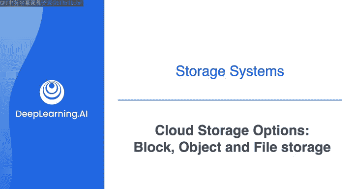
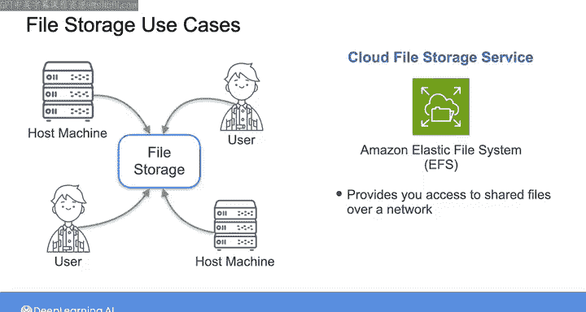
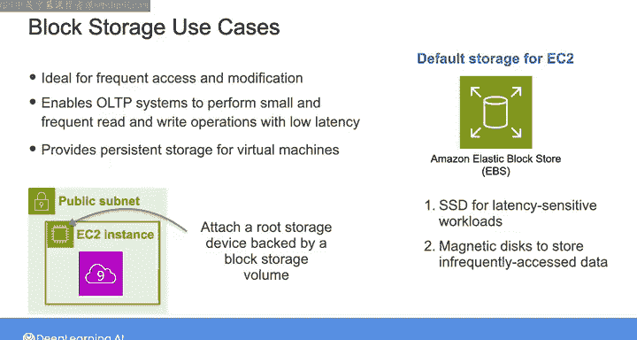
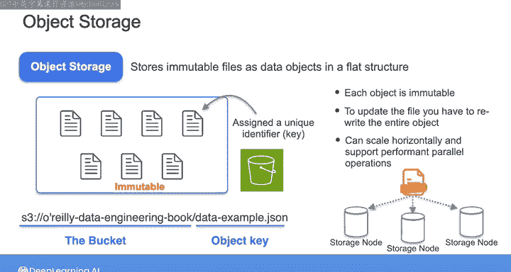
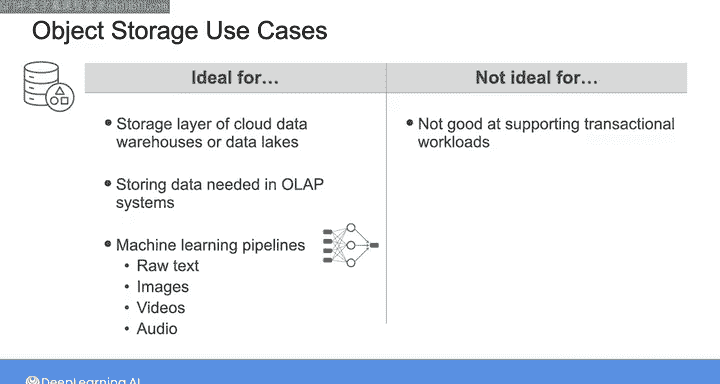
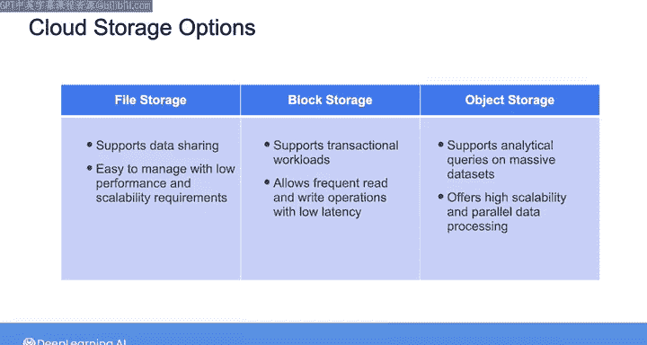

#  142：块存储、对象存储和文件存储 📚

在本节课中，我们将学习三种常见的云存储系统：块存储、文件存储和对象存储。作为一名数据工程师，你需要在众多云存储选项中进行选择。这些存储系统建立在比之前视频中提到的“原始组件”更高的抽象层次上。选择最适合你用例的系统时，你需要权衡这些选项之间的性能和可扩展性。

## 文件存储系统 📁

上一节我们介绍了云存储的基本概念，本节中我们来看看文件存储系统。文件存储系统将文件组织成目录树结构，类似于你笔记本电脑上文件夹的组织方式。每个文件夹包含其文件和子文件夹的元数据，详细记录了名称、所有者、修改日期、访问权限以及指向实际文件和子文件夹本身的位置指针。

因此，要在磁盘上定位一个文件，你需要给操作系统一个路径来遵循，例如 `/user/Matthew_Howsley/output.txt`。操作系统从左到右遵循这种层次结构，从根目录（由正斜杠 `/` 表示）开始，然后找到 `user` 目录，接着是 `Matthew_Howsley` 子目录，最后定位到文件。

以下是文件存储的主要应用场景：

*   当你需要为多个用户或主机提供对文件的集中访问，并且这些文件需要易于共享和管理时，可以使用文件存储。
*   你可以使用托管的云文件存储服务，例如 Amazon Elastic File System (EFS)。该服务为你、你的应用程序和利益相关者提供通过网络访问共享文件的能力，而无需管理网络、扩展磁盘集群或配置。
*   文件存储通常构建在块存储之上，底层存储机制的复杂性对你来说是抽象的。

尽管文件存储是一种更易于访问和理解的存储格式，但其读写性能并非最高，因为它需要跟踪文件层次结构。

## 块存储系统 🔧

上一节我们了解了文件存储，本节中我们来看看块存储。块存储为高速事务性数据访问提供了所需的性能和灵活性。块存储将文件分割成小的、固定大小的数据块，你可以将这些数据块存储在磁盘或固态硬盘上。这允许你为任何给定的数据片段精确分配存储空间。

每个块都有一个唯一的标识符，类似于该块的地址，这有助于你高效地检索和修改单个块中的数据，从而提供比文件存储更高的性能和更低的延迟。

你通常基于分布式架构设计块存储系统，将数据块分布在多个存储磁盘上，这带来了更高的可扩展性和更强的数据持久性。这使得块存储成为大多数现代存储解决方案的支柱，包括本地文件系统、事务性数据库和虚拟机存储。

当你将文件存储在块存储中时，存储应用程序将数据写入多个块，并将这些块的标识符记录在一个数据查找表中。当你请求特定文件时，应用程序从相关块中检索数据，并将其合并为原始序列供你读取。这一切对你都是抽象的，因此你可以通过其唯一标识符定位任何块，并更新该块，而无需替换整个文件。

这使得块存储非常适合数据需要频繁访问和修改的用例。以下是块存储的主要应用场景：

*   **事务性数据库系统**：通常以块级别访问磁盘，以实现高性能的随机访问。这使得 OLTP 系统能够以低延迟执行小型读写操作。
*   **虚拟机持久存储**：例如 EC2 实例。在实验中，当你创建那些运行在 EC2 实例上的 Cloud9 环境时，系统会自动为每个实例附加一个由块存储卷支持的主存储设备。你可以在块存储卷中安装操作系统、文件系统和其他计算资源。

对于 EC2，默认存储是 Amazon Elastic Block Store (EBS)。你可以根据用例从各种 EBS 卷类型中进行选择。例如，一些卷构建在高性能 SSD 上，非常适合对延迟敏感的工作负载；而另一些则使用经济高效的磁盘来存储不常访问的数据。

由于块存储卷通常附加到计算实例，其可扩展性受限于计算资源的扩展能力，因此块存储的容量通常上限在几 TB。

## 对象存储系统 🗃️

上一节我们讨论了块存储，本节中我们来看看对象存储。对象存储将数据存储层与计算层解耦，因此它可以扩展到 PB 级或更多的存储容量。在云环境中，你的存储容量仅受预算限制。使用对象存储，你很可能在耗尽对象存储空间之前就花光了钱。

因此，云对象存储允许你使用临时集群处理数据，并根据需求扩展这些集群。这些临时集群在后台运行，你无需担心它们。这是使大数据对小型组织可用的一个重要因素，这些组织无法负担仅为偶尔运行的数据作业而拥有硬件。

让我们回顾一下在课程 2 的存储系统背景下学到的关于对象存储的知识。与传统的分层文件存储系统不同，对象存储将文件作为不可变的数据对象存储在扁平结构中。

在对象存储系统中，你将对象组织到顶级逻辑容器中，例如 S3 存储桶。每个对象被分配一个唯一的标识符或键，你可以用它来在其容器内查找对象。因此，S3 中的对象标识符可能如下所示：

`s3://bucket-name/path/to/object/data_example.json`

第一部分指的是存储桶名称，该名称在整个 AWS 中必须是唯一的。`path/to/object/data_example.json` 是指向特定对象的键。

一旦你最初写入数据，对象就变得不可变。即使你想更改一个 1GB 文件中的一个字符，也必须重写整个对象，而不是像在块存储中那样只做一个小改动。这看起来像是一个限制，但实际上消除了支持变更同步的开销，因此你可以将对象分布在许多存储节点上，每个节点都包含自己的磁盘，无需在所有节点之间传播数据更改。这使得对象存储能够水平扩展，并支持跨多个磁盘的极高性能并行读写。

每个节点保存对象的分片，这些分片会在多个节点之间复制以确保持久性。这种高可扩展性和持久性使得对象存储非常适合作为云数据仓库和数据湖的存储层。它允许这些存储抽象以经济高效的方式容纳海量数据。

但由于对象是不可变的，对象存储不擅长支持需要低延迟进行许多小更新操作的事务性工作负载。相反，对象存储非常适合存储大规模 OLAP 系统所需的数据，这些系统侧重于读密集型的分析工作负载，而不是写密集型的事务操作。

在现代数据工程应用中，对象存储还在机器学习管道中扮演着关键角色，这些管道需要大量非结构化训练数据，例如原始文本、图像、视频和音频。

因此，文件存储、块存储和对象存储都有广泛的应用场景。以下是选择建议：

*   如果你的重点是简单的数据共享和易于管理，且对性能和可扩展性要求不高，那么文件存储系统可能是最直接的解决方案。
*   如果需要支持需要低延迟频繁读写操作的事务性工作负载，则应选择块存储。
*   如果需要对海量数据集执行分析查询，则可以选择对象存储，因为它具有高可扩展性和并行数据处理能力。

云提供商通常在这三种常见存储选项中提供不同的存储层级。

在下一节视频中，我们将一起学习如何通过考虑用于根据访问频率对数据进行分类的热、温、冷分类方法，来决定合适的存储层级。

本节课中我们一起学习了三种主要的云存储类型：文件存储、块存储和对象存储。我们了解了它们各自的组织结构、性能特点、适用场景以及优缺点。文件存储易于理解和管理，适合共享；块存储性能高，适合频繁读写的事务性工作负载；对象存储可扩展性极强，成本效益高，适合存储海量数据和分析工作负载。理解这些区别对于为你的数据工程项目选择正确的存储解决方案至关重要。