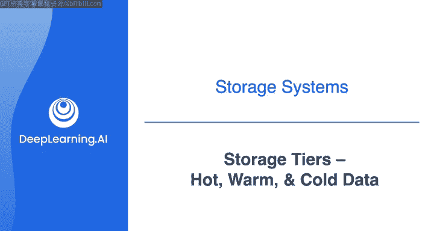
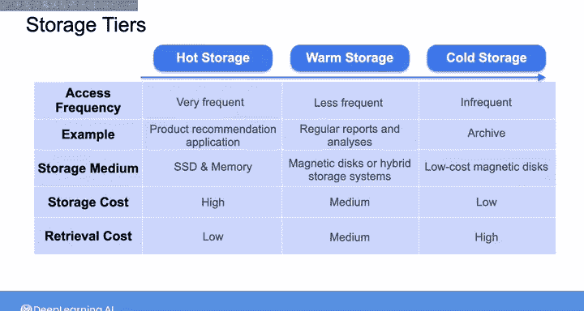
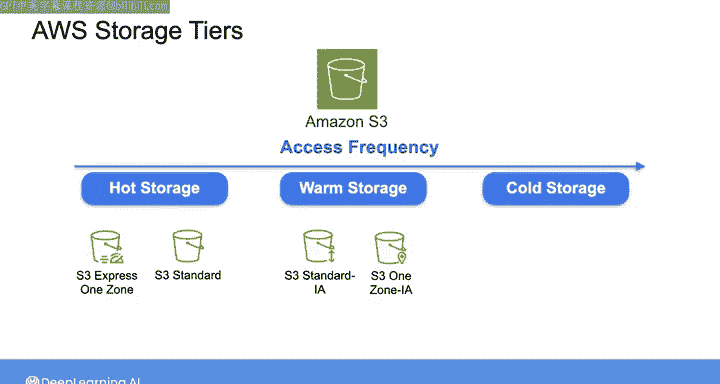

#  143：热数据、温数据、冷数据 🗂️

在本节课中，我们将学习云数据存储服务中的不同存储层级。理解这些层级如何根据数据的访问频率、成本和性能需求进行划分，是设计高效且经济的数据存储解决方案的关键。

---

## 概述

大多数云数据存储服务都提供不同的存储层级供您选择。选择层级时，需要考虑成本、访问速度、访问频率和合规性要求。本节将介绍一种基于数据访问和使用频率的分类方法：热数据、温数据和冷数据。

## 热数据 🔥

在频谱的一端是热数据。热数据是访问频繁且需要快速检索时间的数据。

例如，在产品推荐应用中，您需要频繁访问产品目录和用户的购买历史记录。您可能还希望将频繁运行的查询结果存储在缓存中，以便快速为客户提供产品推荐。

为了提供快速的读取访问，通常希望将热数据存储在利用高性能存储介质（如SSD和内存）的系统中。因此，热数据的存储成本通常更高，但检索数据所需的时间和计算资源相对较低，因为您存储数据的方式优化了速度。

## 温数据 🌡️

温数据的访问频率低于热数据，但仍需要随时可用。

例如，这可能用于不需要实时更新的常规报告和分析的数据。通常希望将温数据存储在利用速度较慢的磁盘或混合存储系统的低成本存储系统中。

与热数据相比，温数据的存储成本较低，但检索数据通常需要更多的时间和计算资源。

## 冷数据 ❄️

在频谱的另一端是冷数据。这是很少被访问且通常用于归档的数据。

例如，您可能决定归档项目文档或保留旧电子邮件以满足合规性目的。您希望将冷数据存储在基于低成本磁盘构建的最具成本效益的存储层级中。

因此，冷数据的存储成本最便宜，但与温数据相比，检索这些数据需要更长的时间并需要更多的计算资源。

## 层级选择与权衡 ⚖️

一般来说，当您从具有快速访问的高性能存储转向具有较慢访问的低性能存储时，存储价格会下降。

如果您将所有数据存储在热存储中，您将能够非常快速地访问数据，但存储价格会非常高昂。如果您将所有数据存储在冷存储中，那么您将节省存储成本，但代价是数据访问的检索时间长且计算需求高。

因此，您通常需要为各种存储需求选择存储层级的组合。

## 实践示例：Amazon S3

以在Amazon S3中存储数据为例：
*   您可能将用于实时交易的频繁访问的热数据存储在所谓的 **S3 Express One Zone** 或 **S3 Standard** 层级中。
*   您可能将需要每周或每月访问的温数据（例如用于微调产品推荐系统）存储在 **S3 Standard-Infrequent Access** 或 **S3 One Zone-Infrequent Access** 层级中。
*   最后，您希望将历史冷数据归档在某个 **S3 Glacier** 层级中。

设计存储解决方案时，除了访问频率，还需要考虑存储解决方案的可扩展性和持久性等因素。

---

## 总结

本节课我们一起学习了数据存储的三种主要层级：热数据、温数据和冷数据。我们了解了它们基于访问频率的定义、典型的应用场景、存储介质选择以及相关的成本与性能权衡。掌握这些概念有助于您根据业务需求，在云存储服务中做出明智的层级选择，从而平衡性能与成本。

在下一个视频中，我们将更深入地探讨分布式存储系统，并讨论与该架构相关的权衡。我们下节课见。