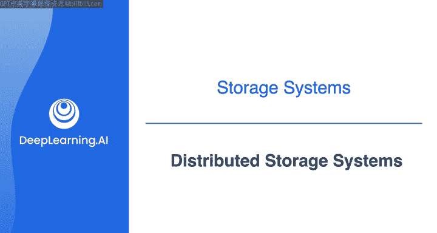
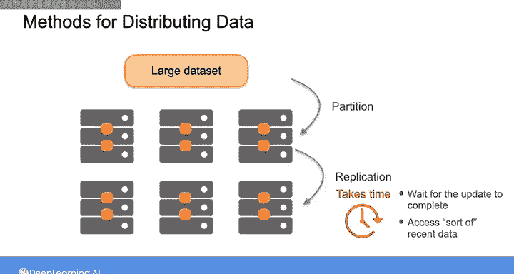
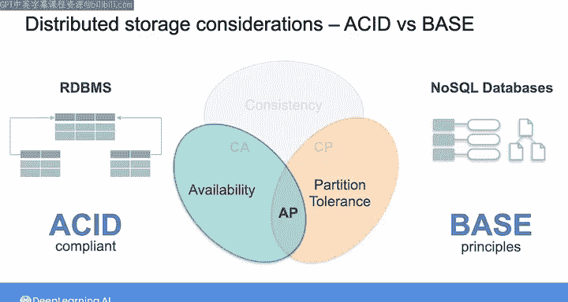
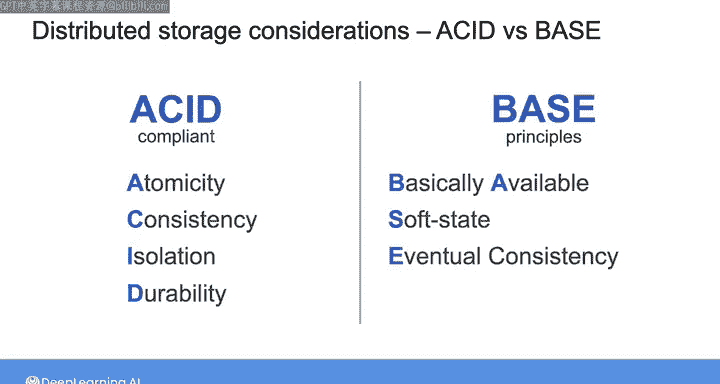
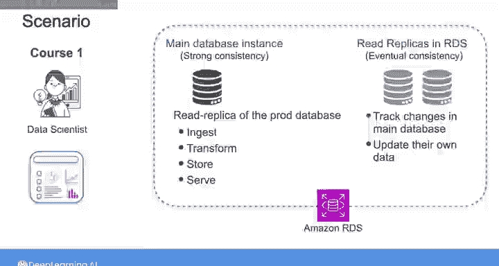

#  144：分布式存储系统 🗄️

在本节课中，我们将要学习分布式存储系统的基本概念、工作原理以及其在数据工程中的重要性。随着数据量的增长和访问模式的复杂化，单机存储已无法满足需求，分布式存储成为了云环境下的默认选择。

---

## 分布式存储架构概述

上一节我们介绍了数据存储的基本需求，本节中我们来看看分布式存储架构是如何工作的。

当数据存储需求增加且数据访问模式变得更加复杂时，单台机器的存储能力将无法满足需求。这时，你需要将数据分布到多台服务器上。实际上，在云环境中，无论是使用块存储、文件存储还是对象存储，分布式存储都是默认的数据存储方式。

在分布式存储系统中，数据被分布和复制到多个通过网络连接的服务器上，这些服务器被称为**节点**。节点组成了**集群**，而多个集群共同构成了分布式存储系统。每个节点都包含如磁盘或SSD等物理存储介质，因此分布式系统的总存储容量是所有节点容量的总和。每个节点通常还具备处理能力，用于管理数据、执行复制和访问控制。

通过这种方式存储数据，你可以轻松地实现系统的**水平扩展**，即通过向集群添加更多节点来应对增长的数据量和负载。相比之下，单机存储架构只能进行**垂直扩展**，即只能升级单台服务器的存储容量。通过将数据分布在多个节点上并在集群间复制，你还能确保更高的**容错性**和**数据持久性**。这意味着即使系统的一个或多个组件发生故障，你的数据也能长期保存。这与**高可用性**密切相关：如果一个节点因硬件、软件故障、网络中断或其他问题而不可用，你仍然可以从另一个未受影响的节点（可能位于不同的地理位置）访问数据。

在性能方面，分布式存储系统将大型处理任务分解为较小的子任务，由各个节点分别处理。这有助于系统并行处理许多读写操作。由于数据在多个节点上复制，系统还可以从最近或负载最轻的副本节点提供读取请求，从而使你能够更快地访问数据。

鉴于这些优势，许多存储解决方案，包括对象存储、云数据仓库、Hadoop分布式文件系统（HDFS）、Apache Spark等，都依赖于分布式存储架构。

---

## 数据分布方法：复制与分区

作为数据工程师，你会发现有两种常见的方法可以在多个节点间分布数据：**复制**和**分区**。

以下是这两种方法的详细说明：

*   **复制**：你在几个不同的节点（可能位于不同的地理位置）上保存相同数据的副本。这种冗余性带来了更高的可用性，并有助于提升性能。
*   **分区**（也称为分片）：它将大数据集分割成更小的子集，称为**分区**或**分片**，然后将不同的分区分配给不同的节点。

在实践中，你可能会结合使用这些方法来分布数据。例如，你可以对一个大数据集进行分区，并将分片分布到不同的节点，然后复制这些节点以创建良好的冗余级别。大多数数据库可以自动以对你透明的方式进行分区和复制，或者你也可以指定复制和分区参数，以便对分布式存储系统进行更精细的控制。

---

## 分布式存储的挑战与CAP定理

分布式存储的一个挑战是，跨节点复制变更需要时间。因此，当你尝试从一个正在更新的节点访问数据时，你面临两种选择：要么等待更新完成后再访问数据，要么访问该节点当前可用的、可能不是最新的数据。

这种权衡由**CAP定理**进行了总结。该定理指出，任何分布式系统最多只能同时保证以下三个属性中的两个：**一致性**、**可用性**和**分区容错性**。

以下是这些属性的定义：

*   **强一致性**：意味着每次读取都能反映最新的写入操作。请注意，这与你在课程2中看到的ACID原则中的“一致性”不同。ACID中的一致性确保事务内的任何数据更改都必须遵循数据库模式定义的一组规则或约束，使数据库从一个有效状态转换到另一个有效状态。而CAP中的强一致性属性有助于实现这一条件。
*   **可用性**：意味着每个请求都会收到响应，即使响应中的数据不一定是最新的。
*   **分区容错性**：意味着即使网络发生中断或故障，导致某些节点与其他节点隔离，系统也能继续运行。

由于没有分布式系统能完全避免网络故障或意外中断，网络分区通常是必须容忍的。也就是说，构建保证分区容错性的系统通常是给定的前提。因此，你通常必须在**一致性**和**可用性**之间做出选择，因为CAP定理指出任何分布式系统最多只能保证三个属性中的两个。

这意味着，在你尝试访问一个仍在更新的节点的场景中，你可以选择将系统设计为取消请求（这降低了可用性但确保了一致性），或者配置系统继续进行读取操作（这提供了高可用性但存在不一致的风险）。旨在符合ACID原则的数据库系统（如RDBMS）通常会选择一致性而非可用性，而不符合ACID原则的NoSQL数据库系统则通常选择可用性而非一致性。

与ACID原则相对，实际上存在一组称为**BASE**的原则，可用于设计和评估分布式数据系统。BASE代表：
*   **基本可用**：意味着大部分时间都能获得一致的数据。
*   **软状态**：意味着事务的提交状态是不确定的。
*   **最终一致性**：意味着在某个时间点后，读取数据将返回一致的值。

---

## 实践应用与配置选择

作为数据工程师，你需要理解你的数据库如何处理一致性。这可以由数据库技术本身、数据库配置参数或在单个查询级别的一致性配置来决定。一旦你理解了数据的技术限制和业务用例，你可能需要与其他利益相关者协商一致性要求。

让我们回顾课程1中的场景：你需要向数据科学家提供销售数据，以便他们为营销团队更新分析仪表板。软件工程师已经设置了生产数据库的**只读副本**，以便你可以摄取、转换、存储并提供所需的销售数据给数据科学家。

假设数据库是使用Amazon RDS Aurora实现的，这是一个分布式关系数据库服务。该数据库有一个主数据库实例，支持严格的**读写后一致性**（即强一致性）。但如果数据科学家重视即使不是最新数据也能立即访问销售数据的能力，那么你可以在Aurora中设置只读副本。

这些只读副本会跟踪对主数据库实例所做的所有更改，并更新它们自己的数据副本。然后，在逐个查询的基础上，你可以决定是从支持强一致性的主数据库实例读取，还是从支持最终一致性的某个只读副本读取。

---

## 总结与后续

本节课中我们一起学习了分布式存储系统的核心概念。我们探讨了其架构如何通过节点和集群实现水平扩展、高可用性和容错性。我们介绍了两种关键的数据分布方法：复制和分区，并深入分析了分布式系统设计中的核心权衡——CAP定理，以及与之相关的ACID和BASE原则。最后，我们通过一个实际场景了解了如何根据业务需求选择不同的数据库一致性配置。

接下来，我包含了一个关于数据库分区的可选阅读材料，如果你有兴趣可以深入了解，它涵盖了数据库如何在不同节点间分布。之后，我将引导你完成一个实验，在那里你将有机会在云中实际操作对象、块和文件存储系统，这些系统都采用了我们讨论的分布式存储架构。你还将把这些系统与主要将数据存储在RAM而非磁盘的内存存储系统进行比较。

我们下个视频见。