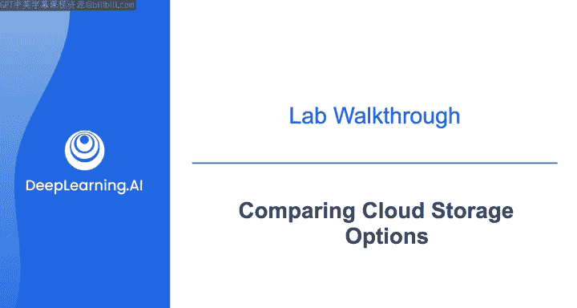
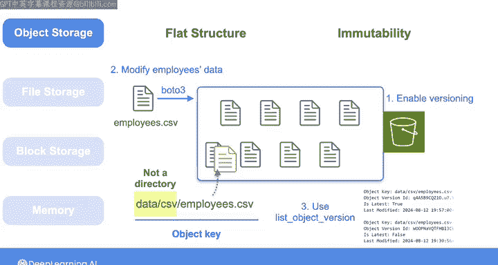
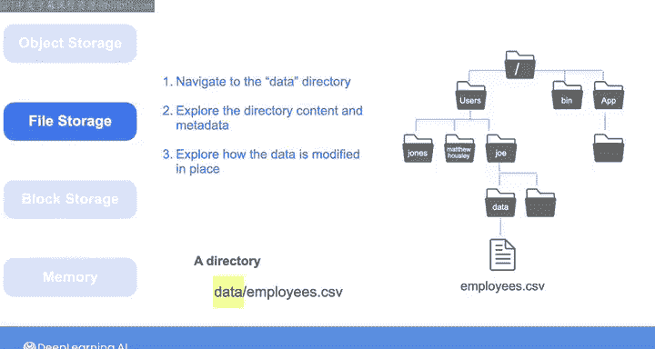
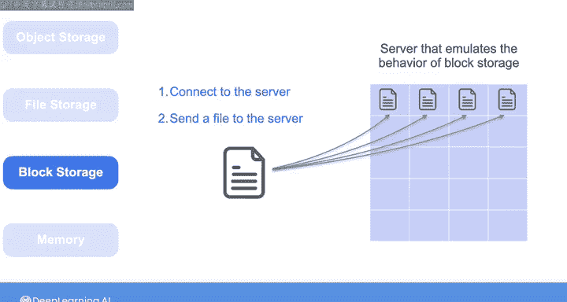
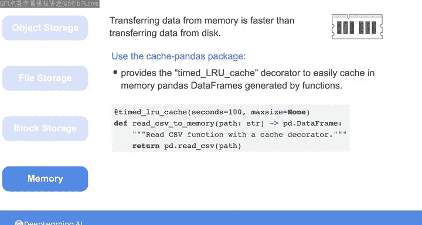
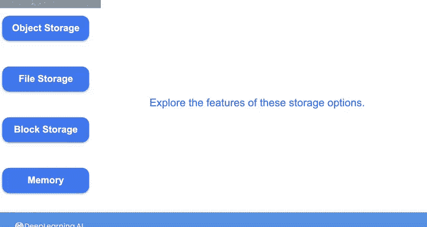

#  145：比较云存储选项 🧪

在本节课中，我们将通过一系列动手实验，探索云对象存储、文件存储和块存储的核心特性。你将学习到不同存储方案的结构、数据操作方式以及性能差异，特别是内存缓存如何显著提升数据检索速度。

---

## 实验概览

在开始实验前，我们先快速了解一下你将完成的练习内容。本次实验分为几个部分，分别对应不同的存储类型。

---

## 第一部分：探索对象存储

上一节我们介绍了实验的整体安排，本节中我们来看看对象存储的特性。你将探索这种存储方案的扁平化结构以及其对象的不可变性。

以下是你在对象存储部分将完成的任务：

1.  使用Boto3将一个包含员工信息的CSV文件上传到S3存储桶。
2.  上传文件时，选择 `data/csv/employee.csv` 作为所创建对象的标识符。请注意，前缀 `data/csv/` 只是对象键的一部分，并不代表S3存储桶中实际存在的目录。
3.  你将完成一个函数，该函数将向你证明前缀 `data/csv/` 并不代表S3存储桶中的一个实际对象，而 `data/csv/employee.csv` 才代表一个对象。

你可以创建共享相同前缀的不同对象。例如，如果你想按年份组织销售数据，可以在对象键中指定年份，并将其用作前缀，以代表该特定年份销售数据的所有对象。这有助于你组织数据，并更快地从正确的存储桶中检索对象。

由于对象是不可变的，你无法就地修改它们。因此，如果你使用存储桶中已存在对象的相同键来上传一个新对象，那么旧对象将被新对象替换。或者，正如你在之前的课程中所见，你可以启用对象版本控制。这样，当你使用现有键上传对象时，旧版本会被保留，并会创建该对象的新版本。

在本实验中，你将再次试验这一特性：在提供的存储桶中启用版本控制，修改员工数据，然后使用相同的键再次上传。接着，你将使用Boto3的 `list_object_versions` 方法来验证是否创建了对象的新版本。此方法会返回对象的旧版本和新版本的元数据。

---

## 第二部分：探索文件存储

完成对象存储的练习后，你将探索文件存储系统的层次化结构。

在文件系统中，你可能会看到像 `data/employees.csv` 这样的路径。这里的 `data` 指的是一个目录，你可以将其视为一个特殊的文件，它包含允许你访问其他文件的信息。

以下是你在文件存储部分将完成的任务：

1.  使用命令行导航到 `data` 目录，然后探索其内容和元数据。
2.  你还会探索在这种存储类型中，数据是如何被就地修改的。

文件系统通常构建在块存储之上，而块存储对你来说通常是抽象的。

---

## 第三部分：探索块存储与内存缓存

为了探索实验中的一些块存储特性，你将获得一个模拟块存储行为的服务器。

以下是你在块存储部分将完成的任务：

1.  连接到该服务器并向其发送一个文件。
2.  服务器将通过将文件分解成块来模拟块存储如何存储数据。

最后，你将与运行实验环境的服务器的内存进行交互。本周早些时候你了解到，从内存传输数据比从磁盘传输数据更快，并且某些数据库允许你将查询结果缓存在内存中以便快速访问。

你将使用 `cache-pandas` 包来测试这一特性。该包提供了 `timed_lru_cache` 装饰器，你可以用它轻松地将函数生成的pandas数据帧缓存在内存中。这样，下次运行脚本时，它将返回缓存的数据帧，而不是再次运行该函数。

你将把这个装饰器用于一个将CSV文件读入pandas数据帧的函数。你将比较第一次读取文件所需的时间与读取存储在内存中的相同数据所需的时间。

但是，由于内存存储容量有限，每当将数据加载到内存时，你需要确保有足够的空间。为了监控内存存储容量，你将使用 `htop` 命令。该命令为你提供系统CPU使用率、内存和运行进程的实时概览。顶部的条形图代表系统资源（包括CPU和内存）的使用情况，下面的每一行对应一个进程，并包含CPU和内存使用信息。

---

## 总结

本节课中，我们一起学习了如何通过实验比较不同的云存储选项。你动手探索了对象存储的扁平结构和不可变性、文件存储的层次化结构，以及块存储的基本原理。你还实践了利用内存缓存来加速数据访问，并学会了使用工具监控系统资源。现在轮到你去完成这些练习，亲自探索这些存储选项的特性了。

在你尝试完实验后，我们下节课再见。下节课我们将探讨数据库如何存储数据，并了解不同类型的数据库。