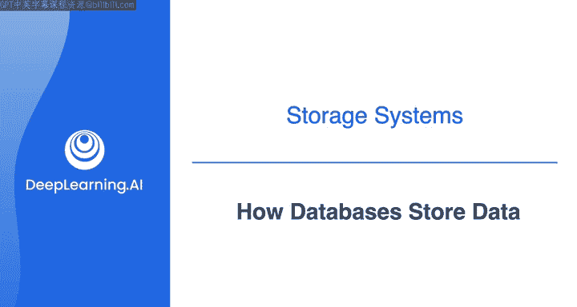
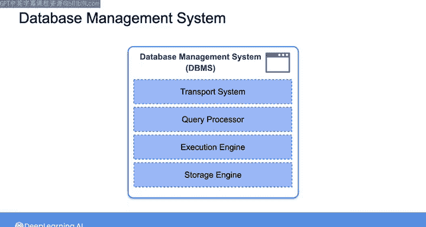
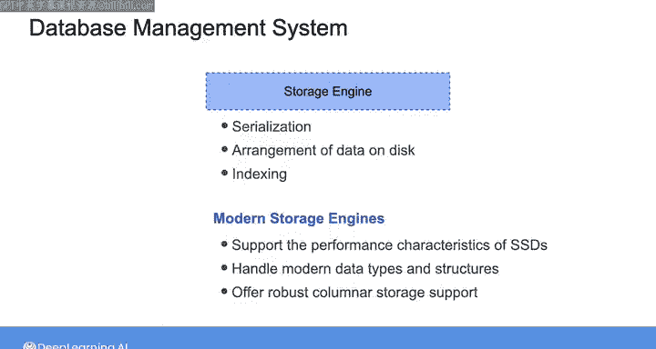
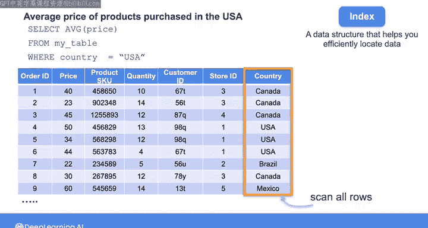
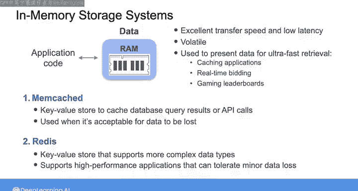

#  146：数据库如何存储数据 🗄️

## 概述

在本节课中，我们将要学习数据库如何存储数据。我们将深入探讨数据库管理系统（DBMS）的存储引擎、索引的工作原理，以及内存数据库的特点。这些知识将帮助你理解数据在数据库中的物理存储方式，以及如何高效地检索数据。

---

## 数据库管理系统（DBMS）的组成

在之前的课程中提到，数据库是最常见的源系统类型之一。你将使用数据库贯穿数据工程生命周期的各个阶段。因此，在本视频中，让我们深入了解数据库如何存储数据。

数据库通常带有一个称为数据库管理系统（DBMS）的软件层，它便于你与数据库进行交互。这对于你在第2课中看到的关系型数据库以及你将在本课后面更详细探讨的非关系型数据库（如图数据库和向量数据库）都是如此。

一个DBMS由传输系统、查询处理器、执行引擎和存储引擎组成。你将在本课程的最后一周学习所有这些组件如何协同工作来处理查询。但现在，让我们专注于存储引擎。

---

## 存储引擎的作用

数据库存储引擎在将数据物理存储到磁盘时为你完成繁重的工作，包括序列化、数据排列和索引。

你可能会使用现代存储引擎，这些引擎经过优化以支持固态硬盘（SSD）的性能特性，并能处理现代数据类型和结构，如可变长度字符串、数组和嵌套数据。随着组织开始对大规模数据应用分析，现代存储引擎也已发展为分析应用提供强大的列存储支持。

当你希望通过编写查询从数据库中检索数据时，速度通常非常重要。假设你查询一个非常大的关系表，该表有数百万甚至数十亿行，并且你特别关注与某些国家相关的行。例如，你想找出在美国购买的产品的平均价格。你可以编写一个SQL查询，从我的表中选择价格列的平均值，并筛选出国家列等于“USA”的结果。

---

## 索引的作用与原理

请注意，我在这里使用SQL查询是因为我想查询一个关系数据库。在本课末尾的实验中，你将使用不同的查询语言来查询图数据库。

回到这个例子，为了执行查询，查询处理器每次都必须扫描整个表以找到满足此筛选条件的记录。事实证明，你可以通过使用一种称为索引的特殊数据结构来加速数据检索。你可以将索引视为一种在旁保留一些元数据的方式，以帮助你更有效地定位所需数据。

在大多数关系数据库管理系统中，索引通常用于主表键和外键。但你也可以将索引应用于其他列，以满足特定应用的需求。在这个例子中，你可以创建一个单独的索引表，该表由两列组成：一列包含按字母顺序排序的国家值，另一列包含引用原始表中相应行的内存地址。然后，当你执行查询以找出在美国购买的产品的平均价格时，查询处理器可以对这个索引表使用二分查找来定位国家代码为“USA”的行。这比线性扫描所有行以查找特定国家代码要快得多。

如果你熟悉计算机科学，你会看到你有效地将检索操作的时间复杂度从O(N)降低到O(log N)。如果你不熟悉这个符号，不用担心。最重要的是，你要理解从排序列表中定位特定国家代码比扫描所有行更快。

所以这是索引的一个例子，根据数据库类型和你的使用情况，还有许多其他类型的索引结构。

---

## 内存数据库简介

现在我想快速提一下使用RAM作为主要存储层的内存数据库。尽管RAM提供了出色的传输速度和低延迟，但它也极其易失。因此，内存数据库通常用于需要超快速数据检索的应用中，如缓存应用、实时竞价和游戏排行榜。但这些数据库不应用于保留或持久存储目的。

例如，你可能使用像Memcached这样的键值存储来缓存数据库查询结果或API调用，在这些情况下，如果机器重启导致数据丢失是可以接受的。你可能还会遇到一个流行的基于内存的存储系统，称为Redis，它是一个支持更复杂数据类型的键值存储。Redis有几种内置的持久化机制，包括快照和日志记录。你可以将这个键值存储用于可以容忍少量数据丢失的极高性能应用。

---

## 总结

在本节课中，我们一起学习了数据库如何存储数据。我们探讨了数据库管理系统（DBMS）的存储引擎如何工作，索引如何通过创建元数据结构来加速数据检索，以及内存数据库的特点和适用场景。理解这些存储机制对于设计和优化高效的数据管道至关重要。

在下一个视频中，我们将更详细地比较数据库中存储结构化和半结构化数据的两种常见方法：行存储和列存储。请加入我，一起探讨它们的存储模式和查询性能。