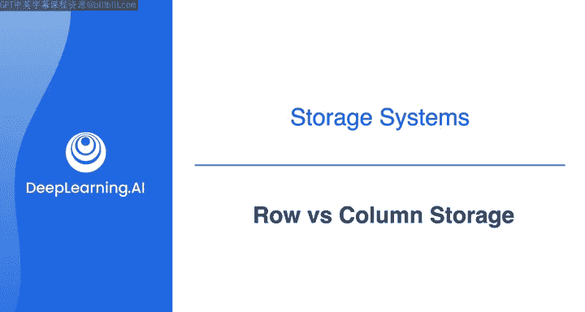
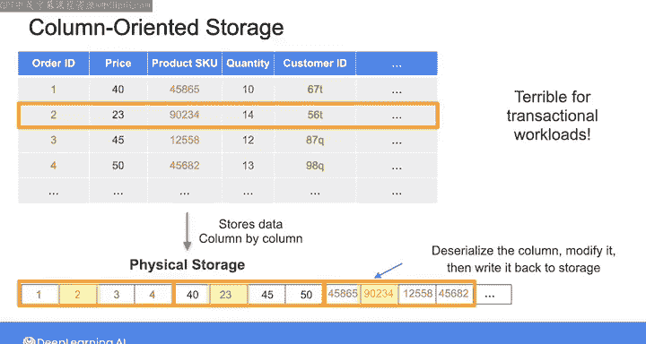

#  147：行存储 vs 列存储 🗂️



在本节课中，我们将要学习数据工程中两种核心的数据存储方式：行存储和列存储。我们将了解它们的工作原理、各自的优缺点，以及如何根据不同的数据访问模式来选择最合适的存储方案。

## 概述

作为数据工程师，您会遇到多种类型的数据库来存储和处理数据。在之前的课程中，我们已经了解了关系型数据库、键值存储和文档数据库。本周晚些时候，您还将学习图数据库和向量数据库等其他类型。本视频将重点介绍在数据工程中常用的两种存储结构化表格数据和半结构化数据的方式：行存储和列存储。您的选择将主要基于数据访问模式，即用户和系统如何访问您的数据。

## 行存储详解

传统的关系型数据库管理系统通常采用行存储来逐行存储数据。每一行代表一条完整的记录。


如果放大物理存储介质，您会发现每一行（对于半结构化数据，则是每个对象）在磁盘上被存储为一个连续的字节序列。这种将相关数据紧邻存储的方式，使得行存储非常适合需要低延迟读写操作的在线事务处理系统。

例如，如果您想根据ID列查询特定记录，由于该记录的所有数据都存储在一起，一旦定位到该ID，您就可以高效地读取和更新数据。

## 行存储在分析查询中的表现

但是，如果您想执行一个需要对整列值进行操作的分析查询呢？分析查询侧重于汇总或聚合列数据，以回答诸如“总收入是多少”、“哪种产品最畅销”或“平均数量是多少”等问题。

让我们看看这类查询在行存储上的表现。假设一个行存储包含100万行数据，每行有30列，每个条目占100字节。

假设第二列代表价格，您想计算所有价格的总和。您需要执行的查询是：
```sql
SELECT SUM(price) FROM my_table;
```

为了执行此查询，您需要将所有行从持久化磁盘存储逐一传输到RAM中。然后，这些行将被发送到CPU进行处理，提取每一行的价格并相加。

因此，需要传输到RAM的总数据量为：
`1,000,000 行 * 30 列/行 * 100 字节/列 = 3 GB`

如果您使用的磁盘数据传输速度为200 MB/秒，将所有数据读取到内存需要多长时间呢？计算如下：
`3 GB (即 3000 MB) / 200 MB/秒 = 15 秒`

对于短期内在小型数据集上执行分析查询来说，这不算太差，行存储模式可以胜任。但它不具备可扩展性。

## 行存储的扩展性挑战

想象一下，如果数据不是100万行，而是10亿行。那么您的数据大小将是3000 GB。在相同的传输速度下，将所有行及其所有列从磁盘传输到RAM将需要超过4个小时。

为了适应这种大规模的数据传输，工程师们设计了另一种存储模式。

## 列存储详解

这种模式就是列存储，或称列式数据库，它是NoSQL数据库的一种。当您在列存储中存储数据时，每一列的数据被集中存储在磁盘上。

因此，第一列的所有数据存储在一起，然后是第二列的所有数据，依此类推。这种方式允许您一次性读取整列数据，而不必为了获取单列数据而扫描每一行。

## 列存储在分析查询中的表现

让我们使用与之前相同的例子，看看列存储的分析查询性能。假设您再次想在一个包含10亿行、30列（每项100字节）的大型数据集中，计算价格列所有值的总和。

由于列存储将每列的数据集中存储，要执行此查询，您只需要将第二列的数据从磁盘传输到RAM。这意味着需要传输的数据大小是：
`10亿个条目 * 100 字节/条目 = 100 GB`

假设我们拥有与之前相同的数据传输速度，即200 MB/秒。那么传输需要多长时间呢？计算如下：
`100 GB (即 100,000 MB) / 200 MB/秒 ≈ 8.3 分钟`

与行存储所需的4个多小时相比，您可以看到，对于大型数据集的分析查询，列存储的效率要高得多。这就是为什么列式数据库更适合专注于数据分析的在线分析处理系统。

## 列存储的局限性

然而，恰恰由于相反的原因，列存储在事务性工作负载上表现不佳，因为您无法轻松访问单个数据行。如果您想读取特定记录，必须通过读取多个列的数据来重建该行。如果您想更新特定记录中的一个字段，则需要反序列化相关列，进行修改，然后再写回存储。

## 如何选择

作为数据工程师，理解行存储和列存储的工作原理差异至关重要，这样您才能为您的用例选择正确的方法。即：
*   对事务性工作负载（如销售平台的生产数据库）使用**行存储**。
*   对分析处理使用**列存储**。

## 后续学习



在接下来的两个可选阅读材料中，您可以了解更多关于结合了行和列存储方法的**Parquet格式**，以及关于**宽列数据库**的阅读材料。虽然Parquet是当今数据工程中流行且常见的格式，宽列数据库不那么常见，但可能非常适合某些事务性工作负载。

在之后的视频中，我们将探讨随着机器学习和生成式AI应用发展而备受关注的**图数据库**。

## 总结


本节课中，我们一起学习了数据存储的两种基本模式。我们了解到，**行存储**将整条记录的数据连续存放，适合需要频繁读写单条记录的**OLTP**场景；而**列存储**将同一字段的数据集中存放，能极大提升对海量数据进行聚合分析的**OLAP**查询效率。理解这两种模式的本质区别，是您作为数据工程师为不同应用场景选择合适存储方案的关键。