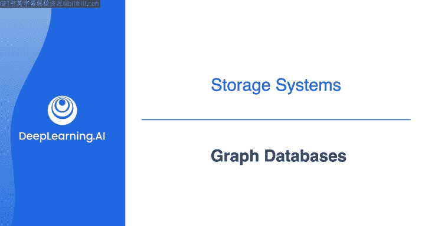
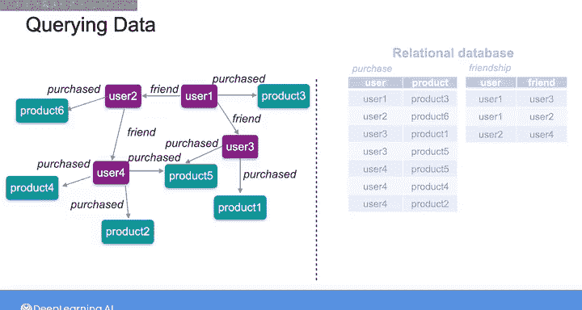
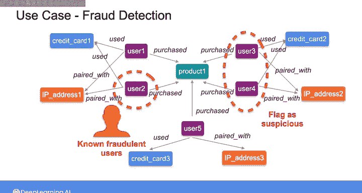
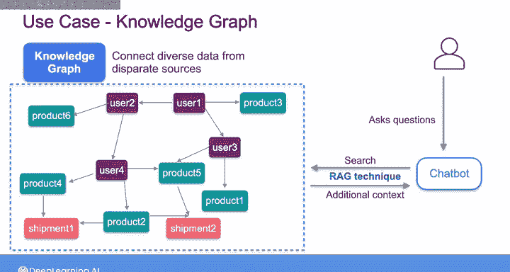
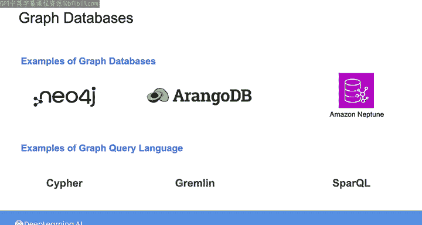

#  148：图数据库 🕸️

在本节课中，我们将要学习图数据库。这是一种使用节点和边构成的数学图结构来存储数据的数据库。我们将了解它的核心概念、工作原理、典型应用场景，并与传统的关系型数据库进行对比。

## 概述

图数据库将数据存储在由**节点**和**边**构成的数学图结构中。节点代表数据项，通常是实体，如人、产品或地点。边则代表这些数据项之间的关系或连接。在现代应用中，如果你正在为涉及数据实体间复杂连接的使用场景构建数据系统，就可能会遇到图数据库。

## 图数据库的核心概念

上一节我们介绍了图数据库的基本定义，本节中我们来看看其核心构成。

图数据库将**关系**视为一等公民。这意味着，与关系型数据库相比，使用图数据库可以非常直观地查看实体之间的关系。

*   **节点**：代表实体，例如用户、产品。可以表示为 `节点(标签: 属性)`，如 `用户(id: 1, 姓名: “张三”)`。
*   **边**：代表关系，例如“购买”、“是朋友”。可以表示为 `边(类型: 属性)`，如 `购买(时间: “2023-10-01”)`。

当你想查询图数据库中的数据时，即查询节点和边之间的关系，你可以遍历图结构。

## 图数据库查询示例

以下是使用图数据库进行查询的一个具体例子。

假设你想向用户1推荐其朋友购买过的产品。
1.  你可以从用户1节点开始，沿着标记为“朋友”的边，找到该用户的所有朋友。
2.  然后，针对每一位朋友，沿着标记为“购买”的边，找到这些朋友过去购买过的产品。
3.  最后，将这些产品汇总成一个推荐列表给用户1。

如果同样的数据存储在右侧这样的关系型数据库中，那么要为用户1创建推荐列表，你需要将“好友关系表”与“购买记录表”进行连接，使连接后的结果包含用户及其朋友购买的产品行。接着，你需要过滤查询结果，只保留用户1的信息。最后，选择不重复的产品，得到推荐列表。

可以想象，如果你想向用户推荐更多产品，例如考虑其朋友的朋友购买的产品，那么查询这样的关系型数据库将需要更多的表连接操作，这会迅速变得复杂且难以控制。

## 图数据库的应用场景

除了产品推荐应用，图数据库还有许多其他用途。

以下是图数据库的一些典型应用场景：
*   **社交网络建模**
*   **表示网络和IT运维关系**
*   **模拟供应链物流**
*   **追踪数据血缘关系**

另一个不那么明显的用例是**欺诈检测**，例如在电子商务交易中。你可以构建一个图来建模实体之间的关系，如客户、他们购买的产品、用于购买的信用卡以及他们的IP地址。然后，通过将这些关系与已知的非欺诈模式进行比较，来识别可疑活动。

例如，假设你知道许多欺诈交易包含一个信用卡号，该卡号已经与一个新用户在一个新的IP地址上使用过。那么，通过分析图中用户、信用卡和IP地址之间的关系，你可以将所有使用已关联其他用户的信用卡、但来自新IP地址的用户标记为可疑。

## 图数据库与知识图谱

你还可以使用图数据库创建**知识图谱**，将来自不同来源的数据连接起来，用于各种用例，例如提高聊天机器人的准确性和可靠性。

例如，在这里，你可以创建一个知识图谱，连接一家电子商务公司的产品、客户和运输数据。当用户与聊天机器人对话时，你可以从知识图谱中检索相关信息，通过一种称为**检索增强生成**的技术，为底层的大语言模型提供额外的上下文。这种技术使LLM能够访问与电子商务公司本身相关且具体的新鲜数据，从而改善查询结果。

我们不会在这些课程中深入探讨特定的生成式AI主题，但这对生成式AI来说是一个非常激动人心的时代。作为一名数据工程师，我鼓励你通过查看本周课程末尾的额外资源链接来了解更多关于这些主题的知识。

## 主流图数据库与查询语言

鉴于图数据库有这么多潜在的应用场景，你需要积累一些使用它们的经验。如今，你可以从许多不同的图数据库中进行选择，包括 **Neo4j**、**ArangoDB** 和 **Amazon Neptune**。使用这些数据库时，你会用到专门的查询语言，如 **Cypher**、**Gremlin** 和 **SPARQL**。

在本节课结束的实验中，你将有机会体验 **Neo4j** 和 **Cypher** 查询语言。除了作为图数据库，Neo4j 还集成了向量数据库中常见的向量搜索功能。

## 总结

本节课中我们一起学习了图数据库。我们了解到，图数据库使用节点和边来存储数据，特别擅长处理实体间的复杂关系。我们通过推荐系统的例子，对比了图数据库和关系型数据库在查询关系时的差异。此外，我们还探讨了图数据库在社交网络、欺诈检测和构建知识图谱等多个领域的应用。最后，我们简要介绍了 Neo4j 等主流图数据库及其专用查询语言。掌握图数据库将帮助你在处理高度互联的数据时，设计出更高效、更直观的解决方案。